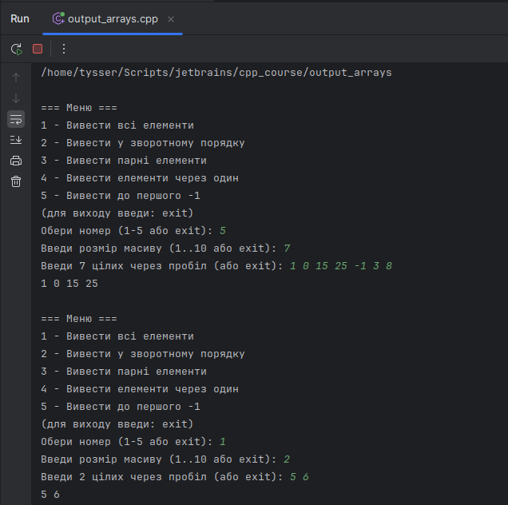
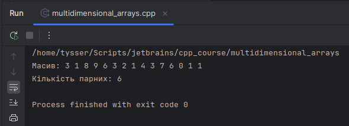
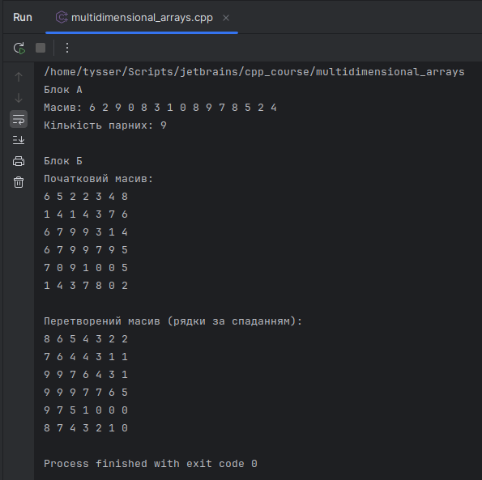

# Тема 4

- `output_arrays.cpp`

---

# Тема 5

- `multidimensional_arrays.cpp`

### Блок А

(`task_array15`)

- Створити масив із 15 випадкових цілих чисел з відрізка [0;9].
- Вивести масив на екран. 
- Підрахувати, скільки в масиві парних елементів, і вивести їх кількість на наступному рядку.

---

### Блок Б 
(`print_double_array`, `transform_double_array`, `create_and_show_double_array`)

- Створити двовимірний масив 6×7 з випадкових цілих чисел у діапазоні [0;9].
- Вивести масив.
- У кожному рядку переставити елементи так, щоб вони були розташовані за спаданням.
- Вивести перетворений масив.

- Сортування відбувається над копією рядка (row), без побічного ефекту на вихідний масив, що передається у функцію `transform_double_array`.

