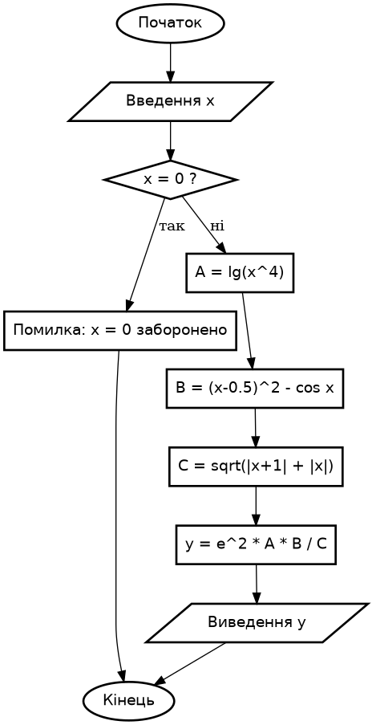
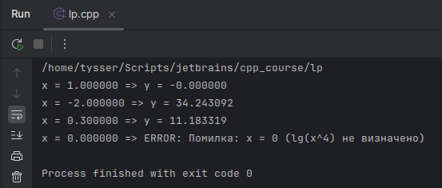

# Лінійне програмування
**Лабораторна робота №1**

## Варіант 10

### Завдання 1
1) **Постановка задачі:**

$$
y = e^2 \cdot \lg x^4 \cdot \frac{(x - 0.5)^2 - \cos x}{\sqrt{|x+1| + |x|}}
$$

2) **Область визначення:**
 - $\lg(x^4)$ вимагає $x^4 > 0 \;\;\Rightarrow\;\; x \neq 0$.
 - $|x+1| + |x| \geq 0$ ; дорівнює нулю лише якщо $x = 0$ і $x = -1$ одночасно не можливо. Отже знаменник $x > 0$ завжди.
 - **Висновок:** $x \in \mathbb{R} \setminus \{0\}$ - всі від’ємні, всі додатні, крім нуля
 - Перевірити $x \neq 0$

3) Вибір методу:
- Лінійні обчислення, одна перевірка $x \neq 0$ з повідомленням про помилку.
- Алгоритм
  - Ввести $x$ .
  - Якщо $x = 0$, повідомити про помилку «задача не визначена при `x = 0`» і завершити.
  - Обчислити:
    - $A = \lg(x^4)$
    - $B = (x - 0.5)^2 - \cos x$
    - $C = \sqrt{|x+1| + |x|}$
    - $y = e^2 \cdot A \cdot \frac{B}{C}$

4) UML



5) Тестування ( `test_task1` ):
6) 


### Завдання 2

$$t = \ln|m-y| + \cos^3my, \quad m = \sqrt{|x+a|} + 1.3 \cdot \lg \frac{\pi}{3}, \quad y = a \cdot \sqrt[3]{\sin^4(x^3)}, \quad x=3, \; a=-1.7$$


---

#### Встановлення `graphviz` та генерування UML блок-схеми.

```bash
sudo apt-get update && sudo apt-get install -y graphviz

# Генерація png
dot -Tpng algo_task1.dot -o algo_task1.png
# або svg
dot -Tsvg algo.dot -o algo.svg
```
