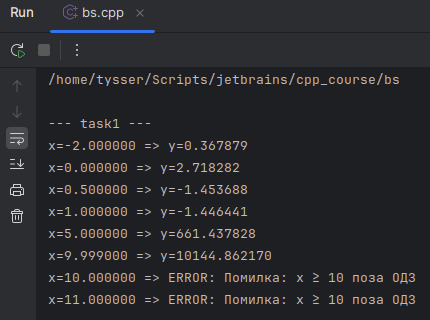

# Розробка програм розгалуженої структури.
**Лабораторна робота №2**

## Варіант 10

---

### Завдання 1
1) **Постановка задачі:**

$$
y = \begin{cases}
x^3\sqrt{x^2+3}, & 1 < x < 10 \\
\arctan(x - 9), & 0 < x \leq 1 \\
e^{x+1}, & x \leq 0
\end{cases}
$$

2) **Область визначення ОДЗ (Область допустимих значень):**
- $x^3\sqrt{x^2+3}$ - визначено для всіх $𝑥$ (підкореневий $x^2+3>0$ )
- $\arctan()$ - визначено для всіх $𝑥$
- $e^{x+1}$ - визначено для всіх $𝑥$
- Встановлено інтервали:
  - гілка 1: $1 < x < 10$ 
  - гілка 2: $0 < x \leq 1$
  - гілка 3: $x \leq 0$
- Для $x \geq 10$ функцію не задано.
  - Область визначення $x \in (-\infty, 10)$ . Точка $x=10$ - заборонена, треба ловити як помилку.
  - Границі:
    - при $x=0$ , беремо третю гілку $e^1=e$
    - при $x=1$ , беремо третю гілку $\arctan(8)$
3) **Вибір методу:**
- Розгалужена структура з перевіркою ОДЗ
- Порядок перевірок: 
  - якщо $x \geq 10$ => помилка «`x ≥ 10` поза ОДЗ» і завершити.
  - якщо $x \leq 0$ => рахуємо `y` ти виводимо  $y=e^{x+1}$
  - інакше якщо $x \leq 1$ => $y=arctan(x - 9)$
  - інакше $1 < x < 10$ => $y=x^3\sqrt{x^2+3}$
4) **Алгоритм**
- Ввести $x$
- Здійснити перевірку ОДЗ
- Якщо `ok` передати на обчислення `y` 
5) **UML**


6) **Тестування ( `test_task1` ):**



---

### Завдання 2
1) **Постановка задачі:**

$$
z = \frac{2.3t + 8}{2\cos t + 1}, \quad 0 \leq t \leq 6.5, \quad \Delta t = 1.1
$$

2) **Область визначення:**
3) **Вибір методу:**
4) **Алгоритм**
5) **UML**
6) **Тестування ( `test_task2` ):**

---

### Завдання 3
1) **Постановка задачі:**

$$
w = \begin{cases}
0.6v - 0.3^v, & -2 < v \leq 0.3 \\
\ln\!\left(v + \sqrt{v + \cos v}\right), & 0.3 < v \leq 5; \Delta v = 0.5
\end{cases}
$$

2) **Область визначення:**
3) **Вибір методу:**
4) **Алгоритм**
5) **UML**
6) **Тестування ( `test_task3` ):**

---
```bash
sudo apt-get update && sudo apt-get install -y graphviz

# Генерація png
dot -Tpng bs_task1.dot -o bs_task1.png
# або svg
dot -Tsvg algo.dot -o algo.svg
```

