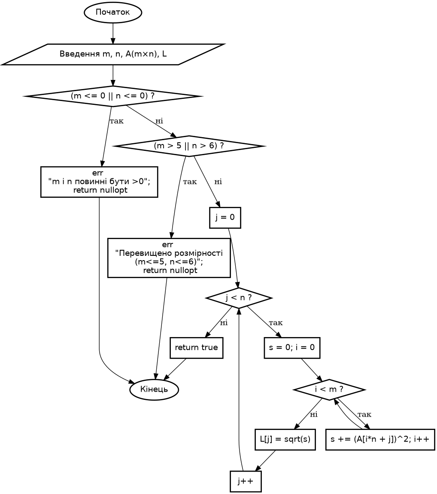

# Розробка програм з одновимірними масивами.
**Лабораторна робота №3**

## Варіант 10

---

### Завдання 1
1) **Постановка задачі:**

- Обчислити добуток модулів значень елементів масиву:

$$
Y(7) = (-2.2; 0.2; 3.1; 2.1; -3.1; 6.1; 0.5)
$$

2) **Вибір методу:**
- Лінійна структура: прохід масивом, накопичення добутку `P *= fabs(Y[i])`
3) **Алгоритм**
- `P = 1`
- Для кожного елемента `y` з `Y: P *= fabs(y)`.
- Вивести `P`.
4) **UML**


5) **Тестування ( `test_task1` ):**


---

### Завдання 2
1) **Постановка задачі:**
- Є матриця $A(m,n)$ , де $m ≤ 5$ (координати вектора), $n ≤ 6$ (кількість векторів).
- Кожен стовпець матриці — це вектор із $m$ координат.
- Потрібно:
  - Обчислити довжини цих $n$ векторів:
    $$L_j = \sqrt{\sum_{j=1}^m a_{ij}^2}, \quad j = 1..n$$
  - Записати ці довжини в одновимірний масив.
  - Знайти максимальну довжину та її номер.
2) **Вибір методу:**
- Цикл по стовпцях (векторах).
- Усередині — другий цикл по координатах: підсумовуємо квадрати → беремо sqrt.
- Записуємо результат у масив довжин.
- У процесі одразу відслідковуємо максимум.
- Метод обчислювальний, лінійно-циклічний.
3) **Алгоритм**
- Ввести $m,n$ , перевірити $m≤5$
- Ввести матрицю $A(m,n)$ .
- Ініціалізувати `maxL = -∞`, `pos = -1$`.
- Для кожного вектора $j=0..n−1$ :
  -  `s = 0` .
  -  Для кожної координати $i=0..m−1:$ `s += A[i][j]^2` .
  - `L[j] = sqrt(s)`.
  - Якщо `L[j] > maxL` : оновити `maxL` і `pos=j`.
  - Вивести масив `L`.
  - Вивести `maxL` і `pos`.


4) **UML**



5) **Тестування ( `test_task2` ):**


---

```bash
sudo apt-get update && sudo apt-get install -y graphviz

# Генерація png
dot -Tpng oda_task1.dot -o oda_task1.png
# або svg
dot -Tsvg oda_task1.dot -o oda_task1.svg
```

