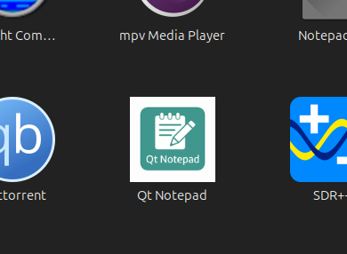
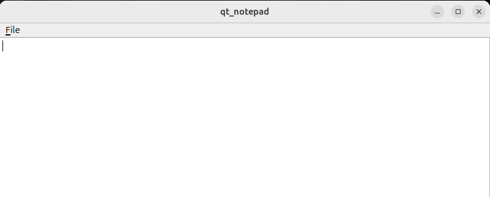

# Завдання 12

У завданні №12 пропонується реалізувати прототип блокнота засобами Delphi.
Однак Delphi сьогодні використовується обмежено, має комерційну ліцензію та невелике комʼюніті.
Для сучасної кросплатформеної розробки обрано C++23 та Qt6:
- Qt6 безкоштовний у Community Edition (GPL/LGPL).
- Підтримується на Windows, Linux та macOS.
- У поєднанні з CMake забезпечує зручну збірку, інсталяцію та інтеграцію з системним середовищем (меню, іконки, ярлики).

---

## Реалізація

- `main.cpp` - створює об’єкт `QApplication`, відкриває головне вікно класу `Notepad`.
- `notepad.h` / `notepad.cpp` - клас Notepad, що наслідує `QMainWindow`, містить `QTextEdit` як центральний віджет і меню **File** з діями:
  - **Open** - відкриття текстового файлу через `QFileDialog`, читання вмісту у `QTextEdit`.
  - **Save** — збереження тексту у файл через `QFileDialog`.
  - **Exit** — закриття застосунку.
- Інтерфейс повторює базовий функціонал Windows Notepad: одне вікно, текстове поле, просте меню.

## Залежності (Ubuntu)

```bash
sudo apt update
sudo apt install -y build-essential ninja-build qt6-base-dev qt6-base-dev-tools
```

## Встановлення

```bash
# 1. Створюємо build-директорію і генеруємо Make/Ninja-файли
cmake -S . -B cmake-build-debug

# 2. Збираємо проект
cmake --build cmake-build-debug -j

# 3. Встановлюємо у систему (бінарник: /usr/local/bin, ярлик: /usr/local/share/applications, іконки: /usr/local/share/icons)
sudo cmake --install cmake-build-debug

# 4. Оновлюємо кеш десктопних файлів (щоб програма з’явилася в меню)
sudo update-desktop-database /usr/local/share/applications/ 2>/dev/null || true

# 5. Оновлюємо кеш іконок (щоб підтягнулося зображення)
sudo gtk-update-icon-cache -f /usr/local/share/icons/hicolor 2>/dev/null || true
```

## Інтеграція в систему

- Бінарник інсталюється у `/usr/local/bin/qt_notepad`.
- Файл `qt_notepad.desktop` у `/usr/local/share/applications/` робить застосунок доступним у меню.
- Іконка (128×128 `icons/qt_notepad-128.png`) копіюється у `/usr/local/share/icons/hicolor/128×128/apps/` і після оновлення кешу підхоплюється робочим середовищем.

## Використання

- Запуск з меню => Qt Notepad
- Або з терміналу:

```bash
qt_notepad
```

- Додаток дозволяє відкривати та створювати текстові файли через провідник `QFileDialog`.




