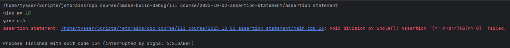
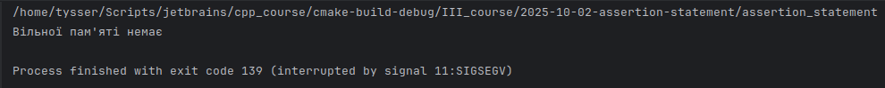
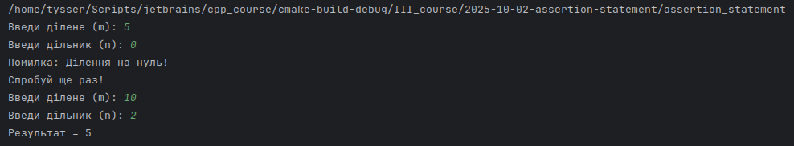

#  Налагодження програм

### 1) Макрос суджень `division_by_whole` (`cassert`)

### 2) Інструкція випробувань і блок захоплення `try_catch_probe`

### 3) Інструкція спричинення `throw`  
  - Функція `double divide(int a,int b)` робить ділення, але кидає виключення якщо ділення на 0
  - Функція `void ask_and_divide()` обертає виклик функції `divide` в `try catch`, він обробляє виключення `throw` якщо воно вилітає з `divide` 

