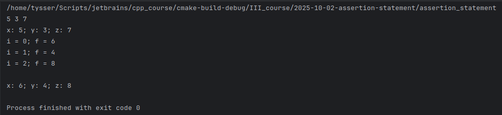

#  Налагодження програм

### 1) Макрос суджень `division_by_whole` (`cassert`)


### 2) Інструкція випробувань і блок захоплення `try_catch_probe`


### 3) Інструкція спричинення `throw`  
  - Функція `double divide(int a,int b)` робить ділення, але кидає виключення якщо ділення на 0
  - Функція `void ask_and_divide()` обертає виклик функції `divide` в `try catch`, він обробляє виключення `throw` якщо воно вилітає з `divide` 


### 4) [Boost.PFR](https://www.boost.org/doc/libs/1_84_0/doc/html/boost_pfr.html) 
**(`квазі-рефлексія` для агрегатів (зручно для обходу полів без ручного коду))**
  - у C++ немає стандартної рефлексії полів. Boost.PFR дає доступ до полів агрегатних `struct` і `class` без користувацьких конструкторів чи баз, тобто простих об’єктів. Усе рахується на етапі компіляції, без ітераторів: створюється `tuple`-вигляд і розкручується шаблонами. Зазвичай для [DTO](https://uk.wikipedia.org/wiki/DTO), серіалізації. Є доступ з індексом. Імен полів немає, працює лише зі значеннями.
  - Варіант без індексу: `for_each_field(value, [](auto& f){ ... });`
  - Варіант з індексом: `for_each_field(value, [](auto& f, std::size_t i){ ... });`

```cpp
    struct Point
    {
        double x;
        double y;
        double z;
    };
    
    Point p = {5, 3, 7};
```



  - Корисні фічі `Boost.PFR` і типове застосування

| Фіча | Що робить | Де застосувати |
|---|---|---|
| `for_each_field(T, fn)` | Проходить по всіх полях агрегата, викликаючи лямбду | Логи/трейсинг, серіалізація/десеріалізація, валідація |
| `get<N>(T)` + `tuple_size<T>` | Доступ до поля за індексом, розмір «як у кортежа» | Узгодження зі `std::apply`, generic-утиліти «як для tuple» |
| `structure_tie(T)` | Повертає кортеж-зв’язку з посилань на поля | Порівняння, свопи, передача в `std::tie`/`std::apply` |
| `boost/pfr/ops.hpp` | Автогенерація операторів `== != < <= > >=` для агрегатів | Швидко отримати повний набір порівнянь без бойлерплейту |
| `boost/pfr/io.hpp` | Потоковий вивід (`<<`) усіх полів агрегата | Діагностика, дебаг-дампи структур |
| `flat_*` | «Сплющена» робота з полями вкладених агрегатів | Простий «плоский» лог/дамп без ручної рекурсії |

