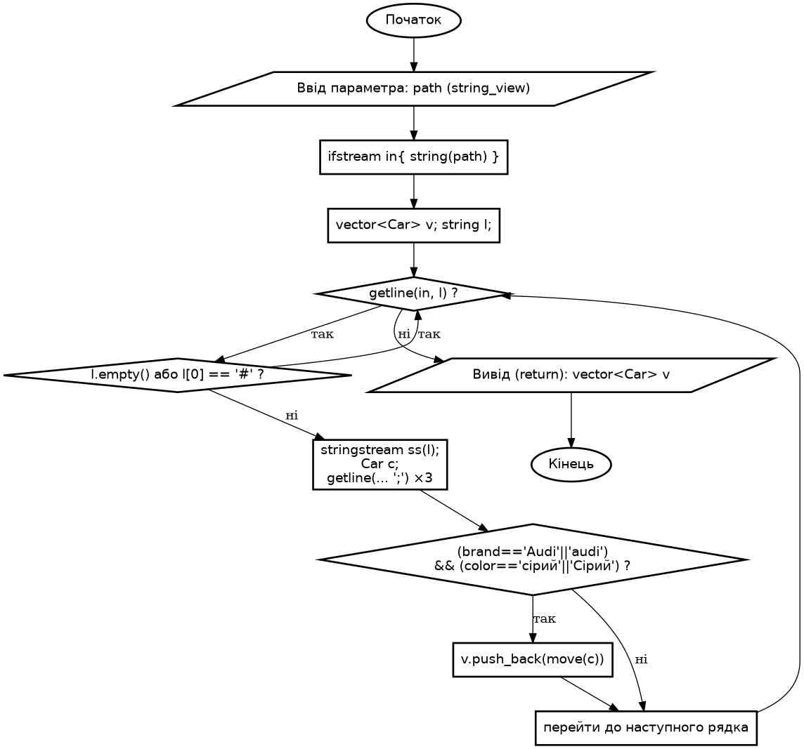
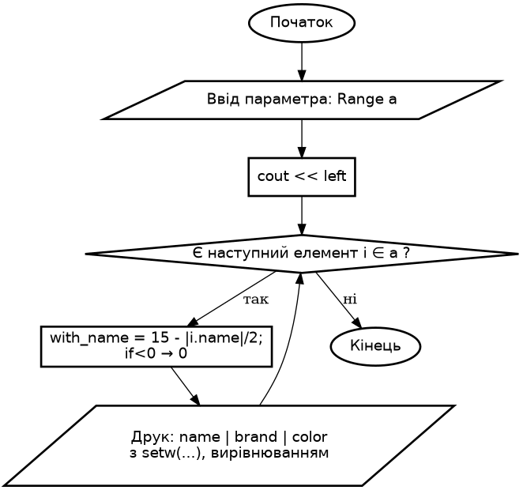
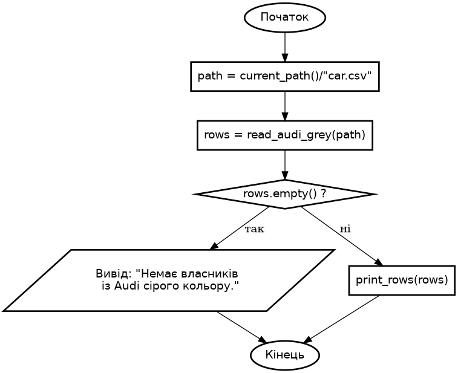
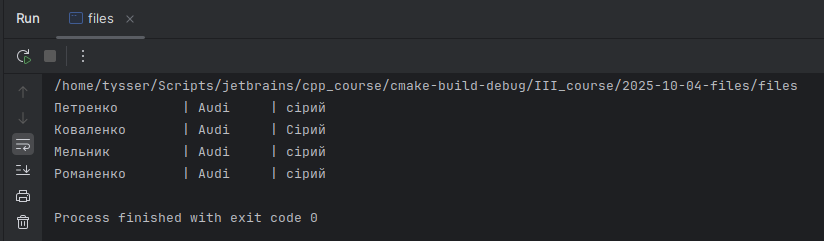

# Розробка програм з файловими змінними. Робота з файлами

**Лабораторна робота №5**

## Варіант 10

---

### Завдання 1
1) **Постановка задачі:**
- Сформувати текстовий файл `car.csv` із записами виду

```csv
# Прізвище;Марка;Колір
Петренко;Audi;сірий
Іваненко;BMW;чорний
Сидоренко;Audi;білий
Коваленко;Audi;Сірий
Шевченко;Toyota;сірий
Мельник;Audi;сірий
Тищенко;VW;білий
Гончаренко;Audi;чорний
Романенко;Audi;сірий
```

- Розробити програму яка зчитує файл та виводить відомості про власників автомобілів марки “Audi” сірого кольору.

2) **Вибір методу:**

- Формат зберігання: CSV-подібний текст із роздільниками `;`.
- `I/O`: стандартні C++ потоки (`std::ifstream`, `std::getline`, `std::stringstream`).
- Модель даних: `struct Car { string name, brand, color; }`.
- Фільтрація: відбір під час читання (умова на `brand ∈ {"Audi","audi"}` та `color ∈ {"сірий","Сірий"})`.

3) **Алгоритм**

```text
для кожного запису car у файлі:
    якщо рядок порожній або починається з "#":
        пропустити
    розділити рядок на name, brand, color за роздільником ";"
    якщо brand == "Audi" або "audi":
        якщо color == "сірий" або "Сірий":
            форматувати ім’я (з урахуванням ширини кирилиці)
            вивести у вигляді таблиці: name | brand | color
```

4) **UML**

- `read_audi_grey`



- `print_rows`



- `process_file`



5) **Тестування ( `test_task` ):**



---

```bash
sudo apt-get update && sudo apt-get install -y graphviz

# Генерація png
dot -Tpng read_audi_grey.dot -o read_audi_grey.png
dot -Tpng print_rows.dot -o print_rows.png
dot -Tpng process_file.dot -o process_file.png
# або svg
dot -Tpng read_audi_grey.dot -o read_audi_grey.svg
```