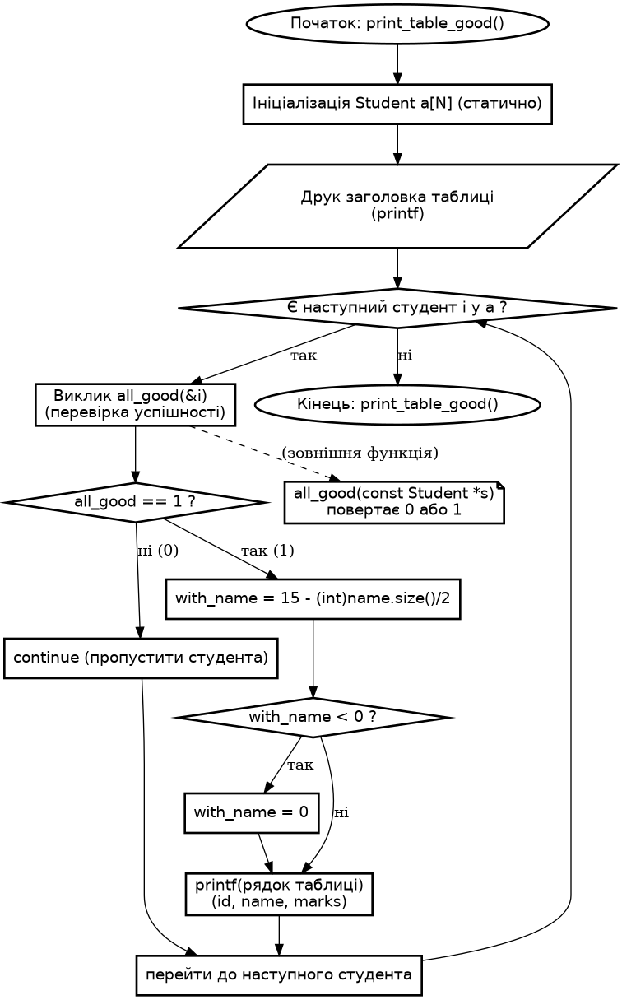

# Розробка програм з рядковими змінними та функціями користувача

**Лабораторна робота №4**

## Варіант 10

---

### Завдання 1

1) **Постановка задачі:**
- Дано масив записів студентів (`id`, `name`, `marks[4]`):

```cpp
    Student a[N] = {
        {1, "Iванчук С.О.", {4,4,3,4}},
        {2, "Панченко І.А.", {5,4,4,5}},
        {3, "Заєць О.М.",    {3,4,4,4}},
        {4, "Вельбицький П.О.", {4,3,3,3}},
        {5, "Сидоренко В.Р.", {2,3,3,2}},
        {6, "Кравченко З.I.", {3,5,4,5}},
        {7, "Якубів Р.Н.",   {5,4,5,4}},
        {8, "Зоренко П.М.",  {4,2,3,3}},
        {9, "Берестяк Г.С.", {4,5,5,5}},
        {10,"Дячик Н.С.",    {5,5,4,4}}
    };
```

- Потрібно надрукувати табличку, що містить тільки тих студентів, у яких всі оцінки - добрі або відмінні (4 або 5).

2) **Вибір методу:**
- Прямий лінійний перебір (`filter`): для кожного студента перевірити його `4` оцінки; якщо жодна `< 4` - додати до вихідної таблиці (надрукувати).

3) **Алгоритм**
```text
для кожного студента s у масиві a:
    ok = true
    для k = 0..3:
        якщо s.marks[k] < 4:
            ok = false
            break
    якщо ok:
        форматувати ім'я (рахунок ширини для кирилиці) і вивести рядок таблиці
```

4) **UML**
- `int all_good(const Student *s)` приймає вказівник на студента, перебирає його оцінки; якщо знайдеться хоча б одна оцінка менша за 4, повертає 0, інакше повертає 1.


- `void print_table_good()` опрацьовує (фільтрує) масив студентів за допомогою all_good і друкує відфільтровані записи (ті, що мають лише оцінки 4 або 5)



5) **Тестування:**


---

### Завдання 2

1) **Постановка задачі:**
- Дано текстовий масив:

```cpp 
string strs[12] = {
    "Привіт",
    "Алгоритми",
    "C++",
    "Сортування рядків",
    "Тест",
    "Лабораторна",
    "B(12)",
    "Я",
    "Україна",
    "Довгий рядок прикладу",
    "Код",
    "Рядок"
};
```

- Потрібно відсортувати масив у порядку спадання довжин його елементів і продемонструвати результат: вивести масив до та після сортування.

2) **Вибір методу:**

- Сортування масиву стандартним алгоритмом `sort` з компаратором: порівнюємо `x.size()` та `y.size()` і повертаємо true, коли `x.size() > y.size()` (тобто порядок — спадання довжини).

3) **Алгоритм**

```text
ініціалізувати масив strs[0..11] заданими рядками

друк "до сортування":
    для i = 0..11:
        вивести strs[i]

викликати sort(strs, strs+12, comparator), де
    comparator(x,y): повернути (x.size() > y.size())

друк "після сортування":
    для i = 0..11:
        вивести strs[i]
```

4) **UML**

- `template <size_t K>`
- `void print_array(const string (&a)[K])`


- `void sort_and_demo()`


5) **Тестування:**


---

### Функції для роботи з рядками `#include <string.h>`

| Функція                | Прототип                                              | Дія                                                                                                                                                                                                                                                    |
|------------------------|-------------------------------------------------------|--------------------------------------------------------------------------------------------------------------------------------------------------------------------------------------------------------------------------------------------------------|
| `atof`                 | `double atof(char *str);`                             | Перетворює рядок `str` в дійсне число подвійної точності. Перетворення здійснюється до першого недопустимого символу або до `'\0'`. Якщо не може перетворити — повертає 0.0                                                                            |
| `atoi`                 | `int atoi(char *str);`                                | Перетворює рядок `str` в десяткове ціле. Якщо число перевищує діапазон `int`, результат залежить від реалізації; якщо не може перетворити — повертає 0                                                                                                 |
| `atol`                 | `long atol(char *str);`                               | Перетворює рядок `str` в довге десяткове ціле                                                                                                                                                                                                          |
| `ecvt`                 | `char *ecvt(double v, int dig, int *dec, int *sign);` | Перетворює дійсне `v` у рядок: `dig` — кількість цифр; `dec` — позиція десяткової крапки; `sign` — знак (0/1). Додає `'\0'`. Повертає вказівник на рядок                                                                                               |
| `fcvt`                 | `char *fcvt(double v, int dig, int *dec, int *sign);` | Похоже на `ecvt`, але `dig` — кількість цифр після крапки (позиція крапки обчислюється інакше)                                                                                                                                                         |
| `gcvt`                 | `char *gcvt(double v, int dig, char *buf);`           | Перетворює дійсне `v` у рядок. На відміну від `ecvt`/`fcvt` розміщує рядок у попередньо оголошений буфер `buf`. `dig` — кількість символів рядка; результат містить представлення числа в фіксованому або плаваючому форматі в залежності від величини |
| `itoa`                 | `char *itoa(int v, char *str, int baz);`              | Перетворює ціле `v` в рядок `str` у системі числення `baz` (2<=baz<=36). Повертає вказівник на рядок                                                                                                                                                   |
| `ltoa`                 | `char *ltoa(long v, char *str, int baz);`             | Перетворює довге ціле `v` в рядок `str`                                                                                                                                                                                                                |
| `strcat`               | `char *strcat(char *sp, char *si);`                   | Приписує рядок `si` до рядка `sp`                                                                                                                                                                                                                      |
| `strchr`               | `char *strchr(char *str, char c);`                    | Знаходить у рядку `str` перше входження символа `c`                                                                                                                                                                                                    |
| `strcmp`               | `int strcmp(char *str1, char *str2);`                 | Порівнює рядки `str1` і `str2`. Повертає `<0` якщо `str1<str2`; `0` якщо рівні; `>0` якщо `str1>str2`                                                                                                                                                  |
| `stricmpi` / `stricmp` | `int stricmp(char *str1, char *str2);`                | Порівнює рядки `str1` і `str2` без врахування регістру для букв (не стандартна, реалізація залежить від платформи). Повертає значення аналогічно `strcmp`                                                                                              |
| `strcpy`               | `char *strcpy(char *sp, char *si);`                   | Копіює рядок `si` в рядок `sp`                                                                                                                                                                                                                         |
| `strcspn`              | `int strcspn(char *str1, char *str2);`                | Визначає довжину першого сегмента рядка `str1`, що містить символи, які **не** входять в множину символів рядка `str2`                                                                                                                                 |
| `strlen`               | `unsigned strlen(char *str);`                         | Обчислює довжину рядка `str`                                                                                                                                                                                                                           |
| `strlwr`               | `char *strlwr(char *str);`                            | Перетворює букви верхнього регістру в рядку в букви нижнього регістру                                                                                                                                                                                  |
| `strncat`              | `char *strncat(char *sp, char *si, int kol);`         | Приписує `kol` символів рядка `si` до рядка `sp`                                                                                                                                                                                                       |
| `strncmp`              | `int strncmp(char *str1, char *str2, int kol);`       | Порівнює `kol` перших символів рядків `str1` та `str2`. Результат аналогічний `strcmp`                                                                                                                                                                 |
| `strncmpi`             | `int strncmpi(char *str1, char *str2, int kol);`      | Порівнює `kol` перших символів рядків `str1` та `str2` без врахування регістру букв. Результат аналогічний `strcmp`                                                                                                                                    |
| `strncpy`              | `char *strncpy(char *sp, char *si, int kol);`         | Копіює `kol` символів рядка `si` в рядок `sp`                                                                                                                                                                                                          |
| `strpbrk`              | `char *strpbrk(char *str1, char *str2);`              | Знаходить у рядку `str1` перше входження довільного символа з множини символів рядка `str2`                                                                                                                                                            |
| `strrchr`              | `char *strrchr(char *str, char c);`                   | Знаходить у рядку `str` останнє входження символа `c`                                                                                                                                                                                                  |
| `strset`               | `char *strset(char *str, int ch);`                    | Записує символ `ch` у всі позиції рядка `str`. Повертає вказівник на `str`                                                                                                                                                                             |
| `strnset`              | `char *strnset(char *str, int ch, size_t n);`         | Записує символ `ch` у перші `n` позицій рядка `str`. Повертає вказівник на `str`. Символ `'\0'` не затирається, якщо `n > strlen(str)`                                                                                                                 |
| `strspn`               | `int strspn(char *str1, char *str2);`                 | Визначає довжину першого сегмента рядка `str1`, що містить символи, які входять (або не входять — див. реалізацію) у множину символів рядка `str2`                                                                                                     |
| `strstr`               | `char *strstr(char *str1, char *str2);`               | Повертає вказівник на елемент рядка `str1`, який є початком підрядка `str2`, і `NULL`, якщо `str2` не входить в `str1`                                                                                                                                 |
| `strupr`               | `char *strupr(char *str);`                            | Перетворює букви нижнього регістру рядка `str` у верхній                                                                                                                                                                                               |
| `ultoa`                | `char *ultoa(unsigned long v, char *str, int baz);`   | Перетворює беззнакове довге ціле `v` в рядок символів (вказана `baz` — система числення)                                                                                                                                                               |

---

### Функції перевірки та перетворення символів `#include <ctype.h>`

| Функція   |              Прототип | Дія                                                                                                                                                             |
|-----------|----------------------:|-----------------------------------------------------------------------------------------------------------------------------------------------------------------|
| `isalnum` | `int isalnum(int c);` | Повертає відмінне від 0 значення, якщо `c` — буква (A–Z, a–z) або цифра (0–9); інакше 0.                                                                        |
| `isalpha` | `int isalpha(int c);` | Повертає відмінне від 0 значення, якщо `c` — буква (A–Z або a–z); інакше 0.                                                                                     |
| `isascii` | `int isascii(int c);` | Повертає відмінне від 0 значення, якщо код `c` належить діапазону ASCII (0..127); інакше 0.                                                                     |
| `iscntrl` | `int iscntrl(int c);` | Повертає відмінне від 0 значення, якщо `c` — керуючий (control) символ (наприклад 0x00–0x1F або 0x7F); інакше 0.                                                |
| `isdigit` | `int isdigit(int c);` | Повертає відмінне від 0 значення, якщо `c` — цифра (0–9); інакше 0.                                                                                             |
| `isgraph` | `int isgraph(int c);` | Повертає відмінне від 0 значення, якщо `c` — графічний друкований символ (має графічне позначення, коди ~0x21–0x7E), тобто друкований, але не пробіл; інакше 0. |
| `islower` | `int islower(int c);` | Повертає відмінне від 0 значення, якщо `c` — літера нижнього регістру (a–z); інакше 0.                                                                          |
| `isprint` | `int isprint(int c);` | Повертає відмінне від 0 значення, якщо `c` — друкований символ (включно з пробілом, коди ~0x20–0x7E); інакше 0.                                                 |
| `ispunct` | `int ispunct(int c);` | Повертає відмінне від 0 значення, якщо `c` — пунктуаційний символ (друкований, але не літера й не цифра); інакше 0.                                             |
| `isupper` | `int isupper(int c);` | Повертає відмінне від 0 значення, якщо `c` — літера верхнього регістру (A–Z); інакше 0.                                                                         |
| `toupper` | `int toupper(int c);` | Перетворює символ `c` у відповідну велику літеру; повертає результат як `int` (якщо `c` не має відповідної великої літери — повертає `c`).                      |

### Функція для роботи з буферами (масивами символів) `#include<mem.h>` або `#include<string.h>`

| Функція    | Прототип                                                                                         | Дія                                                                                                                                                                                                                           |
|------------|--------------------------------------------------------------------------------------------------|-------------------------------------------------------------------------------------------------------------------------------------------------------------------------------------------------------------------------------|
| `memccpy`  | `void *memccpy(void *dest, const void *src, int c, size_t n);`                                   | Копіює до `n` байт з `src` у `dest`, зупиняється й повертає вказівник на байт після першого скопійованого символу `c`, якщо `c` зустрічається; інакше копіює `n` байт і повертає `NULL`. Буфери **не повинні** перекриватися. |
| `memmove`  | `void *memmove(void *dest, const void *src, size_t n);`                                          | Копіює `n` байт з `src` у `dest`. Підтримує перекривання буферів (робить безпечно). Повертає `dest`.                                                                                                                          |
| `movmem`   | `void *movmem(void *src, void *dest, unsigned n);`                                               | (нестандартна / старі бібліотеки) Копіює `n` байт з `src` у `dest`. Дозволяє перекривання. Повертає `dest`.                                                                                                                   |
| `movedata` | `void movedata(unsigned srcseg, unsigned srcoff, unsigned destseg, unsigned destoff, size_t n);` | (DOS-специфічна) Копіює `n` байт між сегмент:оффсет адресами (`srcseg:srcoff` → `destseg:destoff`).                                                                                                                           |
| `memcmp`   | `int memcmp(const void *s1, const void *s2, size_t n);`                                          | Порівнює перші `n` байтів буферів `s1` і `s2` у лексикографічному порядку. Повертає `<0` якщо `s1<s2`, `0` якщо рівні, `>0` якщо `s1> s2`.                                                                                    |
| `memicmp`  | `int memicmp(const void *s1, const void *s2, size_t n);`                                         | Нестандартна функція: як `memcmp`, але без урахування регістру букв (case-insensitive) для байтових порівнянь. Повертає значення аналогічно `memcmp`.                                                                         |
| `memchr`   | `void *memchr(const void *s, int c, size_t n);`                                                  | Шукає символ `c` серед перших `n` байтів буфера `s`. Повертає вказівник на знайдений байт або `NULL`, якщо не знайдено.                                                                                                       |

```bash
sudo apt-get update && sudo apt-get install -y graphviz

# Генерація png
dot -Tpng all_good.dot -o all_good.png
dot -Tpng print_table_good.dot -o print_table_good.png
# або svg
dot -Tpng all_good.dot -o all_good.svg
```
