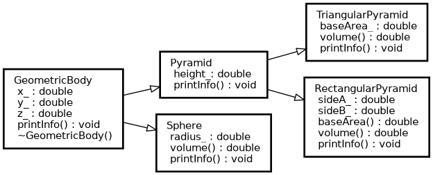
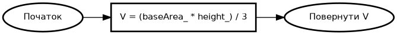
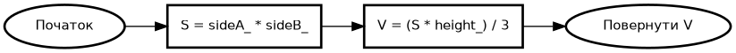
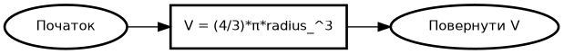
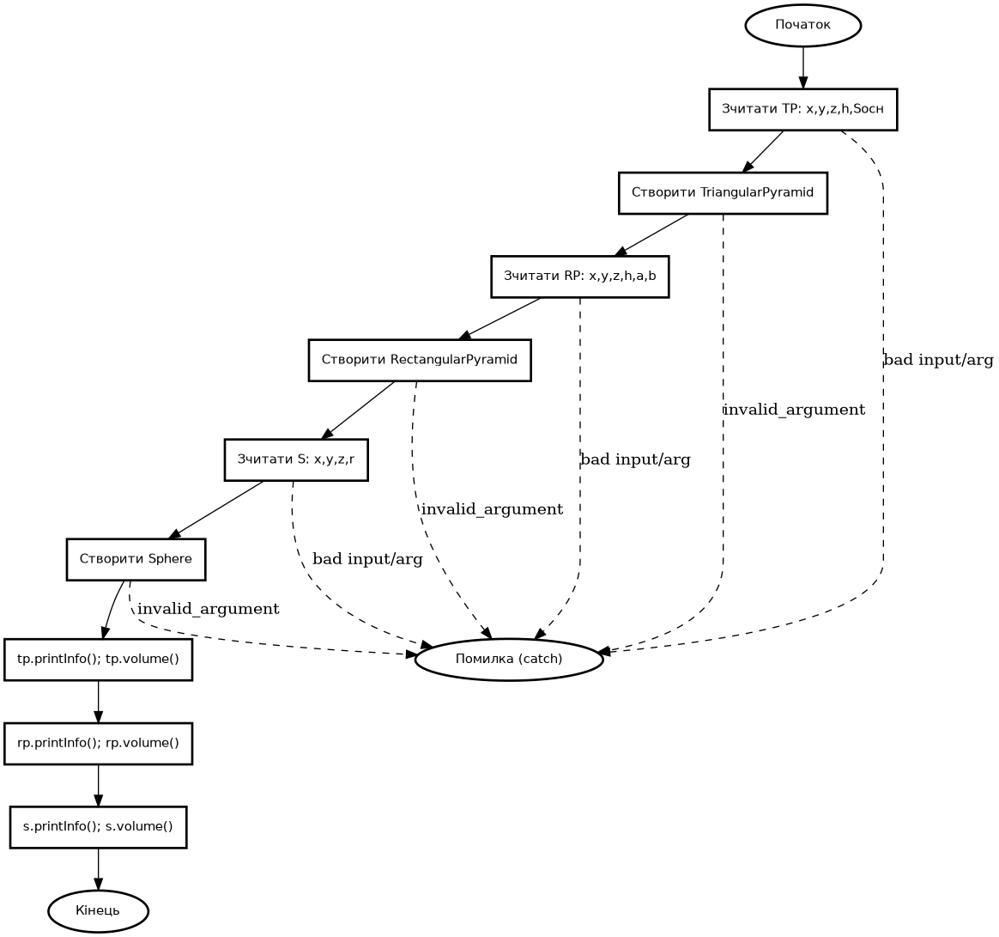
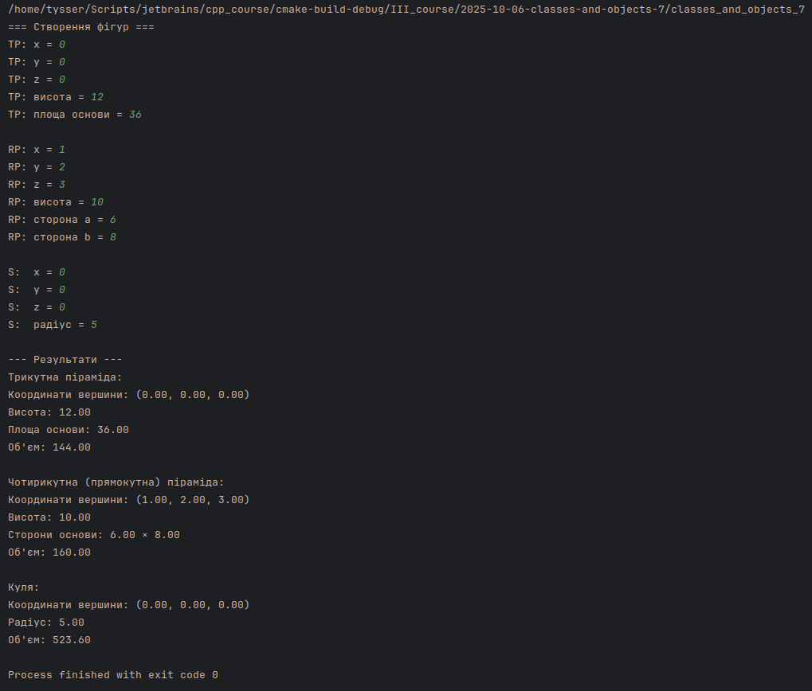
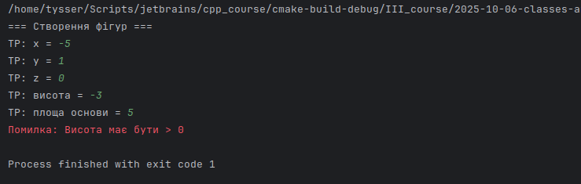
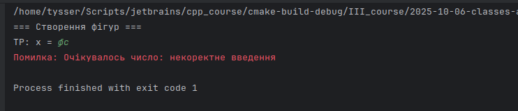

# Розробка програм з користувацькими класами. Робота з класами та об‘єктами.

**Лабораторна робота №7**

## Варіант 10

---

### Завдання 1

1) **Постановка задачі:**
- Створити базовий клас `GeometricBody`, який тримає координати однієї вершини `(x, y, z)`.
- Створити похідні класи:
  - `Pyramid` (додатково: `height_`);
  - `Sphere` (додатково: `radius_`).
- Від `Pyramid` створити:
  - `TriangularPyramid` (додатково: `baseArea_`);
  - `RectangularPyramid` (додатково: `sideA_`, `sideB_` - сторони прямокутної основи).
- Реалізувати:
  - конструктори із перевіркою параметрів;
  - вивід інформації про об’єкт (`printInfo()`);
  - обчислення об’єму (volume()) там, де це має сенс;
    - Трикутна піраміда (площа основи відома):
      $V = \dfrac{S_{\text{осн}} \cdot h}{3}$
    - Прямокутна піраміда (основа — прямокутник $a \times b$):
      $S_{\text{осн}} = a \cdot b,\quad V = \dfrac{a \cdot b \cdot h}{3}$
    - Куля:
      $V = \dfrac{4}{3},\pi r^{3}$
  - перехоплення винятків під час зчитування/перевірки;
  - демонстрацію роботи в main().

---

2) **Реалізація**
- Тип даних: double
- Доступ до координат у похідних: `protected`
- Перевірка інваріантів: кидання `std::invalid_argument` при `<= 0`
- Безпечне зчитування: утиліта `readDouble()` з `std::runtime_error` + `try/catch` у `main`
- Вивід: `std::ostream` із `std::fixed` та `std::setprecision(2)`
- Pi: std::numbers::pi_v<double> (C++20)

---

3) UML

- **`classes`:**



- **`tp_volume rp_volume sphere_volume`:**







- **`main_flow`:**



4) Тестування:







---

```bash
# Graphviz (для побудови UML)
sudo apt install graphviz -y

# Рендер будь-якого .dot у PNG (приклад):
dot -Tpng classes.dot -o classes.png

# classes.dot
# main_flow.dot
# tp_volume.dot
# rp_volume.dot
# sphere_volume.dot
```