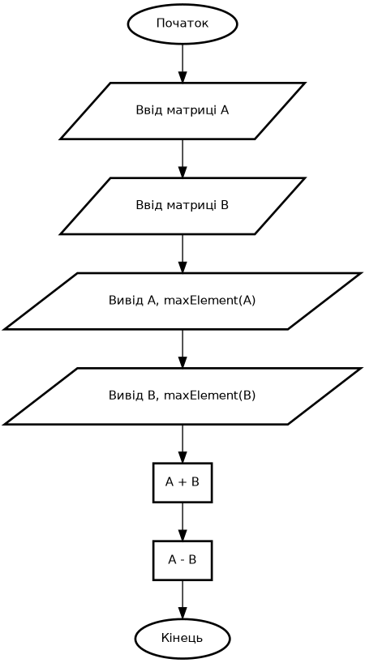
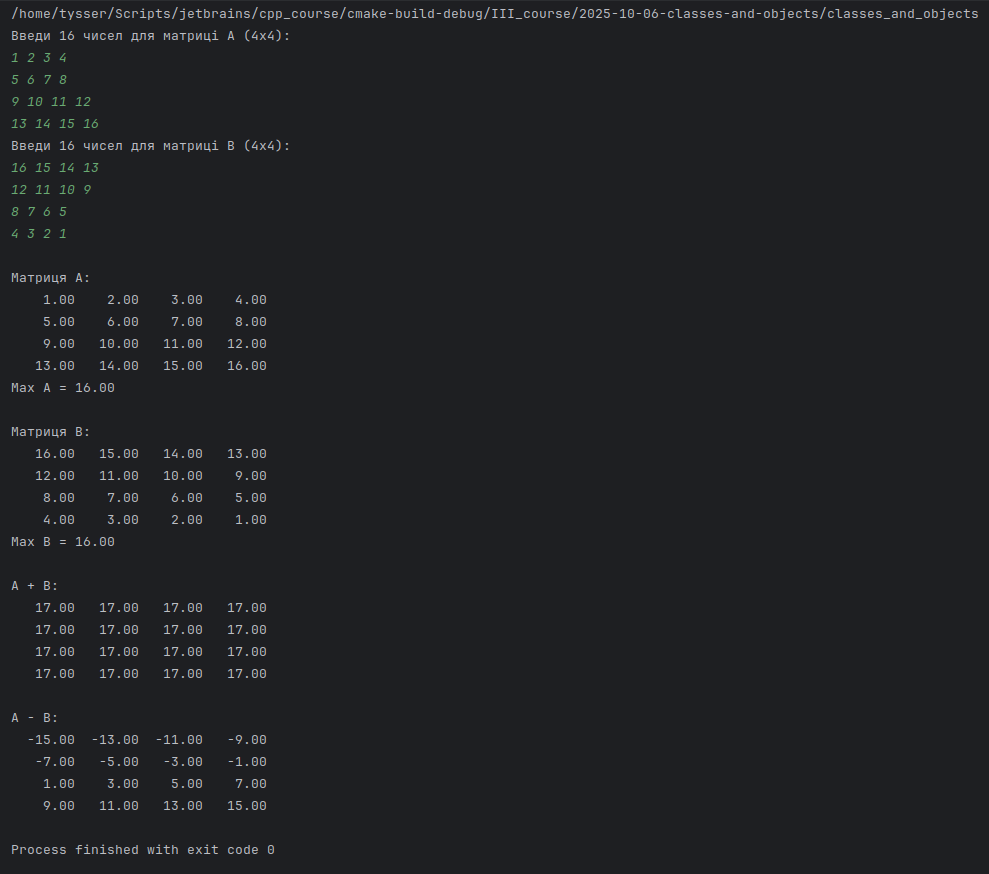

# Розробка програм з користувацькими класами. Робота з класами та об‘єктами.

**Лабораторна робота №6**

## Варіант 10

---

### Завдання 1

1) **Постановка задачі:**

- Створити клас `Matrix4x4`, який зберігає матрицю розміром `4×4`.
- Реалізувати:
  - введення елементів з клавіатури; 
  - виведення на екран; 
  - обчислення максимального елемента; 
  - перевантаження операторів `+` та `-`; 
  - демонстрацію роботи в `main()`.

---

2) **Вибір методу**

- Тип даних: `double`
- Зберігання: `std::array<std::array<double,4>,4>`
- Ввід/вивід: `std::istream`, `std::ostream`
- Обчислення: звичайні цикли без додаткових бібліотек
- Оператори `+`, `-` - покомпонентне додавання/віднімання

---

4) **Методи класу** `Matrix4x4`

| Метод                    | Опис                                     |
|--------------------------|------------------------------------------|
| `read()`                 | Зчитує 16 елементів матриці              |
| `print()`                | Виводить матрицю у форматованому вигляді |
| `maxElement()`           | Повертає найбільше значення              |
| `operator+`, `operator-` | Покомпонентне додавання та віднімання    |

---

5) UML (Graphviz)



---

6) **Тестування**

---



```bash
sudo apt install graphviz -y

dot -Tpng main_flow.dot -o main_flow.png
```
