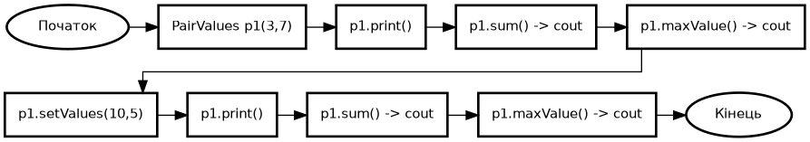

# Розробка програм з користувацькими класами. Робота з класами та об‘єктами.

**Тема 8. Питання для самостійного опрацювання**

---

Класи які буде використано в завданнях


---

### Завдання 1

1) **Постановка задачі:**
- Створити клас із двома цілочисловими полями; Повинен уміти виводити/змінювати значення; обчислювати суму та максимум пари.

2) **Реалізація**

- Типи: int для обох змінних.
- Інкапсуляція: приватні поля `x_`, `y_`; публічні гетери/операції.
- Конструктор: з параметрами за замовчуванням, explicit.
- Методи: `print()`, `setValues(x, y)`, `sum()`, `maxValue()`.
- I/O: `std::cout` для демонстрації.
- Старт функції: `void pairValues()` демонструє створення, зміну, суму й максимум.

3) UML `void pairValues()`



---

### Завдання 2

1) **Постановка задачі:**

- Описати десятковий лічильник у діапазоні `[min; max]` з операціями інкремент/декремент та доступом до поточного значення.

2) **Реалізація**

- Поля: `min_`, `max_`, `value_` (тип `int`, приватні).
- Конструктор: `explicit DecimalCounter(min=0, max=9, value=0)`; перевіряє інваріанти (`min_ <= max_`, `value_ ∈ [min; max]`).
- Методи: `increment()`, `decrement()`, `getValue()`, `print()`.
- При порушенні інваріантів кидає `std::invalid_argument`.
- I/O: `std::cout` для стану лічильника.
- Старт функції: `void decimalCounter()` демонструє ініціалізацію, перевірку та зміну значень.

3) UML `void decimalCounter()`


---

### Завдання 3

1) **Постановка задачі:**

- Створити клас `Employee` з `id` (`int`) і зарплатою (`double`); ввести `N` працівників і вивести інформацію про них.

2) **Реалізація**

- Поля: `id_` (`int`), `salary_` (`double`), приватні.
- Конструктор: `explicit Employee(int id, double salary)`; перевіряє інваріанти (`id_ > 0`, `salary_ >= 0`) і кидає `std::invalid_argument` при порушенні.
- Метод виводу: `print()` у читабельному форматі.
- Збір даних: `std::vector<Employee>`, `reserve(n)`.
- Ввід/вивід: `std::cin` для `n`, `id`, `salary`; `std::cout` для списку.
- У `employee()` використано `try/catch` для повторного вводу при помилці.
- Старт функції: `void employee()` читає, створює, перевіряє і друкує список.

3) UML `void employee()`


---

### Тестування:


```bash
# Graphviz (для побудови UML)
sudo apt install graphviz -y

# Рендер будь-якого .dot у PNG (приклад):
dot -Tpng classes.dot -o classes.png

# classes.dot
# pairValues.dot
# decimalCounter.dot
# employee.dot
```