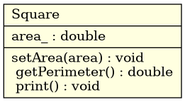
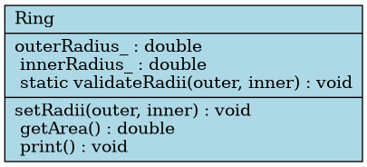
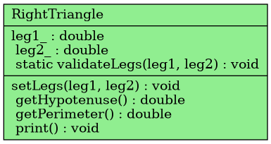
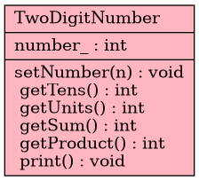
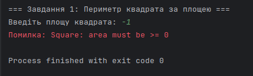
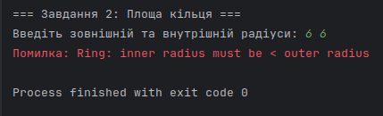
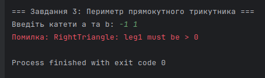
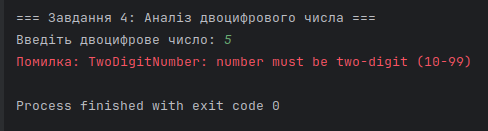
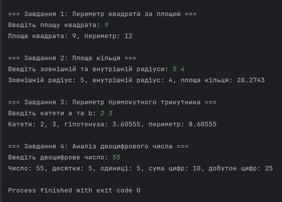

# squarePerimeter, ringArea, rightTrianglePerimeter, twoDigitAnalysis.

**Тема 9. Робота з класами та об‘єктами.**

---

### Завдання 1

1) **Постановка задачі:**
- Створити клас `Square`, який обчислює **периметр квадрата**, якщо задано його **площу**.
- Передбачити перевірку на коректність вхідних даних.

$$
P = 4\sqrt{S}
$$

2) **Реалізація**



- Тип: `double` для площі.
- Інкапсуляція: приватне поле `area_`.
- Конструктор: `explicit Square(double area = 0.0)`; перевіряє інваріант (`area_ >= 0`).
- Методи:
  - `setArea(area)` — встановлення нового значення;
  - `getPerimeter()` — обчислення `4 * sqrt(area_)`;
  - `print()` — вивід результату.
- I/O: `std::cin` для вводу, `std::cout` для виводу.
- Старт функції: `void squarePerimeter()` демонструє створення об’єкта, перевірку та обчислення периметра.

---

### Завдання 2

1) **Постановка задачі:**
- Створити клас `Ring`, який обчислює **площу кільця** за заданими **зовнішнім** та **внутрішнім** радіусами.
- Забезпечити перевірку правильності даних (радіуси > 0, внутрішній < зовнішнього).

$$
S_{\text{кільця}} = \pi \left(R^2 - r^2\right), \quad R>r>0
$$

2) **Реалізація**



- Поля: `outerRadius_`, `innerRadius_` (`double`, приватні).
- Валідація: статичний метод `validateRadii(outer, inner)` викликається у конструкторі та `setRadii()`.
- Конструктор: `explicit Ring(const double outer = 1.0, const double inner = 0.0)`; перевіряє коректність даних.
- Методи:
  - `setRadii(outer, inner)` — встановлення значень із перевіркою;
  - `getArea()` — обчислення $pi * (outer^2 - inner^2)$;
  - `print()` — вивід результатів.
- Стартова функція: `void ringArea()` — демонстрація роботи класу.

---

### Завдання 3

1) **Постановка задачі:**
- Створити клас `RightTriangle`, який за заданими катетами обчислює **гіпотенузу** та **периметр** прямокутного трикутника.
- Перевірити можливість існування трикутника (обидва катети > 0).

$$
P_{\triangle} = a + b + \sqrt{a^2 + b^2}, \quad a>0,\; b>0
$$

2) **Реалізація**



- Поля: `leg1_`, `leg2_` (`double`, приватні).
- Валідація: статичний метод `validateLegs(leg1, leg2)`.
- Конструктор: `explicit RightTriangle(const double leg1 = 1.0, const double leg2 = 1.0)`; перевіряє інваріанти (`leg1 > 0`, `leg2 > 0`).
- Методи:
  - `setLegs(a, b)` — зміна катетів;
  - `getHypotenuse()` — $sqrt(a^2 + b^2)$;
  - `getPerimeter()` — $a + b + c$;
  - `print()` — вивід усіх результатів.
- I/O: `std::cin`, `std::cout`.
- Стартова функція: `void rightTrianglePerimeter()` демонструє перевірку та розрахунок.

---

### Завдання 4

1) **Постановка задачі:**
- Створити клас `TwoDigitNumber`, який аналізує **двоцифрове число**:
    - визначає кількість десятків та одиниць,
    - знаходить суму та добуток його цифр.
- Передбачити перевірку, що число дійсно двоцифрове (10–99).

$$
(t,u,s,p)=\left(\left\lfloor \frac{n}{10} \right\rfloor,\; n\bmod 10,\; \left\lfloor \frac{n}{10} \right\rfloor + (n\bmod 10),\; \left\lfloor \frac{n}{10} \right\rfloor \cdot (n\bmod 10)\right)
$$

| Позначення | Значення                                  | Пояснення                                     |
|------------|-------------------------------------------|-----------------------------------------------|
| `t`        | $\left\lfloor \frac{n}{10} \right\rfloor$ | кількість десятків (ділення на 10 без остачі) |
| `u`        | $n \bmod 10$                              | кількість одиниць (остача від ділення на 10)  |
| `s`        | $t + u$                                   | сума цифр числа                               |
| `p`        | $t \cdot u$                               | добуток цифр числа                            |


2) **Реалізація**



- Поле: `number_` (`int`, приватне).
- Конструктор: `explicit TwoDigitNumber(int number = 10)`; перевіряє інваріант (`10 ≤ number ≤ 99`).
- Методи:
  - `setNumber(n)` — встановлення з перевіркою;
  - `getTens()`, `getUnits()`, `getSum()`, `getProduct()` — обчислення частин;
  - `print()` — вивід результатів.
- I/O: `std::cin`, `std::cout`.
- Стартова функція: `void twoDigitAnalysis()` — демонстрація роботи класу.

---

### Тестування:






```bash
# Graphviz (для побудови UML)
sudo apt install graphviz -y

# Рендер будь-якого .dot у PNG (приклад):
dot -Tpng classes.dot -o classes.png

# squarePerimeter.dot
# ringArea.dot
# rightTrianglePerimeter.dot
# twoDigitAnalysis.dot
```

```bash
# Біжимо по dot файлам у папці
for f in *.dot; do
    # Для кожного виконуємо команду створення малюнку діаграми
    dot -Tpng "$f" -o "${f%.dot}.png"
done
```