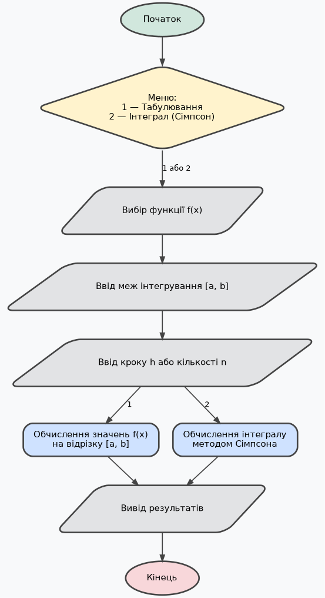

## Табулювання функцій та обчислення інтегралів методом Сімпсона

---

**Лабораторна робота №10**



---

```bash
# Graphviz (для побудови блок-схем)
sudo apt install graphviz -y

# Рендер будь-якої діаграми у PNG (приклад):
dot -Tpng scheme_main.dot -o scheme_main.png

# Автоматичний рендер усіх .dot файлів у поточній директорії
for f in *.dot; do
    dot -Tpng "$f" -o "${f%.dot}.png"
done
```