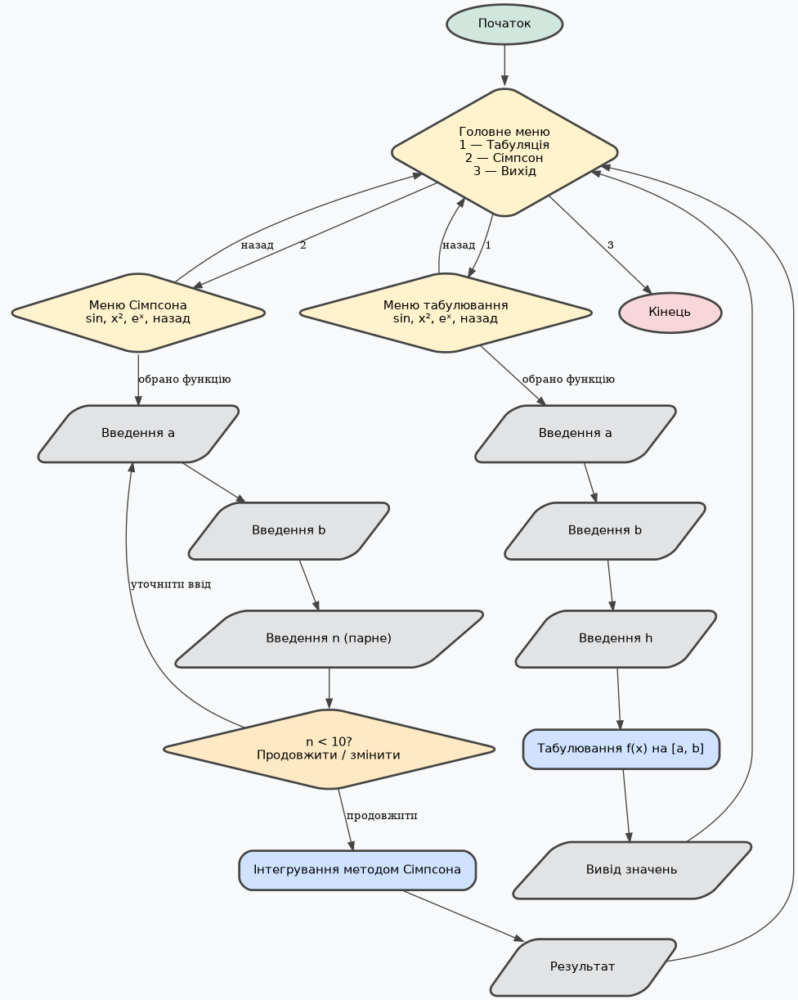
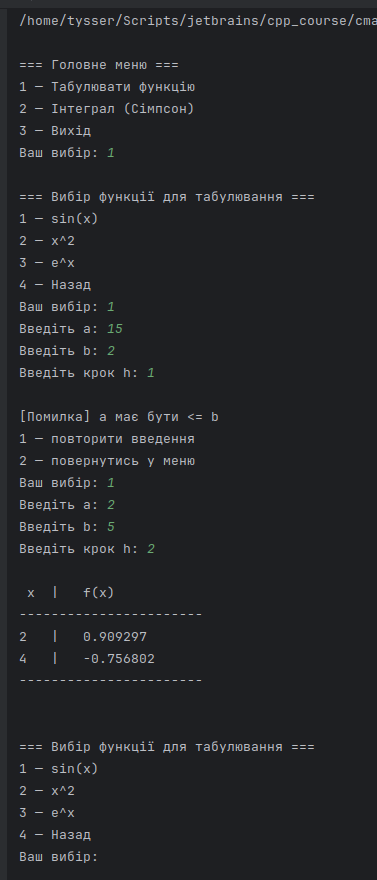
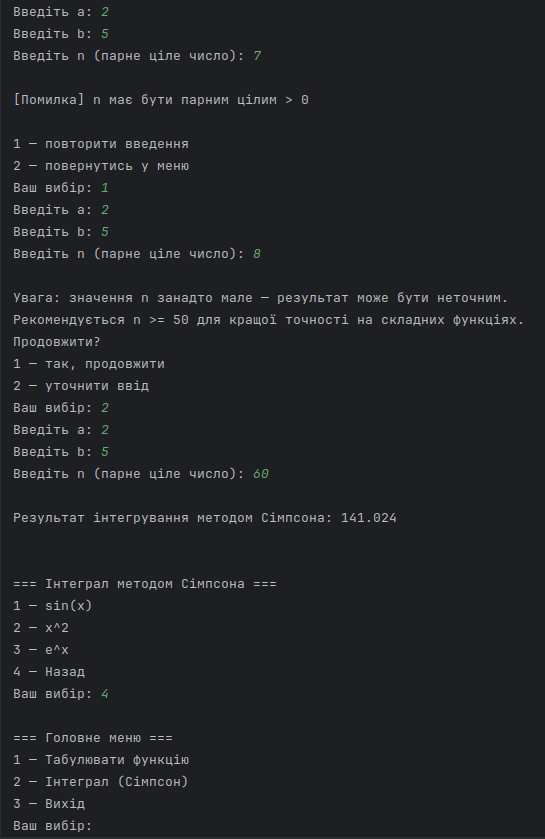

## Табулювання функцій та обчислення інтегралів методом Сімпсона

---

**Лабораторна робота №10**

### Мета роботи

Ознайомитися з табулюванням елементарних функцій на заданому відрізку та
методом чисельного інтегрування Сімпсона. Реалізувати програму з меню,
яка надає можливість:

- обрати одну з елементарних функцій;
- виконати її табулювання на проміжку [a, b] з кроком h;
- обчислити визначений інтеграл методом Сімпсона з параметром n (парне число);
- обробляти некоректне введення користувача.

### Перевірка коректності введення

Програма контролює:

- `a ≤ b` — коректність меж інтегрування/табулювання
- `h > 0` — позитивний крок табуляції
- `n > 0, n % 2 == 0` — метод Сімпсона вимагає парну кількість розбиттів
- повторне введення у разі помилки
- попередження про мале `n` (для покращення точності)



### 1. Табулювання функцій
- Для прикладу обрані три прості функції $sin(x)$ , $x^2$ та $e^x$



### 2. Обчислення інтегралів методом Сімпсона

#### Метод Сімпсона (параболічний метод)

- базується на апроксимації функції на кожному малому проміжку параболою другого степеня.

Формула:

$$
h = \frac{b - a}{n}
$$

$$
I = \frac{h}{3}\left[ f(a) + f(b) + 4\sum_{i=1,3,5,\ldots}^{n-1} f(x_i) + 2\sum_{i=2,4,6,\ldots}^{n-2} f(x_i) \right]
$$



---

```bash
# Graphviz (для побудови блок-схем)
sudo apt install graphviz -y

# Рендер будь-якої діаграми у PNG (приклад):
dot -Tpng scheme_main.dot -o scheme_main.png

# Автоматичний рендер усіх .dot файлів у поточній директорії
for f in *.dot; do
    dot -Tpng "$f" -o "${f%.dot}.png"
done
```