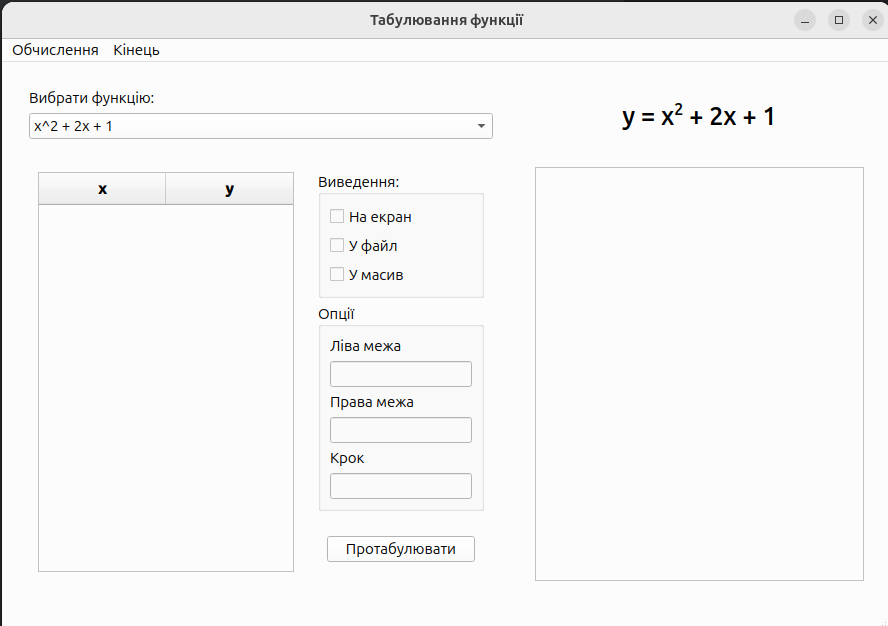

# Програмування циклів. Об'єкти: Memo, MainMenu, PopupMenu, CheckBox, GroupBox
**Лабораторна робота 9**

---
## Програма роботи:
- Написати програму для побудови графіка функції
- Програмне забезпечення: Qt6

**Qt аналоги компонентів**
### 
| C++Builder | Qt6                                 |
|------------|-------------------------------------|
| Edit       | QLineEdit                           |
| Label      | QLabel                              |
| Memo       | QTextEdit                           |
| GroupBox   | QGroupBox                           |
| CheckBox   | QCheckBox                           |
| MainMenu   | QMenuBar                            |
| PopupMenu  | QMenu (через setContextMenuPolicy)  |
| Chart      | QtCharts (QChartView + QLineSeries) |


```bash
sudo apt update

# Встановити Qt6Charts
sudo apt install qt6-charts-dev
# Встановити tools
sudo apt install qt6-base-dev qt6-tools-dev qt6-tools-dev-tools
```


```text
┌─────────────────────────────────────────────────────────────────────────┐
│  Меню:  Обчислення | Кінець                                             │
├───────────────────────────────────────┌─────────────────────────────────┤
│ ComboBox (формули y = ...)            │  Графік                         │
├───────────────────┬───────────────────┤                                 │ 
│ Таблиця           │  [Виведення]      │                                 │
│                   │   ☐ На екран      │                                 │
│                   │   ☐ У файл        │                                 │
│                   │   ☐ У масив       │                                 │
│                   │                   │                                 │
│                   │  Поле: Ліва межа  │                                 │
│                   │  Поле: Права межа │                                 │
│                   │  Поле: Крок       │                                 │
├─────────────────────────────────────────────────────────────────────────┤
│ Кнопка "Побудувати"                                                     │
└─────────────────────────────────────────────────────────────────────────┘
```

