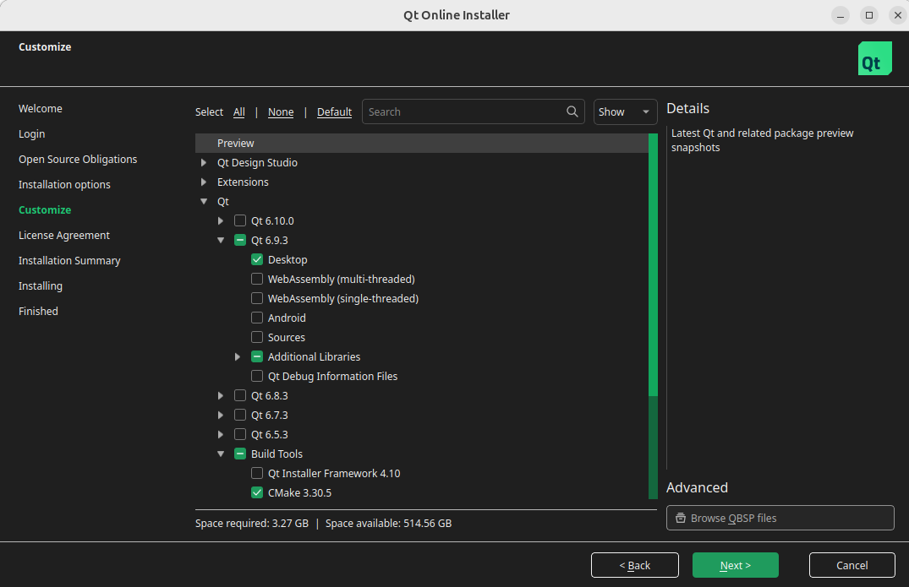
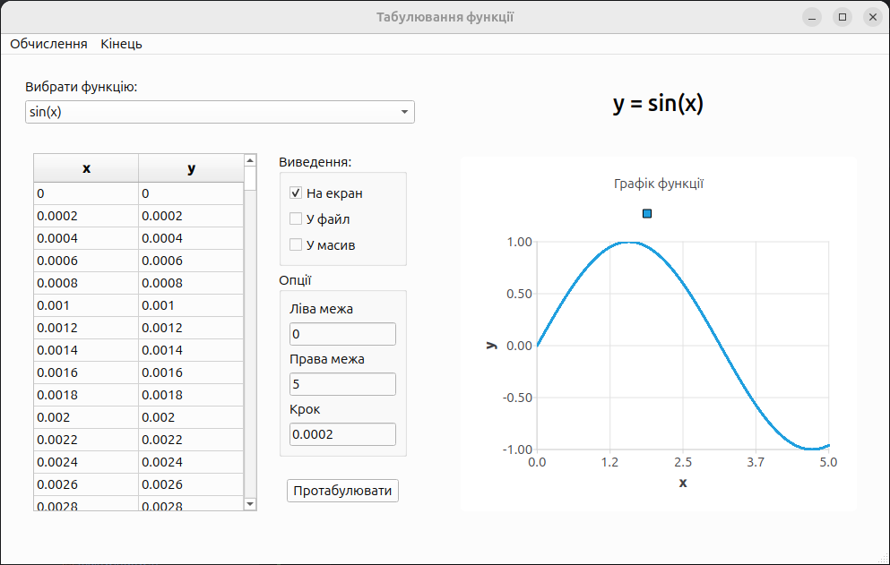
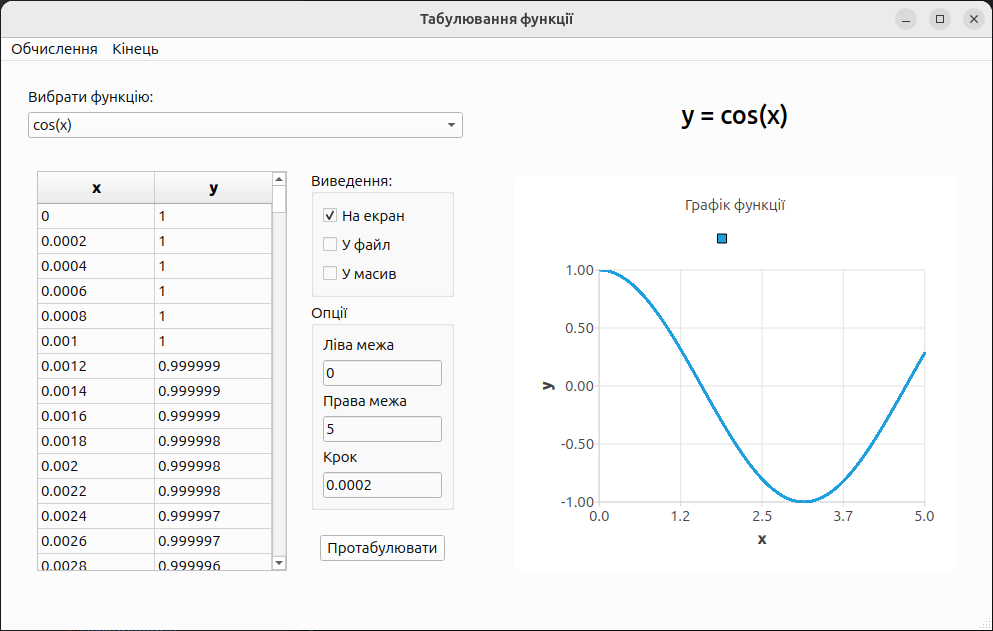
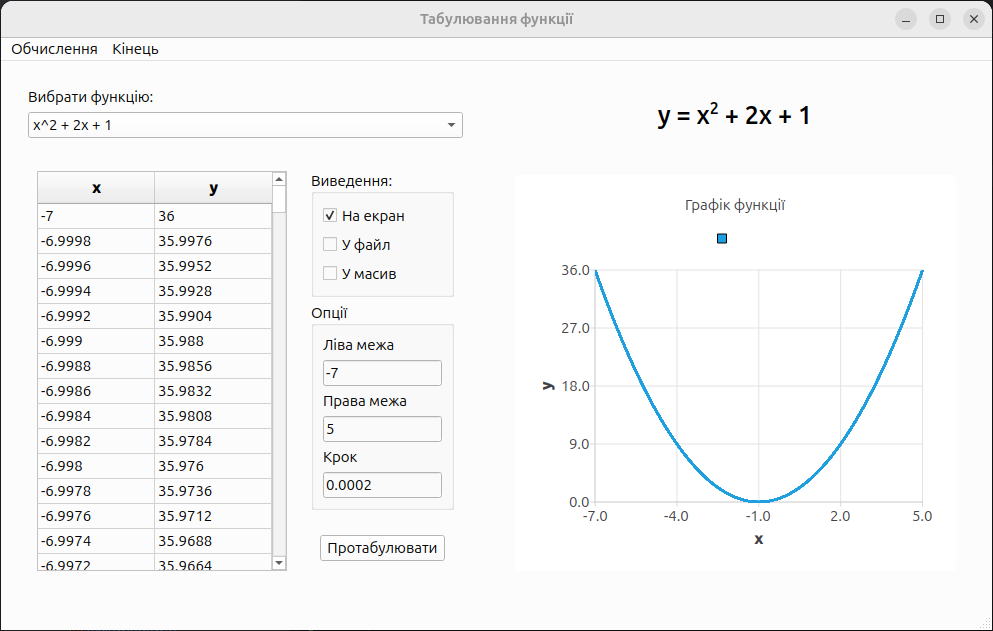

# Програмування циклів. Об'єкти: Memo, MainMenu, PopupMenu, CheckBox, GroupBox
**Лабораторна робота 9**

---

## Програма роботи:
- Написати програму для побудови графіка функції
- Програмне забезпечення: Qt6(`QtDesigner`) замість C++Builder

**`Qt - аналоги` компонентів**

| C++Builder | Qt6                                 |
|------------|-------------------------------------|
| Edit       | QLineEdit                           |
| Label      | QLabel                              |
| Memo       | QTextEdit                           |
| GroupBox   | QGroupBox                           |
| CheckBox   | QCheckBox                           |
| MainMenu   | QMenuBar                            |
| PopupMenu  | QMenu (через setContextMenuPolicy)  |
| Chart      | QtCharts (QChartView + QLineSeries) |

---

## Встановлення інструментів QT6

```bash
sudo apt update

# Встановити Qt6Charts
# Скачати інсталер
# https://www.qt.io/download-qt-installer (qt-online-installer-linux-x64-4.10.0.run)

chmod +x qt-online-installer-linux-x64-4.10.0.run
./qt-online-installer-linux-x64-4.10.0.run
```

### Обираємо `Desktop` `Charts` `Creator` `CMake` `Ninja` `Shader Tools`

(`QtDesigner` всередині `Qt Creator`)



```bash
# Запустити QtDesigner
~/Qt/6.9.3/gcc_64/bin/designer &
```

---

## Завдання:

- Створити Qt-додаток, який дозволяє користувачу вибрати математичну функцію, задати інтервал та крок табуляції, обчислити значення, відобразити їх у таблиці та побудувати графік. Результат має мати можливість виводитись на екран, у файл або у внутрішній масив для подальшої обробки.

### Спрощений лейаут

```text
┌─────────────────────────────────────────────────────────────────────────┐
│  Меню:  Обчислення | Кінець                                             │
├───────────────────────────────────────┌─────────────────────────────────┤
│ ComboBox (формули y = ...)            │  Графік                         │
├───────────────────┬───────────────────┤                                 │ 
│ Таблиця           │  [Виведення]      │                                 │
│                   │   ☐ На екран      │                                 │
│                   │   ☐ У файл        │                                 │
│                   │   ☐ У масив       │                                 │
│                   │                   │                                 │
│                   │  Поле: Ліва межа  │                                 │
│                   │  Поле: Права межа │                                 │
│                   │  Поле: Крок       │                                 │
├─────────────────────────────────────────────────────────────────────────┤
│ Кнопка "Побудувати"                                                     │
└─────────────────────────────────────────────────────────────────────────┘
```

---

## Валідації вводу

- Перед обчисленням виконуються перевірки коректності введених даних:
  - Перевірка, чи введені значення дійсні числа (okA, okB, okH);
  - Крок h повинен бути більший за нуль;
  - Права межа b повинна бути більшою за ліву межу a.

- Таблиця прикладів роботи QString::toDouble()
  - | Ввід         | a   | okA                                  |
    |--------------|-----|--------------------------------------|
    | `5.2`        | 5.2 | true                                 |
    | `-10`        | -10 | true                                 |
    | `abc`        | 0   | false                                |
    | `5,3` (кома) | 5   | true в деяких локалях, false в інших |
    | `""` (пусто) | 0   | false                                |

---

## Тестування:





