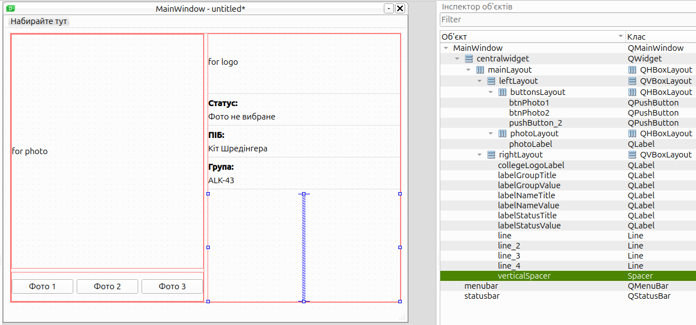
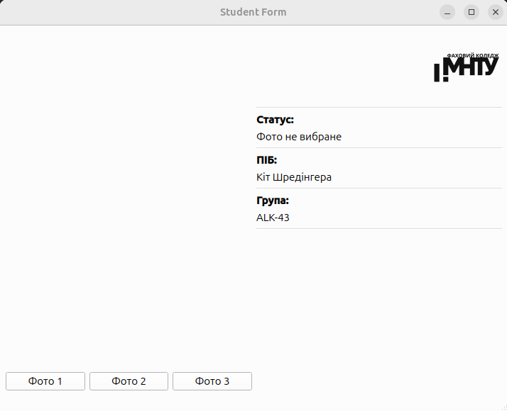
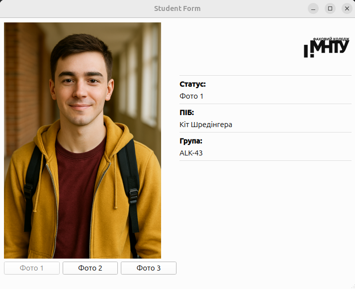
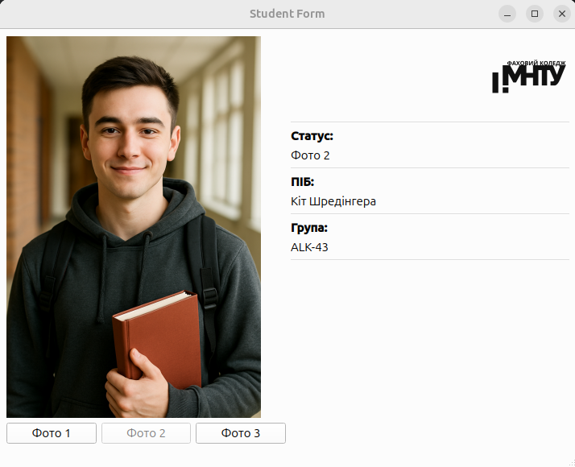
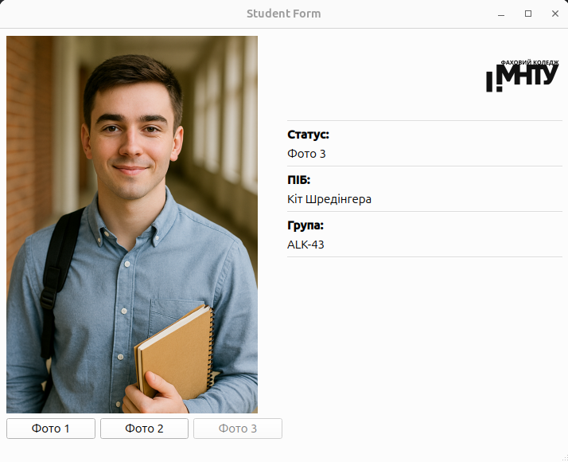
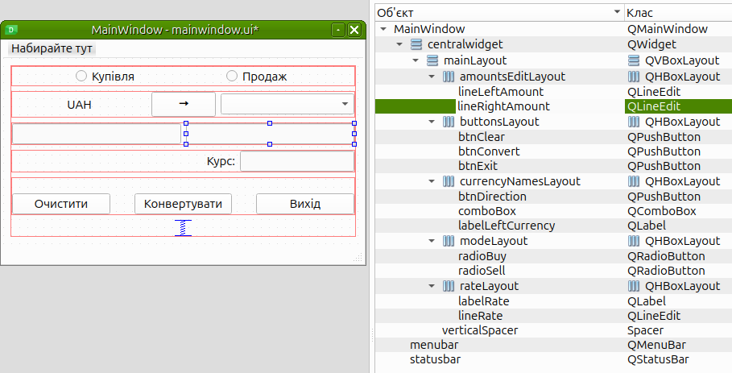
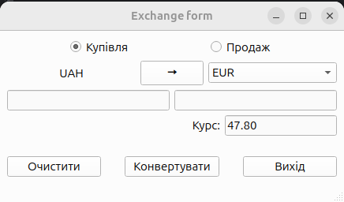

# Стандартні елементи інтерфейсу. Робота з формами та сигналами-слотами

**Лабораторна робота 8**

---

## Програма роботи:

- Розробити програму «Анкета студента» з перемиканням зображень
- Розробити програму «Обмін валюти»
- Програмне забезпечення: Qt6 (QtDesigner)

### Загальна логіка Qt

- UI створюється в Qt Designer, файл mainwindow.ui генерує клас Ui::MainWindow, який ініціалізується в конструкторі MainWindow. 
- Програма стартує через QApplication, створює об'єкт MainWindow і відображає його на екрані.
- Система збірки — CMake, який автоматично обробляє .ui-файли та Qt-макроси (AUTOUIC, AUTORCC, AUTOMOC).

```cpp
#include <QApplication>
#include "mainwindow.h"

int main(int argc, char *argv[]) {
    QApplication app(argc, argv);
    MainWindow w;
    w.show();
    return QApplication::exec();
}
```

### 1) «Анкета студента»
- Створи форму з написами про студента та двома зображеннями, що перекриваються; кнопки по кліку показують потрібне фото і ховають інше. 
- Розширення: додати третє фото, змінювати підписи/доступність кнопок і підтримувати коректну послідовність перемикань та початкові стани видимості.

  - Структура елементів на формі:
  
    | objectName         | type           | value (text / role)       |
    |--------------------|----------------|---------------------------|
    | `collegeLogoLabel` | QLabel         | `for logo` (placeholder)  |
    | `labelGroupTitle`  | QLabel         | `Група:`                  |
    | `labelGroupValue`  | QLabel         | `ALK-43`                  |
    | `labelNameTitle`   | QLabel         | `ПІБ:`                    |
    | `labelNameValue`   | QLabel         | `Кіт Шредінгера`          |
    | `labelStatusTitle` | QLabel         | `Статус:`                 |
    | `labelStatusValue` | QLabel         | `Фото не вибране`         |
    | `line`             | QFrame (HLine) | horizontal line           |
    | `line_2`           | QFrame (HLine) | horizontal line           |
    | `line_3`           | QFrame (HLine) | horizontal line           |
    | `line_4`           | QFrame (HLine) | horizontal line           |
    | `verticalSpacer`   | QSpacerItem    | —                         |
    | `photoLabel`       | QLabel         | `for photo` (placeholder) |
    | `btnPhoto1`        | QPushButton    | `Фото 1`                  |
    | `btnPhoto2`        | QPushButton    | `Фото 2`                  |
    | `btnPhoto3`        | QPushButton    | `Фото 3`                  |
  
  - 

  - 

  - 

  - 

  - 

- Зображення підключені через `resources.qrc` - Qt-ресурс, який вбудовує файли всередину виконуваного додатка, що робить програму незалежною від зовнішніх картинок.
- Завантаження виконується через QPixmap, а відображення через QLabel з пропорційним масштабуванням.
- Перемикання фото реалізовано сигналами та слотами: натискання кнопки встановлює відповідне зображення, оновлює текст статусу та блокує кнопку активного фото.

### 2) «Обмін валюти»
- Зробити форму фіксованого розміру з двома перемикачами «Купівля/Продаж», полями для курсів і суми, полем-результатом тільки для читання, кнопками «Обчислити» та «Вихід», і стрілкою напрямку операції. 
- По «Обчислити» конвертувати суму за вибраним напрямком, додати кнопку очищення, і можливість міняти напрямок кліком по стрілці.
  - Структура елементів на формі:

    | objectName          | type         | value (text / role)                         |
    |---------------------|--------------|---------------------------------------------|
    | `radioBuy`          | QRadioButton | `Купівля` *(checked = true by default)*     |
    | `radioSell`         | QRadioButton | `Продаж`                                    |
    | `labelLeftCurrency` | QLabel       | `UAH` *(фіксована валюта зліва)*            |
    | `btnDirection`      | QPushButton  | `→` *(міняється на `←` при зміні напрямку)* |
    | `comboBox`          | QComboBox    | `USD`, `EUR` *(валюта справа)*              |
    | `lineLeftAmount`    | QLineEdit    | поле вводу *(активне при купівлі)*          |
    | `lineRightAmount`   | QLineEdit    | поле вводу *(активне при продажу)*          |
    | `labelRate`         | QLabel       | `Курс:`                                     |
    | `lineRate`          | QLineEdit    | курс з API *(read-only)*                    |
    | `btnClear`          | QPushButton  | `Очистити`                                  |
    | `btnConvert`        | QPushButton  | `Конвертувати`                              |
    | `btnExit`           | QPushButton  | `Вихід`                                     |

  - 

  - 

- Курси валют завантажуються онлайн через `QNetworkAccessManager` з відкритого API ПриватБанку.
  - https://api.privatbank.ua/p24api/pubinfo?json&exchange&coursid=5
  - Відповідь:
  ```json
    [{"ccy":"EUR","base_ccy":"UAH","buy":"47.80000","sale":"48.80000"},{"ccy":"USD","base_ccy":"UAH","buy":"41.47000","sale":"42.07000"}]
  ```
- Режим конвертації (Купівля / Продаж) та напрямок задаються радіокнопками та кнопкою-стрілкою, що змінює напрям і автоматично перемикає доступність полів вводу.
- Обробка введення та відображення результату виконується через QLineEdit: при купівлі користувач вводить суму в гривні, при продажу - суму валюти, а відповідне друге поле блокується від редагування.
- Конвертація виконується у слоті кнопки «Конвертувати»: у режимі купівлі гривня ділиться на курс, у режимі продажу - множиться, після чого результат відображається у відповідному полі.
- Кнопки «Очистити» та «Вихід» реалізують скидання введених значень та завершення програми.
  
