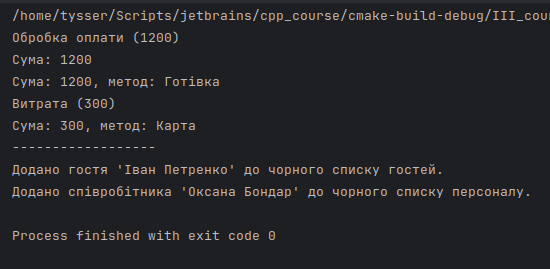

# Тема 11. Перевантаження аргументів

---

## Завдання

- Дослідити застосування поліморфізму через перевантаження функцій:
    - за типом аргументів;
    - за кількістю аргументів.
- Приклади з реальної предметної області - хостельної системи.

---

## Теорія

- Перевантаження функцій (`function overloading`) - це можливість визначати кілька функцій з однаковим ім’ям, але різною сигнатурою.  
  Відмінність може бути у типах, кількості або порядку аргументів.  
  Вибір відповідної функції відбувається під час компіляції, що є проявом статичного поліморфізму(`compile-time polymorphism`).

- Основні правила та критерії:
  - Кількість параметрів: Функції можуть відрізнятися кількістю параметрів.
  - Типи параметрів: Функції можуть мати однакову кількість параметрів, але різні типи даних цих параметрів (наприклад, `int` та `double`).
  - Порядок параметрів: Функції можуть мати однакові типи параметрів, але в різному порядку.
  - Тип значення, що повертається (`return type`): Лише тип значення, що повертається, недостатній для перевантаження. Функції, що відрізняються лише типом, який вони повертають, спричинять помилку компіляції.

---

## Приклади для використання

- Перевантаження за кількістю аргументів (`Transaction`)
  Використовується для різного рівня деталізації звіту про фінансову операцію.
  Метод `print_summary()` може вивести коротку інформацію або розширену з методом оплати залежно від кількості аргументів.
  - Окрім перевантаження функцій (статичний поліморфізм), у прикладі використано також віртуальну функцію `process()`, яка демонструє динамічний поліморфізм(`runtime polymorphism`) - різні реалізації поведінки для класів `Payment` і `Expense` під спільним інтерфейсом `Transaction`.

- Перевантаження за типом аргументів (`Blacklist`)
  Єдиний метод `add()` приймає різні типи - `Guest` або `Staff`.
  Це дозволяє однаково обробляти додавання до чорного списку незалежно від того, чи це гість, чи співробітник.

