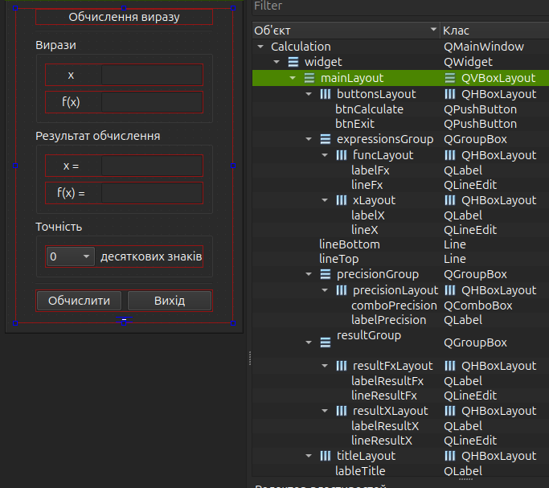

# Тема: Cтворення власних класів. Наслідування і віртуальні функції. Інтерпретатор математичних виразів

**Практичне заняття №10. ЗМ2. ЛЗ11**

---

### Мета роботи: 

- Навчитися створювати та використовувати власні класи, реалізовувати наслідування та віртуальні функції, а також програмно будувати деревоподібні структури (графи) для обчислення математичних виразів.

---

### Завдання: 

1) Розробити інтерпретатор математичних виразів, який:
    - приймає рядок символів, що описує функцію;
    - підтримує базові операції:
      - додавання `+`,
      - віднімання `-`,
      - множення `*`,
      - ділення `/`
      - зведення у ступінь `^`;
    - працює з числовими операндами та змінною `x`;
    - виконує обчислення виразу шляхом побудови дерева операцій.
2) Розробити графічний інтерфейс у середовищі Qt6, який забезпечує введення, парсинг і відображення результатів обчислення.

---

### Опис форми:

1) Група `“Вирази”`
    - Поле `x` - введення значення змінної x.
    - Поле `f(x)` - введення математичного виразу у вигляді рядка (наприклад: `x*x+2*x+3`).
2) Група `“Результати обчислення”`
    - Поле `x =`- відображає обчислене значення змінної.
    - Поле `f(x)` = - показує результат обчислення функції після підстановки `x`.
3) Група `“Точність”`
    - Випадаючий список - вибір кількості десяткових знаків для форматування результату.
4) Кнопки керування
    - Обчислити - запускає обробку введеного виразу, будує дерево операцій і виводить результати.
    - Вихід - закриває застосунок.

---

### Неймінг форми:

#### Лейаути:

```text
mainLayout
 ├── expressionsGroup
 │    ├── xLayout (labelX + lineX)
 │    └── funcLayout (labelFx + lineFx)
 ├── resultGroup
 │    ├── resultXLayout (labelResultX + lineResultX)
 │    └── resultFxLayout (labelResultFx + lineResultFx)
 ├── precisionGroup
 │    └── precisionLayout (comboPrecision + labelPrecision)
 └── buttonsLayout (btnCalculate + btnExit)
```

#### Елементи їх типи та значення:

| objectName           | type        | value / text (якщо потрібно)            |
|----------------------|-------------|-----------------------------------------|
| **mainLayout**       | QVBoxLayout | головне вертикальне розташування        |
| **expressionsGroup** | QGroupBox   | `Вирази`                                |
| **resultGroup**      | QGroupBox   | `Результати обчислення`                 |
| **precisionGroup**   | QGroupBox   | `Точність`                              |
| **xLayout**          | QHBoxLayout | розташування для `x`                    |
| **funcLayout**       | QHBoxLayout | розташування для `f(x)`                 |
| **resultXLayout**    | QHBoxLayout | розташування для результату `x`         |
| **resultFxLayout**   | QHBoxLayout | розташування для результату `f(x)`      |
| **precisionLayout**  | QHBoxLayout | розташування для комбо вибору точності  |
| **buttonsLayout**    | QHBoxLayout | розташування для кнопок                 |
| **labelX**           | QLabel      | `x`                                     |
| **lineX**            | QLineEdit   | ввід значення змінної `x`               |
| **labelFx**          | QLabel      | `f(x)`                                  |
| **lineFx**           | QLineEdit   | ввід результату обчислення функції      |
| **labelResultX**     | QLabel      | `x =`                                   |
| **lineResultX**      | QLineEdit   | read-only, результат введеного `x`      |
| **labelResultFx**    | QLabel      | `f(x) =`                                |
| **lineResultFx**     | QLineEdit   | read-only, результат обчислення функції |
| **comboPrecision**   | QComboBox   | значення: `0`, `1`, `2`, `3`, `4`       |
| **labelPrecision**   | QLabel      | `десяткових знаків`                     |
| **btnCalculate**     | QPushButton | `Обчислити`                             |
| **btnExit**          | QPushButton | `Вихід`                                 |



[Демонстрація роботи](https://youtu.be/3a6KluJV_1c)


