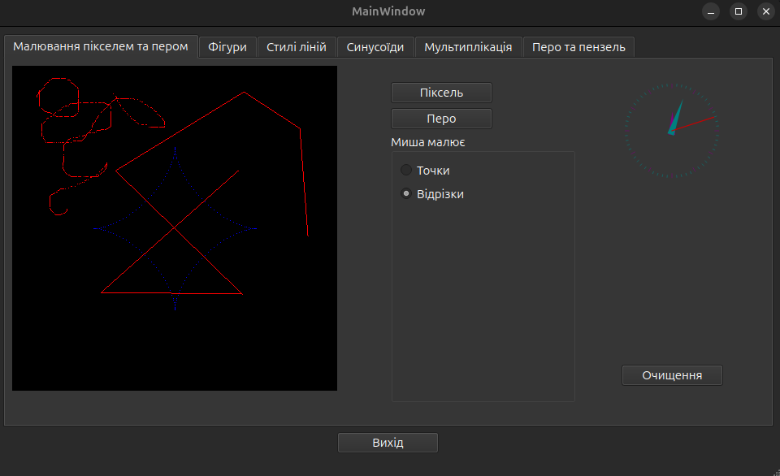
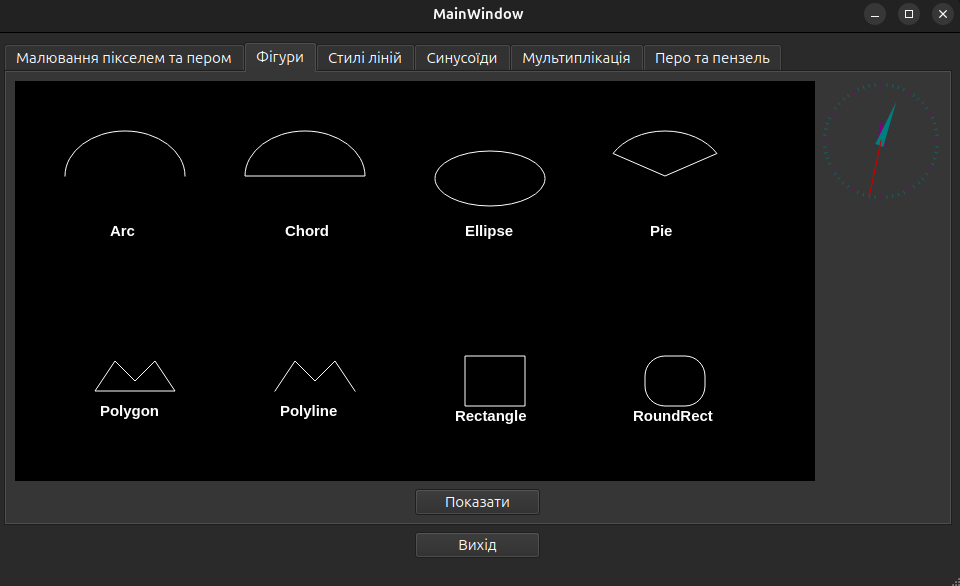
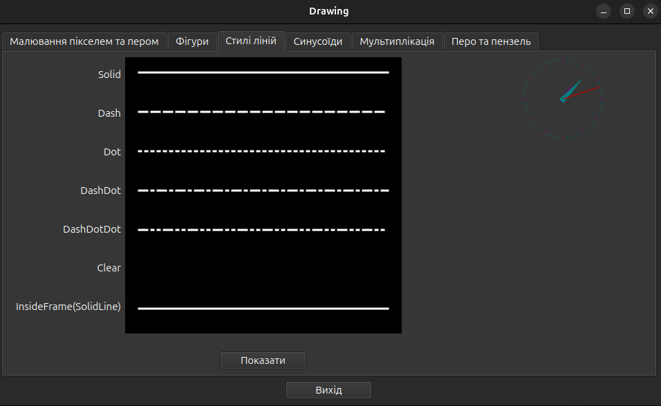
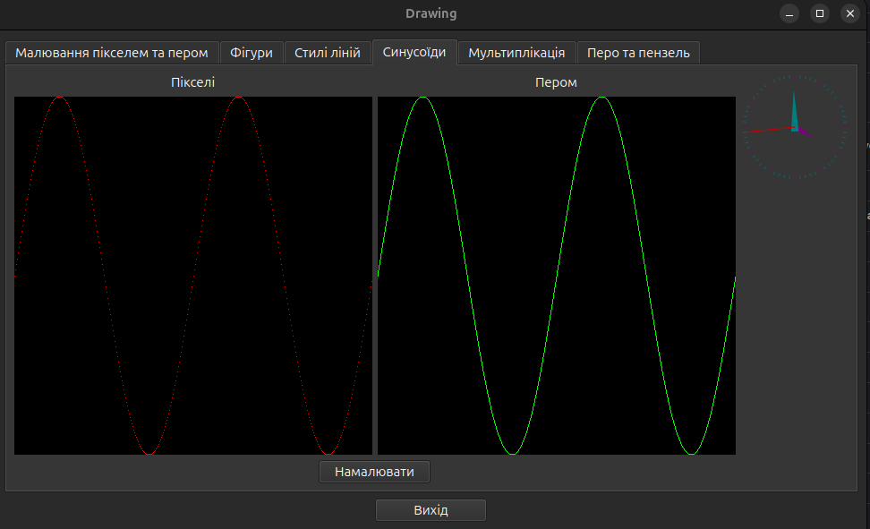
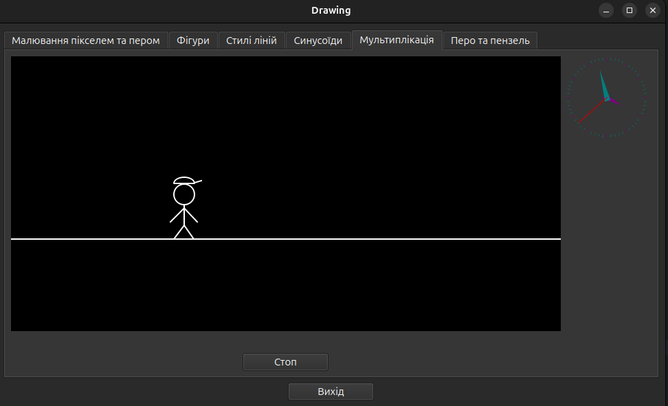
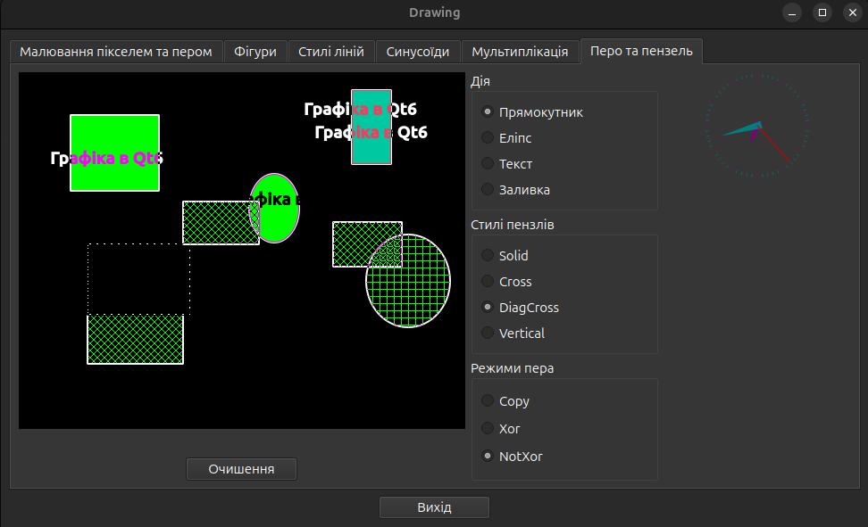

# Тема: Основні функції базової графіки

**Практичне заняття №12.**

## Мета роботи: 
- Детальне знайомство з можливостями графічних функцій в С++ на конкретному прикладі програми, яка буде керувати кольором і шаблонами заливки, відображати текстову інформацію, малювати за допомогою графічних примітивів елементи в середовищі програмування `Qt6`

## Завдання:
- Створити форму проекту. На формі додати шість сторінок. Кожна з цих сторінок буде відповідати окремому етапу проекту. На кожній сторінці встановити компонент `QWidget` с реалізацією класу годинника `AnalogClock` з секундною стрілкою, що рухається.

```text
mainLayout
 ├── tabWidget
 │     ├── tabAnimation
 │     ├── tabLineStyles
 │     ├── tabPenBrush
 │     ├── tabPixelPen
 │     ├── tabShapes
 │     └── tabSinusoids
 └── btnExit
```

| objectName        | type        | value / text / description   |
|-------------------|-------------|------------------------------|
| **mainLayout**    | QVBoxLayout | головний вертикальний лейаут |
| **tabWidget**     | QTabWidget  | вкладки всього застосунку    |
| **tabAnimation**  | QWidget     | вкладка «Анімація»           |
| **tabLineStyles** | QWidget     | вкладка «Стилі ліній»        |
| **tabPenBrush**   | QWidget     | вкладка «Перо/Пензель»       |
| **tabPixelPen**   | QWidget     | вкладка «Піксель/Перо»       |
| **tabShapes**     | QWidget     | вкладка «Фігури»             |
| **tabSinusoids**  | QWidget     | вкладка «Синусоїди»          |
| **btnExit**       | QPushButton | текст: `Вихід`               |

---

### Сторінка `Малювання пікселем та пером`

- Кнопка `Піксель` - намалювати астроїду сукупністю точок (внутрішня фігура).
- Кнопка `Перо` - намалювати астроїду ламанням, що виходить з центру (зовнішня фігура).
- Режим `Точки` - перетягування миші малює одиночні пікселі по Canvas.
- Режим `Відрізки` - послідовні клацання малюють з’єднані відрізки.
- Астроїда обчислюється параметрично (`computePixel()`).

```text
tabPixelPen
 ├── tabMainLayout
 │      ├── tabDrawingLeftLayout
 │      │        └── drawArea
 │      └── tabDrawingRightLayout
 │              ├── toolsLayout
 │              │      ├── btnPixel
 │              │      ├── btnPen
 │              │      └── groupMouseMode
 │              │             └── layoutMouseMode
 │              │                    ├── radioPoints
 │              │                    └── radioLines
 │              └── extraLayout
 │                     ├── pixelPenTimerWidget
 │                     └── btnClear
```

| objectName          | type         | description                           |
|---------------------|--------------|---------------------------------------|
| tabPixelPen         | QWidget      | вкладка “Малювання пікселем та пером” |
| drawArea            | Canvas       | полотно малювання                     |
| btnPixel            | QPushButton  | намалювати астроїду точками           |
| btnPen              | QPushButton  | намалювати астроїду лініями           |
| btnClear            | QPushButton  | очистити канвас                       |
| radioPoints         | QRadioButton | режим “точки”                         |
| radioLines          | QRadioButton | режим “відрізки”                      |
| pixelPenTimerWidget | QWidget      | контейнер для годинника               |

#### Реалізація:



---

### Сторінка `Фігури`

- При натисканні кнопки Показати канвас відрисовує графічні примітиви, розташовані у сітці 2x4.
- Відображаються такі фігури:

- Перший ряд:
  1. `Arc`
  2. `Chord`
  3. `Ellipse`
  4. `Pie`

- Другий ряд:
  5. `Polygon`
  6. `Polyline`
  7. `Rectangle`
  8. `RoundRect`

```text
tabShapes
 ├── shapesMainLayout
 │      ├── drawAreaShapes
 │      └── shapesTimerLayout
 │             ├── shapesTimerWidget
 │             └── verticalSpacer
 └── btnShowShapes
```

| objectName            | type        | description                            |
|-----------------------|-------------|----------------------------------------|
| **tabShapes**         | QWidget     | вкладка “Фігури”                       |
| **shapesMainLayout**  | QHBoxLayout | головний горизонтальний лейаут вкладки |
| **drawAreaShapes**    | Canvas      | полотно для відображення примітивів    |
| **shapesTimerLayout** | QVBoxLayout | колонка праворуч під годинник          |
| **shapesTimerWidget** | QWidget     | контейнер для AnalogClock              |
| **btnShowShapes**     | QPushButton | кнопка “Показати”                      |

#### Реалізація:



---

### Сторінка `Стилі ліній`

- При натисканні на кнопку Показати канвас відображає набір ліній з різними стилями пера.
  Лінії малюються зверху вниз у такому порядку:
  - `SolidLine` - суцільна лінія
  - `DashLine` - штрихова
  - `DotLine` - пунктир
  - `DashDotLine` - штрих-пунктир
  - `DashDotDotLine` - штрих-пунктир-пунктир
  - `NoPen` - порожній рядок (лінія не малюється)
  - `SolidLine` - дубль суцільної, що відповідає стилю psInsideFrame у Builder

```text
tabLineStyles
 └── linesMainLayout
        ├── linesDrawAreaLayout
        │      ├── btnShowLines
        │      └── linesSignaturesAndCanvasLayout
        │             ├── linesCanvasLayout
        │             │       └── drawAreaLines
        │             └── linesSignaturesLayout
        │                    ├── psClear
        │                    ├── psDash
        │                    ├── psDashDot
        │                    ├── psDashDotDot
        │                    ├── psDot
        │                    ├── psInsideFrame
        │                    └── psSolid
        └── linesTimerLayout
               └── lineTimerWidget
```

| objectName                         | type        | description                               |
|------------------------------------|-------------|-------------------------------------------|
| **tabLineStyles**                  | QWidget     | вкладка “Стилі ліній”                     |
| **linesMainLayout**                | QHBoxLayout | головний горизонтальний лейаут вкладки    |
| **linesDrawAreaLayout**            | QVBoxLayout | ліва колонка: кнопка та область перегляду |
| **btnShowLines**                   | QPushButton | кнопка “Показати”                         |
| **linesSignaturesAndCanvasLayout** | QHBoxLayout | блок: канвас + підписи стилів ліній       |
| **linesCanvasLayout**              | QVBoxLayout | контейнер під канвас                      |
| **drawAreaLines**                  | Canvas      | полотно для демонстрації стилів ліній     |
| **linesSignaturesLayout**          | QVBoxLayout | колонка праворуч з підписами              |
| **psClear**                        | QLabel      | підпис “Clear”                            |
| **psDash**                         | QLabel      | підпис “Dash”                             |
| **psDashDot**                      | QLabel      | підпис “DashDot”                          |
| **psDashDotDot**                   | QLabel      | підпис “DashDotDot”                       |
| **psDot**                          | QLabel      | підпис “Dot”                              |
| **psInsideFrame**                  | QLabel      | підпис “InsideFrame”                      |
| **psSolid**                        | QLabel      | підпис “Solid”                            |
| **linesTimerLayout**               | QVBoxLayout | права колонка під годинник                |
| **lineTimerWidget**                | QWidget     | контейнер для AnalogClock                 |

#### Реалізація:



---

### Сторінка `Синусоїди`

- На сторінці `Синусоїди` малюються синусоїди: у лівому вікні `пікселями`, в правому - `пером`.

```text
tabSinusoids
 ├── sinusoidsMainLayout
 │      ├── drawAndButtonAreaLayout
 │      │      ├── btnShowSinusoids
 │      │      └── drawAreaPixelAndPenLayout
 │      │             ├── drawAreaPenLayout
 │      │             │      ├── canvasAreaPenLayout
 │      │             │      │      └── drawAreaPen
 │      │             │      └── sinusoidsPenLabel
 │      │             └── drawAreaPixelLayout
 │      │                    ├── canvasAreaPixelLayout
 │      │                    │      └── drawAreaPixel
 │      │                    └── sinusoidsPixelLabel
 │      └── sinusoidsTimerLayout
 │             └── sinusoidsTimerWidget
```

| objectName                    | type        | description                                |
|-------------------------------|-------------|--------------------------------------------|
| **tabSinusoids**              | QWidget     | вкладка Синусоїди                          |
| **sinusoidsMainLayout**       | QHBoxLayout | головний горизонтальний лейаут вкладки     |
| **drawAndButtonAreaLayout**   | QVBoxLayout | знизу кнопка, зверху дві області малювання |
| **btnShowSinusoids**          | QPushButton | кнопка Показати                            |
| **drawAreaPixelAndPenLayout** | QHBoxLayout | дві області поруч: Pen і Pixel             |
| **drawAreaPenLayout**         | QVBoxLayout | колонка для Pen                            |
| **canvasAreaPenLayout**       | QVBoxLayout | лейаут над Canvas                          |
| **drawAreaPen**               | Canvas      | канвас для синусоїди Pen                   |
| **sinusoidsPenLabel**         | QLabel      | підпис Pen                                 |
| **drawAreaPixelLayout**       | QVBoxLayout | колонка Pixel                              |
| **canvasAreaPixelLayout**     | QVBoxLayout | лейаут над Canvas                          |
| **drawAreaPixel**             | Canvas      | канвас для синусоїди Pixel                 |
| **sinusoidsPixelLabel**       | QLabel      | підпис Pixel                               |
| **sinusoidsTimerLayout**      | QVBoxLayout | права колонка під годинник                 |
| **sinusoidsTimerWidget**      | QWidget     | контейнер для AnalogClock                  |
| **verticalSpacer_7**          | Spacer      | відступ                                    |

#### Реалізація:


---

## Сторінка `Мультиплікація`

- На сторінці `Мультиплікація` відображається постать людини, що рухається.
- Після натиснення кнопки `Старт` чоловічок виходить з правого краю канвасу і рухається ліворуч.
- Коли він повністю зникає за лівим краєм, цикл повторюється, і фігура знову з'являється справа.
- Під час руху кнопка змінює свій текст на `Стоп`.
- Натискання `Стоп` зупиняє анімацію.

```text
tabAnimation
 ├── animationMainLayout
 │      ├── animationTimerLayout
 │      │       └── animationTimerWidget
 │      └── canvasAndButtonAreaLayout
 │              ├── btnStartStop
 │              └── canvasAreaAnimationLayout
 │                      └── drawAreaAnimation
```

| objectName                    | type        | description                            |
|-------------------------------|-------------|----------------------------------------|
| **tabAnimation**              | QWidget     | вкладка Animation                      |
| **animationMainLayout**       | QHBoxLayout | головний горизонтальний лейаут вкладки |
| **animationTimerLayout**      | QVBoxLayout | колонка праворуч під годинник          |
| **animationTimerWidget**      | QWidget     | контейнер для `AnalogClock`            |
| **canvasAndButtonAreaLayout** | QVBoxLayout | ліва частина: кнопка і канвас          |
| **btnStartStop**              | QPushButton | кнопка Start/Stop для анімації         |
| **canvasAreaAnimationLayout** | QVBoxLayout | колонка під канвас                     |
| **drawAreaAnimation**         | Canvas      | полотно для відображення анімації      |

#### Реалізація:



---

## Сторінка `Перо та пензель`

- На цій сторінці при клацанні мишею з'являються випадковим чином розміщені на малюнку фігури або напис з різними стилями заливки відповідно до вибраних значень в групах: `Дія`, `Стилі пензлів`, `Режими пера`.

```text
tabPenBrush
 ├── penBrushMainLayout
 │      ├── canvasAndBtnClearLayout
 │      │       ├── canvasAreaPenBrushLayout
 │      │       │       └── penBrushDrawArea
 │      │       └── penBrushBtnClear
 │      └── controlLayout
 │             ├── brushActionGroup
 │             │        ├── actRectangle
 │             │        ├── actEllipse
 │             │        ├── actText
 │             │        └── actFill
 │             ├── brushStylesGroup
 │             │        ├── bsSolid
 │             │        ├── bsCross
 │             │        ├── bsDiagCross
 │             │        └── bsVertical
 │             └── penModesGroup
 │                      ├── pmCopy
 │                      ├── pmXor
 │                      └── pmNotXor
 └── penBrushTimerLayout
         └── penBrushTimerWidget
```

| objectName                   | type         | description                                     |
|------------------------------|--------------|-------------------------------------------------|
| **tabPenBrush**              | QWidget      | вкладка Pen/Brush                               |
| **penBrushMainLayout**       | QHBoxLayout  | головний горизонтальний лейаут вкладки          |
| **canvasAndBtnClearLayout**  | QVBoxLayout  | ліва колонка: канвас + кнопка Очищення          |
| **canvasAreapenBrushLayout** | QVBoxLayout  | контейнер для Canvas (в середині лівої колонки) |
| **penBrushDrawArea**         | Canvas       | область малювання                               |
| **penBrushbtnClear**         | QPushButton  | кнопка Очищення                                 |
| **controlLayout**            | QVBoxLayout  | права колонка з усім керуванням                 |
| **brushActionGroup**         | QGroupBox    | група дій                                       |
| **actRectangle**             | QRadioButton | режим Прямокутник                               |
| **actEllipse**               | QRadioButton | режим Еліпс                                     |
| **actText**                  | QRadioButton | режим Текст                                     |
| **actFill**                  | QRadioButton | режим Заливка                                   |
| **brushStylesGroup**         | QGroupBox    | група стилів пензля                             |
| **bsSolid**                  | QRadioButton | Solid                                           |
| **bsCross**                  | QRadioButton | Cross                                           |
| **bsDiagCross**              | QRadioButton | DiagCross                                       |
| **bsVertical**               | QRadioButton | Vertical                                        |
| **penModesGroup**            | QGroupBox    | режими пера                                     |
| **pmCopy**                   | QRadioButton | режим Copy                                      |
| **pmXor**                    | QRadioButton | режим Xor                                       |
| **pmNotXor**                 | QRadioButton | режим NotXor                                    |
| **penBrushTimerLayout**      | QVBoxLayout  | колонка справа під годинник                     |
| **penBrushTimerWidget**      | QWidget      | контейнер для AnalogClock                       |

#### Реалізація:

