# Тема: Удосконалення інтерпретатора математичних виразів. Обчислення першої та другої похідної

[Початок: (Інтерпретатор математичних виразів.)](https://github.com/yourhostel/cpp_course/tree/main/III_course/2025-11-10-qt-practical-10-tree-parser)

**Практичне заняття №11. ЗМ2. ЛЗ11**

---

### Мета роботи: 

- Розвинути навички об’єктно-орієнтованого програмування, використавши для реалізації задачі про інтерпретатор механізми інкапсуляції, наслідування, поліморфізму, динамічного зв’язування і віртуальних функцій.
- Удосконалити інтерпретатор математичних виразів з метою знаходження значення виразу та його похідних довільного порядку.

---

### Завдання:

- Застосувати інтерпретатор для розв’язування задачі про політ ракети. 
- Обчислити шлях, швидкість і прискорення ракети, рух якої описується математичним виразом, який вводять під час роботи програми. 
   - підтримує базові операції:
      - додавання `+`,
      - віднімання `-`,
      - множення `*`,
      - ділення `/`
      - зведення у ступінь `^`; 
   - які застосовуватимуться до дійсних чисел і змінної `x`(час) яка також може бути представлена виразом.

---

### Узагальнена структура програми:
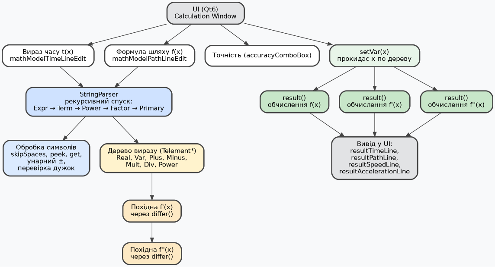

---

### Вдосконалення парсера:

Попередня версія:

 - відсутність токенізатора
 - відсутність унарного мінуса
   - відсутність розмежування `мінус як оператор` і `мінус як знак числа`
 - помилки не в момент розбору
 - пошук операторів зліва направо, проходячи рядок кілька разів
 - один монолітний цикл перевірки

Оновлення:

- окрема токенізація (токенізатор - модуль, що розбиває рядок на лексеми/токени)
- рекурсивний спуск: `parseExpression -> parseTerm -> parseFactor -> parsePrimary`
- чіткі рівні пріоритетів
- унарний мінус
- структурована обробка помилок:
  - Перевірка введення:
    - `Не вказано значення часу`
    - `У виразі часу не можна використовувати x`
    - `Поле формули шляху порожнє`
  - Помилки розбору виразу:
    - `Порожній вираз`
    - `Зайві символи в кінці виразу`
    - `Неочікуваний кінець виразу`
    - `Немає закриваючої дужки`
    - `Невірний символ у виразі`
    - `Некоректне число з двома крапками`
    - `Не вдалося перетворити число`
  - Математичні помилки:
    - `Ділення на нуль`
  - Обмеження інтерпретатора:
    - `Ступінь дозволено лише з числовим показником`

---

### Дерево форми:

```text
Calculation
 └── widget
      └── mainLayout
           │
           ├── mathModelLayout
           │      └── mathModelGroupBox
           │             ├── mathModelPathLayout
           │             │      ├── mathModelPathLabel
           │             │      └── mathModelPathLineEdit
           │             └── mathModelTimeLayout
           │                    ├── mathModelTimeLabel
           │                    └── mathModelTimeLineEdit
           ├── resultLayout
           │      └── resultGroupBox
           │             ├── resultAccelerationLayout
           │             │      ├── resultAccelerationLabel
           │             │      └── resultAccelerationLine
           │             ├── resultPathLayout
           │             │      ├── resultPathLabel
           │             │      └── resultPathLine
           │             ├── resultSpeedLayout
           │             │      ├── resultSpeedLabel
           │             │      └── resultSpeedLine
           │             └── resultTimeLayout
           │                    ├── resultTimeLabel
           │                    └── resultTimeLine
           ├── accuracyLayout
           │      └── accuracyGroupBox
           │             ├── accuracyComboBox
           │             └── accuracyLabel           
           └── buttonLayout
                  ├── btnCalculate
                  └── btnExit                                
```

---

### Елементи їх типи та значення:

| objectName                   | type        | description                           |
|------------------------------|-------------|---------------------------------------|
| **Calculation**              | QMainWindow | головне вікно `Політ ракети`          |
| **widget**                   | QWidget     | центральний контейнер                 |
| **mainLayout**               | QVBoxLayout | основний вертикальний лейаут          |
| **accuracyoLayout**          | QHBoxLayout | лейаут для секції точності            |
| **accuracуGroupBox**         | QGroupBox   | панель `Точність`                     |
| **accuracуComboBox**         | QComboBox   | кількість знаків після крапки         |
| **accuracуLabel**            | QLabel      | текст `знаки після десяткової крапки` |
| **buttonLayout**             | QHBoxLayout | контейнер для кнопок                  |
| **btnCalculate**             | QPushButton | кнопка `Обчислити`                    |
| **btnExit**                  | QPushButton | кнопка `Вихід`                        |
| **mathModelLayout**          | QHBoxLayout | секція математичної моделі            |
| **mathModelGroupBox**        | QGroupBox   | блок `Математична модель`             |
| **mathModelPathLayout**      | QHBoxLayout | поле введення шляху f(x)              |
| **mathModelPathLabel**       | QLabel      | текст `шлях`                          |
| **mathModelPathLineEdit**    | QLineEdit   | введення формули шляху                |
| **mathModelTimeLayout**      | QHBoxLayout | поле введення часу x                  |
| **mathModelTimeLabel**       | QLabel      | текст `час`                           |
| **mathModelTimeLineEdit**    | QLineEdit   | введення значення часу                |
| **resultLayout**             | QHBoxLayout | секція результатів                    |
| **resultGroupBox**           | QGroupBox   | блок `Результати обчислень`           |
| **resultAccelerationLayout** | QHBoxLayout | рядок прискорення                     |
| **resultAccelerationLabel**  | QLabel      | `прискорення`                         |
| **resultAccelerationLine**   | QLineEdit   | значення f''(x)                       |
| **resultPathLayout**         | QHBoxLayout | рядок шляху                           |
| **resultPathLabel**          | QLabel      | `шлях`                                |
| **resultPathLine**           | QLineEdit   | значення f(x)                         |
| **resultSpeedLayout**        | QHBoxLayout | рядок швидкості                       |
| **resultSpeedLabel**         | QLabel      | `швидкість`                           |
| **resultSpeedLine**          | QLineEdit   | значення f'(x)                        |
| **resultTimeLayout**         | QHBoxLayout | рядок часу                            |
| **resultTimeLabel**          | QLabel      | `час`                                 |
| **resultTimeLine**           | QLineEdit   | значення `x`                          |

---

### Тестування:

- #### Таблиця тестових випадків:

    - Валідні приклади:
        - | `час`                 | `шлях`                                           |
          |-----------------------|--------------------------------------------------|
          | `5+8/2`               | `3*x+2`                                          |
          | `5.88+1.25/0.13698*3` | `8.3*x*x*x - 12/x/x + 0.13` (приклад з завдання) |
          | `-2+(2+3)*4`          | `(x-1)^3 + 2` (унарний мінус, дужки, ступінь)    |

        - 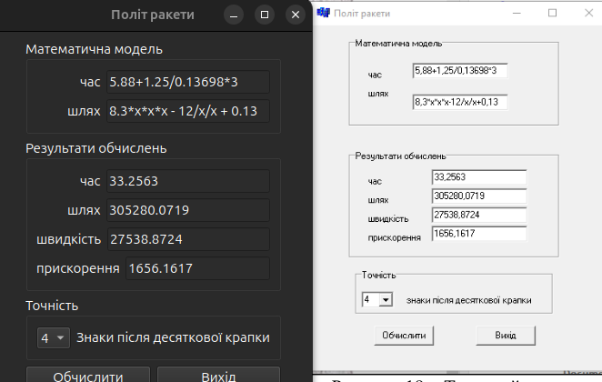
        - 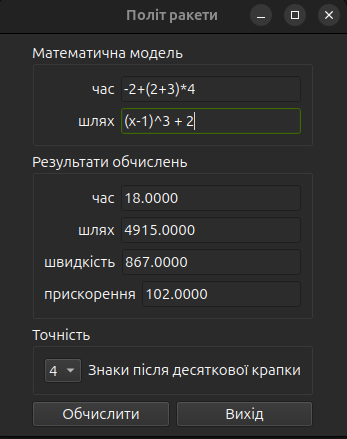

    - Винятки:
        - | помилка                                        | вираз час  | вираз шлях |
          |------------------------------------------------|------------|------------|
          | `Не вказано значення часу`                     | ``         | `3*x+2`    |
          | `У виразі часу не можна використовувати x`     | `3*x+2`    | `3*x+2`    |
          | `Поле формули шляху порожнє`                   | `5`        | ``         |
          | `Порожній вираз`                               | `()`       | `3*x+1`    |
          | `Зайві символи в кінці виразу`                 | `5+3`      | `5+3x`     |
          | `Неочікуваний кінець виразу`                   | `5+`       | `3*x`      |
          | `Немає закриваючої дужки`                      | `(2+(3*4)` | `x+1`      |
          | `Невірний символ у виразі`                     | `3*t+2`    | `x+1`      |
          | `Некоректне число з двома крапками`            | `4.3.2`    | `x+1`      |
          | `Не вдалося перетворити число`                 | `.e3`      | `x+1`      |
          | `Ділення на нуль`                              | `5`        | `3/0`      |
          | `Ступінь дозволено лише з числовим показником` | `5`        | `x^x`      |
        - 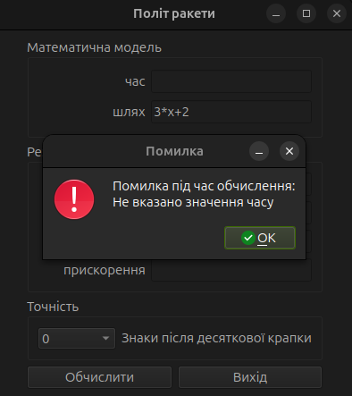
        - 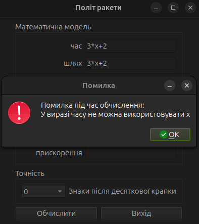
        - 
        - 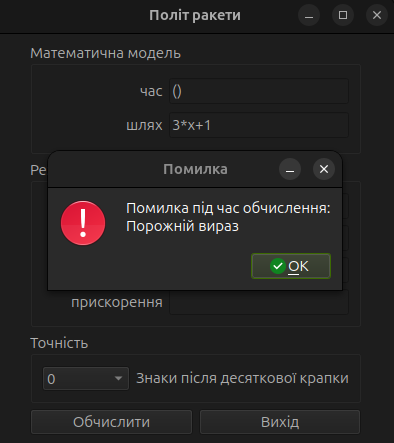
        - 
        - 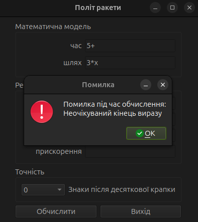
        - 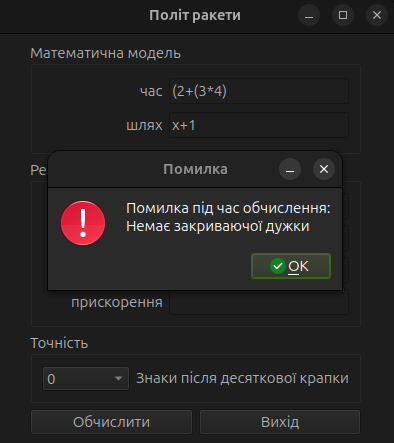
        - 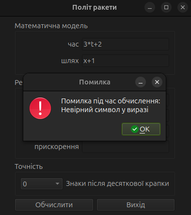
        - 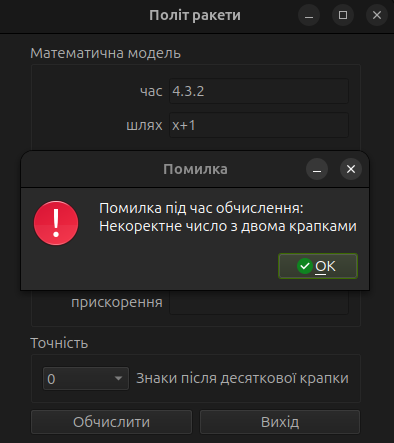
        - 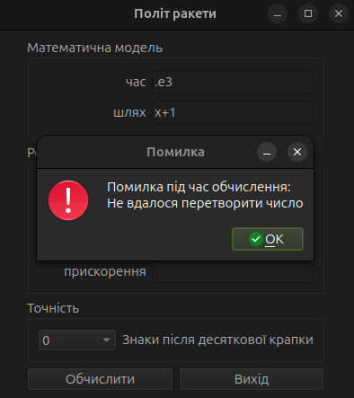
        - 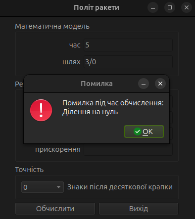
        - 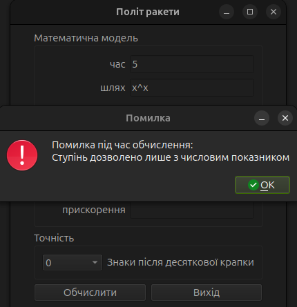

---

```bash
# Graphviz (для побудови блок-схем)
sudo apt install graphviz -y

# Рендер будь-якої діаграми у PNG (приклад):
dot -Tpng tree_interpreter_arch.dot -o tree_interpreter_arch.png

# Автоматичний рендер усіх .dot файлів у поточній директорії
for f in *.dot; do
    dot -Tpng "$f" -o "${f%.dot}.png"
done
```

