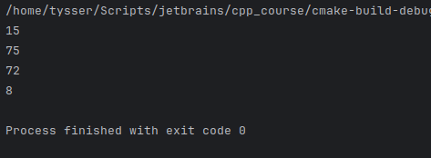

# Тема 14. Порушення прав доступу. Дружні функції

---

## Завдання:
1) Доповнити функцію `Employer::hire()` реакцією на те, що немає вакантних посад.
   - У клас додано фрагмент коду що до відсутності вакансії:
     - ```cpp
       // Вправа 5.4 
       if (i == _volume)
       {
           cout << "No free positions for "
                << person.getName() << endl;
           return;
       } 
       ```

2) Реалізувати метод звільнення робочого місця `void Employer::fire(const size_t i)`.
   - Реалізація:
     - ```cpp
       // Звільнення працівника. // Вправа 5.5
       void Employer::fire(const size_t index) const
       {
       if (index >= _volume)
       return;
       
           if (_office[index]._free)
               return;
       
           delete _office[index]._pemployee;
           _office[index]._pemployee = nullptr;
           _office[index]._free = true;
       }
       ```
    
   - Перевірка через `test_task()`:

     - 

3) Задати сигнатуру та реалізацію утиліти `exe()`, здатної виконувати будь-яку операцію простого арифметичного калькулятора, фрагмент визначення якого наведено у матеріалах лекції. Якщо арифметичні операції виконуються над вмістом регістра акумулятора, як це показано на прикладі операції додавання. Визначити інші операції.
    - Реалізація:
      - Сигнатура утиліти `exe()`:
      - ```cpp
        double exe(Calc& c, double (Calc::*op)());
        ```
        - `Calc& c` - Над яким калькулятором працюємо
        - `double (Calc::*op)()` - Вказівник на метод цього калькулятора
        - Повертає те, що повертає операція `_a`
        
      - Реалізація утиліти `exe()`:
      - ```cpp
        double exe(Calc& c, double (Calc::*op)()) 
        {
        return (c.*op)();   // виклик методу через pointer-to-member
        }
        ``` 
      - ```cpp
        // Арифметичний калькулятор
        struct Calc {
        
            double _a;   // акумулятор
            double _x;   // значення
        
            explicit Calc(const double a = 0, const double x = 0) : _a(a), _x(x) {}
        
            // a = a + x
            double add()       { return _a += _x; }
        
            // a = a - x
            double sub()       { return _a -= _x; }
        
            // a = a * x
            double mul()       { return _a *= _x; }
        
            // a = a / x
            double divide()    { return _a /= _x; }
        
            // а = x (записати нове значення)
            double load()      { return _a = _x; }
        
            // скинути регістри
            void clear()       { _a = 0; _x = 0; }
        };
        ```
        - Виконання `test_task_3();`:
        - 