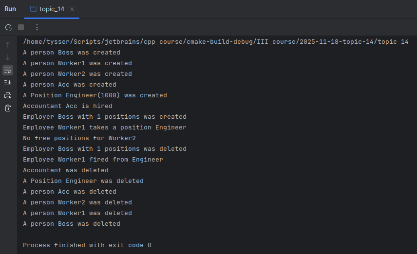

# Тема 14. Порушення прав доступу. Дружні функції

---

## Завдання:
1) Доповнити функцію `Employer::hire()` реакцією на те, що немає вакантних посад.
- У клас додано фрагмент коду що до відсутності вакансії:
  - ```cpp
    if (i == _volume)
    {
        cout << "No free positions for "
             << person.getName() << endl;
        return;  // Вправа 5.4 
    } 
    ```

2) Реалізувати метод звільнення робочого місця `void Employer::fire(const size_t i)`.
- Реалізація:
  - ```cpp
    // Звільнення працівника
    void Employer::fire(const size_t index) const
    {
    if (index >= _volume)
    return;
    
        if (_office[index]._free)
            return;
    
        delete _office[index]._pemployee;
        _office[index]._pemployee = nullptr;
        _office[index]._free = true;
    }
    ```
    
## Перевірка через  `test_task()`:



3) Задати сигнатуру та реалізацію утиліти `exe()`, здатної виконувати будь-яку операцію простого арифметичного калькулятора, фрагмент визначення якого наведено у матеріалах лекції, якщо арифметичні операції виконуються над вмістом регістра акумулятора, як це показано на прикладі операції додавання. Визначити інші операції.