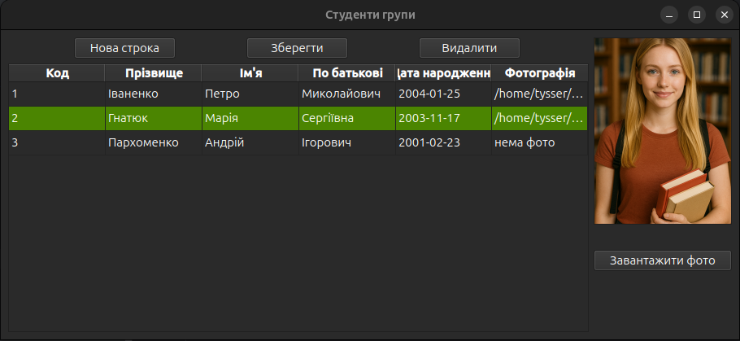
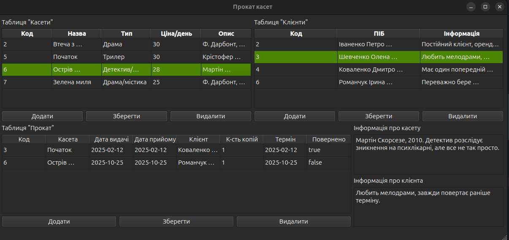

# Практичне заняття №13

**Розробка додатка управління БД**

---

## Інструменти:
  - **PostgreSQL**
  - **Docker Compose**
  - **Qt6 Designer**

---

## Завдання `Об'єктно орієнтоване програмування`: 
1. Створити просту базу даних "Студенти групи" та налаштувати її відображення у `UI` створений за допомогою `Qt6 Designer`.
   - Реалізувати `inline editing`
   - Кнопки `Додати строку`, `Зберегти`, `Видалити`, `Оновити`
   - Окремий блок с фото, та кнопкой `Завантажити фото`
     - Завантажує фото
     - При натисканні `Зберегти`, посилання на фото зберігається у БД
  - UI неймінг:
    - | Об'єкт             | Клас        | Опис                             |
      |--------------------|-------------|----------------------------------|
      | studentsWindow     | QMainWindow | Головне вікно                    |
      | centralWidget      | QWidget     | Кореневий віджет                 |
      | contentLayout      | QHBoxLayout | Основний лейаут (таблиця + фото) |
      | tablePanelLayout   | QVBoxLayout | Ліва панель з таблицею           |
      | tableButtonsLayout | QHBoxLayout | Верхні кнопки над таблицею       |
      | addRowButton       | QPushButton | Додати новий рядок у таблицю     |
      | saveButton         | QPushButton | Зберегти дані в БД               |
      | deleteButton       | QPushButton | Видалити вибраний рядок/студента |
      | studentsTable      | QTableView  | Таблиця                          |
      | photoPanelLayout   | QVBoxLayout | Права панель для фото            |
      | photoPreviewLabel  | QLabel      | Прев’ю фото студента             |
      | loadPhotoButton    | QPushButton | Завантажити фото                 |

    - Налаштування поля для фотки:
      - ```text
        photoPreviewLabel (QLabel)
        |
        ├─ QFrame
        |     └─ frameShape  => StyledPanel
        └─ QLabel
              └─ scaledContents => true
        ```
    - 
    
    - [демонстрація роботи](https://youtu.be/bv95EImlWO0)

2. Проста СУБД "Пункт прокату" (Додаткове завдання)
   - Реалізувати `inline editing` для трьох зв'язаних таблиць.
   - Каскадне видалення та оновлення форми відповідно до стану БД
   - UI неймінг:
     - | Об'єкт                 | Клас        | Опис                               |
       |------------------------|-------------|------------------------------------|
       | Rental                 | QMainWindow | Головне вікно форми "Прокат касет" |
       | centralWidget          | QWidget     | Кореневий віджет                   |
       | mainLayout             | QVBoxLayout | Головний вертикальний контейнер    |
       | topLayout              | QHBoxLayout | Верхній блок (касети, клієнти)     |
       | tapesLayout            | QVBoxLayout | Блок таблиці "Касети"              |
       | tapesLabel             | QLabel      | Назва таблиці "Касети"             |
       | tapesTable             | QTableView  | Таблиця касет                      |
       | tapesButtonsLayout     | QHBoxLayout | Кнопки керування касетами          |
       | tapesAddButton         | QPushButton | Додати касету                      |
       | tapesDeleteButton      | QPushButton | Видалити касету                    |
       | tapesSaveButton        | QPushButton | Зберегти зміни касет               |
       | customersLayout        | QVBoxLayout | Блок таблиці "Клієнти"             |
       | customersLabel         | QLabel      | Назва таблиці "Клієнти"            |
       | customersTable         | QTableView  | Таблиця клієнтів                   |
       | customersButtonsLayout | QHBoxLayout | Кнопки клієнтів                    |
       | customersAddButton     | QPushButton | Додати клієнта                     |
       | customersDeleteButton  | QPushButton | Видалити клієнта                   |
       | customersSaveButton    | QPushButton | Зберегти клієнтів                  |
       | bottomLayout           | QHBoxLayout | Нижній блок (прокат, memo)         |
       | rentalsLayout          | QVBoxLayout | Блок таблиці "Прокат"              |
       | rentalsLabel           | QLabel      | Назва таблиці "Прокат"             |
       | rentalsTable           | QTableView  | Таблиця прокату                    |
       | rentalsButtonsLayout   | QHBoxLayout | Кнопки керування прокатом          |
       | rentalsAddButton       | QPushButton | Додати операцію прокату            |
       | rentalsDeleteButton    | QPushButton | Видалити операцію                  |
       | rentalsSaveButton      | QPushButton | Зберегти прокат                    |
       | infoLayout             | QVBoxLayout | Панель описів                      |
       | infoTapesLabel         | QLabel      | Заголовок "Інформація про касету"  |
       | infoTapesText          | QTextEdit   | Memo про касету                    |
       | infoCustomersLabel     | QLabel      | Заголовок "Інформація про клієнта" |
       | infoCustomersText      | QTextEdit   | Memo про клієнта                   |

     - 
     
     - [демонстрація роботи](https://youtu.be/Ss_JPBWw-2s)

---

## Таблиці та зв'язки для обох завдань:

- База підіймається через `docker-compose.yml`
- Ініціалізація виконується файлами `students.sql`(схема для таблиці `students`) та `rental.sql`(схема для таблиць `tapes`, `customers` та `rentals`)
- Оскільки ініціалізація виконується лише перший раз, а інші рази ігнорується, для оновлення необхідно видаляти контейнер разом з `volume` для повторной ініціалізації.

```bash
# Підіймання бази
docker compose up -d
# Дивимось логи
docker logs -f app-pg

# -v видаляє разом з volume
docker compose down -v
# Окремо 
docker volume rm devops_pgdata
# Подивитися всі volume
docker volume ls

# Зміна через SQL скрипт:
# З попереднім видаленням DROP TABLE IF EXISTS students CASCADE; у скрипту.
# Точкові зміни schema migration через ALTER TABLE, 
# наприклад: ALTER TABLE students ADD COLUMN rating NUMERIC(3,1);
docker exec -i app_pg psql -U app_user -d app_db < ./init/students.sql

# Перевірка чи бачить докер ініт-файли
docker exec -it app_pg ls /docker-entrypoint-initdb.d

# подивитись структуру таблиці rentals прямо всередині PostgreSQL
docker exec -it app-pg psql -U serg -d app-db -c "\d rentals"
```

- 
- 

---

## Завдання `Основи програмної інженерії`: 
- Запустити тестовий Docker-контейнер `bash` командою:
```bash
docker run --rm -it bash bash -c "md5sum /etc/hosts"
```
  - Яка:
    - скачує образ `bash`
    - створює новий контейнер
    - Прапори:
      - `--rm` видалення контейнера після завершення.
      - `-it` інтерактивний режим с псевдотерміналом.
    - В середині контейнера
      - ```bash
        bash -c "md5sum /etc/hosts"
        ```
- Ціль: отримати `MD5`-хеш файлу `/etc/hosts` контейнера.
- Результат:
  - 