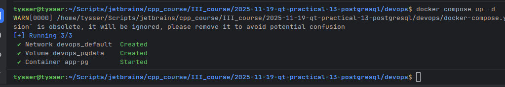
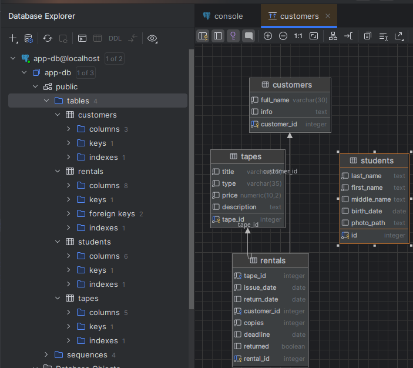

# Практичне заняття №13

**Розробка додатка управління БД**

---

## Інструменти:
  - **PostgreSQL**
  - **Docker Compose**
  - **Qt6 Designer**

---

## Структура каталогів:

```text
2025-11-19-qt-practical-13-postgresql/
  devops/
    init/
      rental.sql
      students.sql
    docker-compose.yml
  rental/
    main.cpp
    rental.cpp
    rental.h
    rental.ui
  screenshots/
  students/
    photos/
    main.cpp
    students.cpp
    students.h
    students.ui
```

---

## Завдання `Об'єктно орієнтоване програмування`: 
1. Створити просту базу даних "Студенти групи" та налаштувати її відображення у `UI` створений за допомогою `Qt6 Designer`.
   - Реалізувати `inline editing`
   - Кнопки `Додати строку`, `Зберегти`, `Видалити`, `Оновити`
   - Окремий блок с фото, та кнопкой `Завантажити фото`
     - Завантажує фото
     - При натисканні `Зберегти`, посилання на фото зберігається у БД
  
2. Проста СУБД "Пункт прокату" (Додаткове завдання)
   - Реалізувати `inline editing` для трьох зв'язаних таблиць.

---

## Таблиці та зв'язки для обох завдань:

- База підіймається через `docker-compose.yml`
- Ініціалізація виконується файлами `students.sql`(схема для таблиці `students`) та `rental.sql`(схема для таблиць `tapes`, `customers` та `rentals`)
- Оскільки ініціалізація виконується лише перший раз, а інші рази ігнорується, для оновлення необхідно видаляти контейнер разом з `volume` для повторной ініціалізації.

```bash
# Підіймання бази
docker compose up -d
# Дивимось логи при запитах
docker logs -f app_pg

# -v видаляє разом з volume
docker compose down -v
# Окремо 
docker volume rm devops_pgdata
# Подивитися всі volume
docker volume ls

# Зміна через SQL скрипт:
# З попереднім видаленням DROP TABLE IF EXISTS students CASCADE; у скрипту.
# Точкові зміни schema migration через ALTER TABLE, 
# наприклад: ALTER TABLE students ADD COLUMN rating NUMERIC(3,1);
docker exec -i app_pg psql -U app_user -d app_db < ./init/students.sql

# Перевірка чи бачить докер ініт-файли
docker exec -it app_pg ls /docker-entrypoint-initdb.d
```

- 
- 

---

## Завдання `Основи програмної інженерії`: 
- Запустити тестовий Docker-контейнер `bash` командою:
```bash
docker run --rm -it bash bash -c "md5sum /etc/hosts"
```
  - Яка:
    - скачує образ `bash`
    - створює новий контейнер
    - Прапори:
      - `--rm` видалення контейнера після завершення.
      - `-it` інтерактивний режим с псевдотерміналом.
    - В середині контейнера
      - ```bash
        bash -c "md5sum /etc/hosts"
        ```
- Ціль: отримати `MD5`-хеш файлу `/etc/hosts` контейнера.
- Результат:
  - 