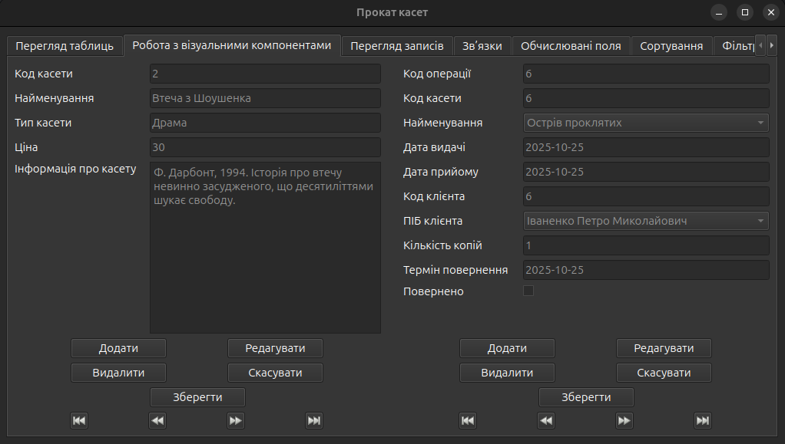
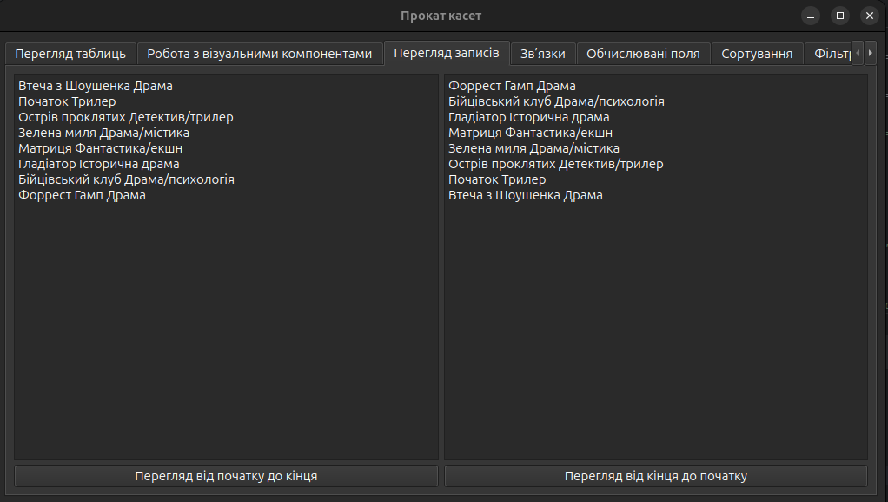
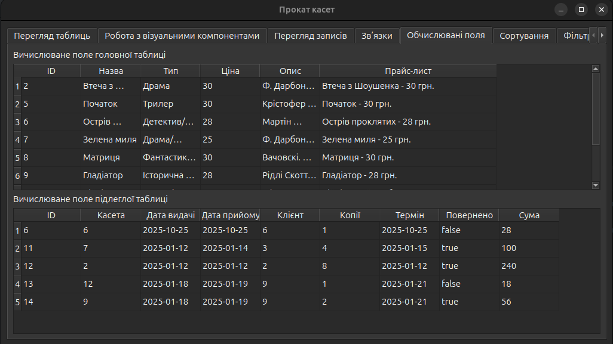
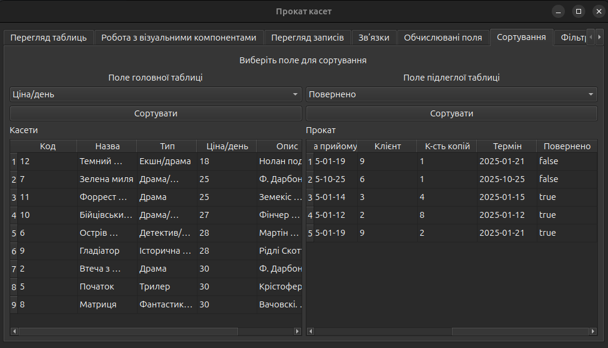
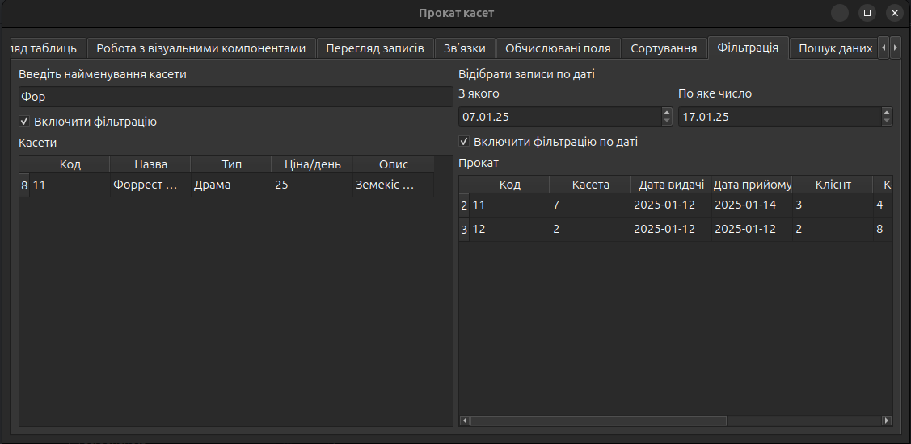

# Тема: Доступ до бази даних.

## Мета: Навчитися створювати додатки в C++ Qt6 з допомогою Qt Desiner
- придбати практичні навички у програмній реалізації управління станом БД PostgreSQL.

---

### Завдання:
1. Викликати редактор полів і відобразити імена полів таблиць, раніше створених у попередній роботі.
2. Створити поля для перегляду всіх пов'язаних підлеглих полів таблиць.
3. Налаштувати поля і призначити властивості полів за допомогою редактора полів (подання дати, ширини поля, зміна заголовка поля, введення початкового значення при створенні нових рядків).
4. Використовуючи можливості редактора полів, створити додаток, що реалізує подання даних у вигляді форми.
5. Організувати програмне керування даними: вставку, редагування, видалення, збереження, скасування змін.
6. Виконати програмну реалізацію сортування різних типів полів.
7. Відфільтрувати записи різних типів полів за певними критеріями.
8. З допомогою різних методів знайти записи за певними критеріями.

---
### Виконання з модифікацією під Qt

#### 1. Робота з візуальними компонентами

- Реалізація навігації по записах, їх додавання, редагування, видалення та повернення початкового стану до моделі у випадку скасування режиму редагування. Оновлення та синхронізація моделі з базой даних при збереженні. 

- Неймінг елементів:

| Елемент                | Тип         | Текст у інтерфейсі    |
|------------------------|-------------|-----------------------|
| vcTapeIdEdit           | QLineEdit   | Код касети            |
| vcTapeTitleEdit        | QLineEdit   | Найменування          |
| vcTapeTypeEdit         | QLineEdit   | Тип касети            |
| vcTapePriceEdit        | QLineEdit   | Ціна                  |
| vcTapeDescriptionEdit  | QTextEdit   | Інформація про касету |
| vcTapeAddButton        | QPushButton | Додати                |
| vcTapeEditButton       | QPushButton | Редагувати            |
| vcTapeDeleteButton     | QPushButton | Видалити              |
| vcTapeCancelButton     | QPushButton | Скасувати             |
| vcTapeSaveButton       | QPushButton | Зберегти              |
| vcTapeFirstButton      | QToolButton | Перший запис          |
| vcTapePrevButton       | QToolButton | Попередній запис      |
| vcTapeNextButton       | QToolButton | Наступний запис       |
| vcTapeLastButton       | QToolButton | Останній запис        |
| vcRentalIdEdit         | QLineEdit   | Код операції          |
| vcRentalTapeIdEdit     | QLineEdit   | Код касети            |
| vcRentalTapeCombo      | QComboBox   | Найменування          |
| vcRentalIssueDateEdit  | QLineEdit   | Дата видачі           |
| vcRentalReturnDateEdit | QLineEdit   | Дата прийому          |
| vcRentalCustomerIdEdit | QLineEdit   | Код клієнта           |
| vcRentalCustomerCombo  | QComboBox   | ПІБ клієнта           |
| vcRentalCopiesEdit     | QLineEdit   | Кількість копій       |
| vcRentalDeadlineEdit   | QLineEdit   | Термін повернення     |
| vcRentalReturnedCheck  | QCheckBox   | Повернено             |
| vcRentalAddButton      | QPushButton | Додати                |
| vcRentalEditButton     | QPushButton | Редагувати            |
| vcRentalDeleteButton   | QPushButton | Видалити              |
| vcRentalCancelButton   | QPushButton | Скасувати             |
| vcRentalSaveButton     | QPushButton | Зберегти              |
| vcRentalFirstButton    | QToolButton | Перший запис          |
| vcRentalPrevButton     | QToolButton | Попередній запис      |
| vcRentalNextButton     | QToolButton | Наступний запис       |
| vcRentalLastButton     | QToolButton | Останній запис        |

---

#### 2. Сторінка перегляду записів.

- Реалізація виводу записів в прямому та зворотному порядку.

- Неймінг елементів:

| Елемент              | Тип         | Текст у інтерфейсі              |
|----------------------|-------------|---------------------------------|
| `rvForwardTextEdit`  | QTextEdit   | (без тексту)                    |
| `rvForwardButton`    | QPushButton | `Перегляд від початку до кінця` |
| `rvBackwardTextEdit` | QTextEdit   | (без тексту)                    |
| `rvBackwardButton`   | QPushButton | `Перегляд від кінця до початку` |

---

#### 3. Сторінка зв'язків

- Перегляд зв'язаних записів:
  - обрано рядок у таблиці `Касети`
    - У таблиці `Прокат` показати записи `rentals`, де `tape_id` `=` вибраному `id`
  - обрано рядок у таблиці `Клієнти`
    - У таблиці `Прокат` показати записи `rentals`, де `customer_id` `=` вибраному `id`
  - Кнопки:
  - `Звʼязок з касетами` встановлює режим: фільтруємо `rentals` по `tape_id`
  - `Звʼязок з клієнтами` встановлює режим: фільтруємо `rentals` по `customer_id`
  - `Убрати звʼязки показує` усі rentals (без фільтру)

- Неймінг елементів:

| Елемент                | Тип         | Текст у інтерфейсі  |
|------------------------|-------------|---------------------|
| `rvTapesTable`         | QTableView  | (Касети)            |
| `rvCustomersTable`     | QTableView  | (Клієнти)           |
| `rvRentalsTable`       | QTableView  | (Прокат)            |
| `rvTapeLinkButton`     | QPushButton | Зв’язок з касетами  |
| `rvCustomerLinkButton` | QPushButton | Зв’язок з клієнтами |
| `rvClearLinkButton`    | QPushButton | Прибрати зв’язки    |

---

#### 4. Вичислюване поле

- Сума = (ціна касети з `tapesModel`) * `copies`
  - беремо `rentalsModel` знаходимо `tape_id` знаходимо відповідну ціну в `tapesModel` і множимо.

- Неймінг елементів:

| Елемент          | Тип        | Текст у інтерфейсі                 |
|------------------|------------|------------------------------------|
| `cfTapesLabel`   | QLabel     | Вичислюване поле головної таблиці  |
| `cfTapesTable`   | QTableView | (без тексту)                       |
| `cfRentalsLabel` | QLabel     | Вичислюване поле підлеглої таблиці |
| `cfRentalsTable` | QTableView | (без тексту)                       |

---

#### 5. Сортування

- Залежно від типу стовпця застосовується правильний режим сортування (числовий, датовий, булевий або текстовий) через `applySortRole(model, spec, columnIndex)`.
- Виконуємо сортування моделі за вказаним індексом `model->sort(columnIndex, Qt::AscendingOrder)`.
- Обраний порожній рядок зі списку `QComboBox` скидає сортування через `emit requestReloadAllTables()`, що перезавантажує таблиці з БД без застосованого сорту.

- Неймінг елементів:

| Елемент               | Тип         | Текст у інтерфейсі           |
|-----------------------|-------------|------------------------------|
| sortTab               | QWidget     |                              |
| sortHeaderLabel       | QLabel      | Виберіть поле для сортування |
| sortTapesComboLabel   | QLabel      | Поле головної таблиці        |
| sortTapesCombo        | QComboBox   |                              |
| sortTapesButton       | QPushButton | Сортувати                    |
| sortTapesTableLabel   | QLabel      | Касети                       |
| sortTapesTable        | QTableView  |                              |
| sortRentalsComboLabel | QLabel      | Поле підлеглої таблиці       |
| sortRentalsCombo      | QComboBox   |                              |
| sortRentalsButton     | QPushButton | Сортувати                    |
| sortRentalsTableLabel | QLabel      | Прокат                       |
| sortRentalsTable      | QTableView  |                              |

---

#### 6. Фільтр

- Фільтрація назв (лівий блок)
  - Якщо checkBox не включений, фільтр не активний, показуємо все.
  - Якщо включений, беремо текст із `QLineEdit`, робимо `setFilterRegularExpression("^" + text + ".*")`.
  - Фільтрація по стовпцю `setFilterKeyColumn( indexOf("title") )`.
- Фільтрація по даті (правий блок)
  - За умови увімкненого checkBox:
    - беремо `dateFrom` і `dateTo`
    - робимо фільтр через `filterAcceptsRow`
    - дістаємо значення дати з моделі
    - пропускаємо тільки ті рядки, де `dateFrom` `<=` `rowDate` `<=` `dateTo`

- Неймінг елементів:

| Елемент                 | Тип         | Текст у інтерфейсі          |
|-------------------------|-------------|-----------------------------|
| filterTab               | QWidget     |                             |
| filterMainLayout        | QHBoxLayout |                             |
| filterLeftLayout        | QVBoxLayout |                             |
| filterRightLayout       | QVBoxLayout |                             |
| filterLeftLabel         | QLabel      | Введіть найменування касети |
| filterTitleEdit         | QLineEdit   |                             |
| filterTitleCheckBox     | QCheckBox   | Включити фільтрацію         |
| filterTapesTableLabel   | QLabel      | Касети                      |
| filterTapesTable        | QTableView  |                             |
| filterRightLabel        | QLabel      | Відібрати записи по даті    |
| filterDateLayout        | QHBoxLayout |                             |
| filterDateFromLayout    | QVBoxLayout |                             |
| filterDateToLayout      | QVBoxLayout |                             |
| filterDateFromLabel     | QLabel      | З якого                     |
| filterDateFromEdit      | QDateEdit   |                             |
| filterDateToLabel       | QLabel      | По яке число                |
| filterDateToEdit        | QDateEdit   |                             |
| filterDateCheckBox      | QCheckBox   | Включити фільтрацію по даті |
| filterRentalsTableLabel | QLabel      | Прокат                      |
| filterRentalsTable      | QTableView  |                             |

---

#### 6. Пошук

