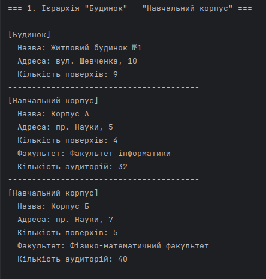
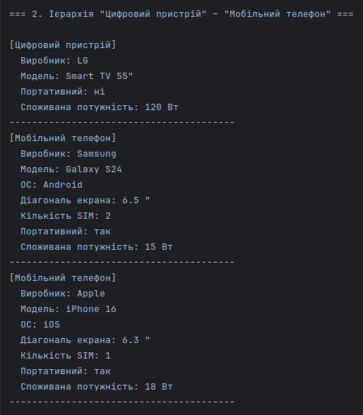
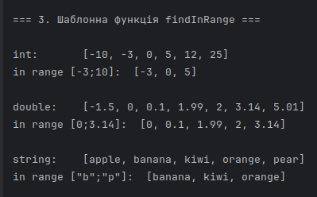
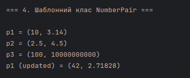

# Тема 15. Шаблони та успадкування. Питання для самостійного опрацювання.

---

## Завдання:

1. Створити ієрархію класів `"Будинок" – "Навчальний корпус"`. Створити масив указівників і вивести в циклі дані про об'єкти різних типів.
2. Створити ієрархію класів `"Цифровий пристрій" – "Мобільний телефон"`. Створити масив указівників і вивести в циклі дані про об'єкти різних типів.
3. Створити шаблонну функцію для пошуку в масиві елементів, які знаходяться в певному діапазоні. Перевірити роботу для різних типів елементів.
4. Створити шаблон класу для зберігання пари чисел різних типів.

## Виконання:

1. Ієрархія класів `"Будинок" – "Навчальний корпус"`.
   - Базовий клас `Building`. Клас описує узагальнений будинок. Він містить спільні для всіх типів будівель властивості:
       - `name_`  назва будівлі
       - `address_`  адреса
       - `floors_`  кількість поверхів
   - Базовий клас оголошує віртуальний деструктор, для коректного видалення похідних об'єктів через вказівник на базовий клас.
   - Метод `printInfo()` є віртуальним, оскільки для різних типів будівель виводиться різна інформація.
   - Похідний клас `EducationalBuilding` оголошено як `final`, що забороняє подальше успадкування від нього. Цей клас успадковує базовий `Building` та розширює його двома додатковими характеристиками:
      - `faculty_` факультет, якому належить навчальний корпус
      - `classrooms_` кількість аудиторій
   - Метод `printInfo()` перевизначається (`override`) для виводу додаткових полів.
   - Тестування ієрархії: функція `testBuildings()`. Створюється масив вказівників на базовий клас `Building`, але фактично в ньому зберігаються об'єкти як базового класу, так і похідного. Демонструється механізм поліморфізму, викликаючи `printInfo()` через вказівник типу `Building*`, програма запускає правильну версію методу (базову або перевизначену в похідному класі). У циклі об'єкти різних типів обробляються однаково, без окремих умов чи перевірок типу.
   - Виконання:
     - 
2. Ієрархія класів `"Цифровий пристрій" – "Мобільний телефон"`.
   - Базовий клас `DigitalDevice` описує будь-який цифровий пристрій. Містить загальні характеристики:
       - `brand_` виробник
       - `model_` модель
       - `portable_` портативний чи ні
       - `powerWatts_` споживана потужність (умовна величина)
   - Метод `printInfo()` оголошений як `virtual` для забезпечення поліморфізму, деструктор `virtual` для коректного видалення через вказівник на базовий клас.
   - Похідний клас `MobilePhone` оголошений як `final`, успадковує `DigitalDevice` і додає властивості, характерні для смартфона:
       - `os_` операційна система
       - `screenInches_` діагональ екрана
       - `simSlots_` кількість SIM-карт
   - У `MobilePhone` перевизначено метод `printInfo()` (`override`) для виводу розширеної інформації про телефон.
   - Тестування ієрархії: функція `testDigitalDevices()`. Створюється масив вказівників типу `DigitalDevice*`, у якому розміщуються як об’єкти базового типу, так і похідного `MobilePhone`. При виведенні у циклі демонструється поліморфізм, для кожного об'єкта викликається правильна версія `printInfo()`. Пам’ять звільняється в кінці функції.
   - Виконання:
       - 
3. Шаблонна функція для пошуку елементів у заданому діапазоні.
    - Реалізовано універсальну шаблонну функцію `findInRange()`, яка приймає:
        - вектор елементів `const std::vector<T>&`
        - нижню межу діапазону `low`
        - верхню межу `high`
          і повертає новий вектор, що містить усі елементи, які задовольняють умові  
          `low <= element <= high`.
    - Функція працює для будь-якого типу, що підтримує операції порівняння (`>=` і `<=`),  
      тому підходить для:
        - цілих чисел `int`
        - чисел з плаваючою комою `double`
        - рядків `std::string` (лексикографічне порівняння)
    - Для зручності виводу створена допоміжна шаблонна функція `printVector()`,  
      яка друкує вектор будь-якого типу.
    - Тестування функціоналу: `testFindInRange()`.  
      Функція перевіряє роботу `findInRange()` на трьох різних типах:
        - `int`  пошук у діапазоні `[-3; 10]`
        - `double`  пошук у діапазоні `[0; 3.14]`
        - `std::string`  пошук у лексикографічному діапазоні `["b"; "p"]`  
    - Результати кожного тесту виводяться на екран за допомогою `printVector()`.
    - Виконання:
        - 
4. Шаблонний клас для зберігання пари чисел різних типів.
    - Створено універсальний шаблонний клас `NumberPair<T1, T2>`, призначений для зберігання двох значень різних типів.
    - Клас містить приватні поля:
        - `first_`  перше значення типу `T1`
        - `second_`  друге значення типу `T2`
    - Передбачено:
        - конструктор за замовчуванням
        - конструктор для ініціалізації пари (`NumberPair(const T1&, const T2&)`)
        - гетер доступу до першого елемента `first()`
        - гетер доступу до другого елемента `second()`
        - сетери `setFirst()` та `setSecond()` для зміни значень
    - Метод `print()` дозволяє вивести пару у форматі `(first_, second_)`.
    - Тестування функціоналу: функція `testNumberPair()`.  
      Створюються кілька об’єктів `NumberPair` із різними комбінаціями типів:
        - `NumberPair<int, double>`
        - `NumberPair<double, double>`
        - `NumberPair<long, long long>`
          Виконується вивід значень та зміна елементів пари для демонстрації роботи сеттерів.
    - Виконання:
        - 