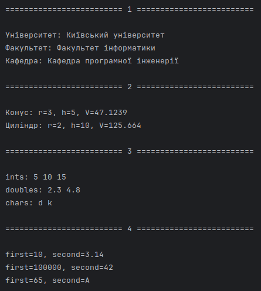

# First semester assessments

---

1. Створити ієрархію класів "Університет" – "Факультет" – "Кафедра". Створити масив указівників і вивести в циклі дані про об'єкти різних типів.
  - [University.cpp](https://github.com/yourhostel/cpp_course/blob/main/III_course/2025-12-26-semester-assessments/classes/University.cpp) 
  - [University.h](III_course/2025-12-26-semester-assessments) 
  - демо-функція в `main`: `demoUniversityHierarchy(https://github.com/yourhostel/cpp_course/blob/main/III_course/2025-12-26-semester-assessments/classes/University.h)`
2. Створити ієрархію класів "Фігури обертання" – "Конус". Створити масив указівників і вивести в циклі дані про об'єкти різних типів.
  - [SolidOfRevolution.cpp](https://github.com/yourhostel/cpp_course/blob/main/III_course/2025-12-26-semester-assessments/classes/SolidOfRevolution.cpp)
  - [SolidOfRevolution.h](https://github.com/yourhostel/cpp_course/blob/main/III_course/2025-12-26-semester-assessments/classes/SolidOfRevolution.h)
  - демо-функція в `main`: `demoSolidsOfRevolution()`
3. Створити шаблонну функцію для пошуку в масиві елементів, які знаходяться в певному діапазоні. Перевірити роботу для різних типів елементів.
  - [FindInRange.tpp](https://github.com/yourhostel/cpp_course/blob/main/III_course/2025-12-26-semester-assessments/classes/FindInRange.tpp)
  - [FindInRange.h](https://github.com/yourhostel/cpp_course/blob/main/III_course/2025-12-26-semester-assessments/classes/FindInRange.h)
  - демо-функція в `main`: `demoFindInRange()`
4. Створити шаблон класу для зберігання пари чисел різних типів.
  - [NumberPair.tpp](https://github.com/yourhostel/cpp_course/blob/main/III_course/2025-12-26-semester-assessments/classes/NumberPair.tpp)
  - [NumberPair.h](https://github.com/yourhostel/cpp_course/blob/main/III_course/2025-12-26-semester-assessments/classes/NumberPair.h)
  - демо-функція в `main`: `demoNumberPair()`

---

