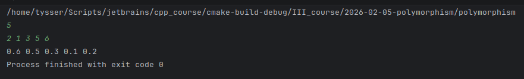
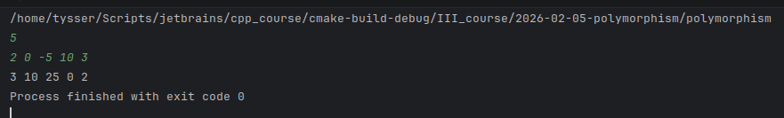

# Тема: Поліморфізм у мовах програмування

### 1 Що таке поліморфізм
- Поліморфізм (з грец. «багатоформність») це здатність об'єктів або структур приймати різні форми, мати різну поведінку при єдиному інтерфейсі чи складі.
- Це властивість системи типів або мови програмування, що дозволяє одному імені функції, методу або оператора працювати з різними типами значень при збереженні узгодженого інтерфейсу.
- Він існує у ООП, функціональних мовах, і у мовах з сильною статичною типізацією без класів.

---

Поліморфізм у [wikipedia.org](https://uk.wikipedia.org/wiki/Поліморфізм_(програмування))

---

### 2 Основна формальна класифікація Карделлі
  - **Універсальний поліморфізм**. Функція працює однаково для великого класу типів.
    - *Параметричний поліморфізм*. Функція або тип описуються через параметри типів.
      - Приклади:
        - Generics у `Java`, `C#`, `Kotlin`
        - Templates у `C++`
        - Поліморфні функції у `Haskell`
        - ```java
          // Концепція
          // Алгоритм однаковий незалежно від T.
          List<T>
          ```
    - *Підтиповий поліморфізм* Базується на відношенні підтипу. Об’єкт підтипу можна використовувати там, де очікується базовий тип.
      - Наслідування
      - Інтерфейси
      - Абстрактні класи
      - Характерне динамічне зв’язування.
  - **Спеціальний (Ad-hoc) поліморфізм** Одна операція має різні реалізації для різних типів.
     - Перевантаження функцій:
       - ```java
         add(int, int)
         add(double, double)
         ```
     - Перевантаження операторів:
       - ```cpp
         operator+ у C++
         ``` 
     - Поліморфізм примусу (Coercion). Автоматичне приведення типів.
       - ```javascript
         "5" + 10 
         ```

#### ЛОГІЧНІ ВИДИ ПОЛІМОРФІЗМУ

| Форма поліморфізму | Підтип         | Опис                                        | Типові механізми                         | Приклади мов           |
|--------------------|----------------|---------------------------------------------|------------------------------------------|------------------------|
| Універсальний      | Параметричний  | Алгоритм однаковий для довільних типів      | Generics, Templates, поліморфні функції  | C++, Java, C#, Haskell |
| Універсальний      | Підтиповий     | Підтип можна використовувати як базовий тип | Наслідування, інтерфейси, virtual методи | Java, C++, C#, Kotlin  |
| Спеціальний        | Перевантаження | Одна назва функції має різні реалізації     | Overloading функцій та операторів        | C++, Java              |
| Спеціальний        | Примусовий     | Автоматичне приведення типів                | Type coercion                            | JavaScript, C#, C++    |

---

### 3 Час зв’язування
  - **Статичне зв’язування**. Вибір функції відбувається під час компіляції.
    - Зазвичай:
      - перевантаження
      - параметричний поліморфізм
        - реалізація через шаблони та generics
          - з мономорфізацією ([C++](https://en.cppreference.com/w/cpp/language/templates.html), [Rust](https://rustlangua.github.io/rustbookua.github.io/ch10-01-syntax.html))
          - без мономорфізації `type erasure` ([Java](https://uk.wikipedia.org/wiki/Узагальнення_в_Java))
          - змішана модель ([C#](https://learn.microsoft.com/en-us/dotnet/csharp/fundamentals/types/generics))
  - **Динамічне зв’язування** Вибір методу відбувається під час виконання(`runtime`).
    - Використовується при:
      - virtual методах
      - інтерфейсах
      - [пізньому зв’язуванні](https://studfile.net/preview/5203473/)

#### МЕХАНІЗМ ВИБОРУ РЕАЛІЗАЦІЇ

| Тип зв’язування | Опис                                | Типові механізми                             | Приклади мов        |
|-----------------|-------------------------------------|----------------------------------------------|---------------------|
| Статичне        | Вибір реалізації під час компіляції | Перевантаження, параметричний поліморфізм    | C++, Rust, Java, C# |
| Динамічне       | Вибір реалізації під час виконання  | Virtual методи, інтерфейси, dynamic dispatch | Java, C#, Python    |


---

### 4 Типізація
  - **Номінальна типізація**
    - Тип визначається іменем. (Java, C#, C++)
  - **Структурна типізація** 
    - Тип визначається набором операцій. (TypeScript, Go, OCaml)
  - **Качина типізація**
    - Це динамічний випадок структурної типізації. Качина типізація не залежить від наслідування.
      - Принцип: Якщо об’єкт підтримує потрібні методи, він підходить.
      - [«If it looks like a duck, swims like a duck and quacks like a duck, then it probably is a duck»](https://uk.wikipedia.org/wiki/Качина_типізація).
        («Якщо воно виглядає як качка, плаває як качка і кахкає як качка, то це напевно і є качка»).
      - Python приклад:
        - ```python
          # Тут не перевіряється тип, перевіряється поведінка.
          def make_sound(obj):
          obj.sound()
          ```

#### МОДЕЛЬ ТИПІЗАЦІЇ

| Модель типізації | Опис                              | Типові механізми  | Приклади мов          |
|------------------|-----------------------------------|-------------------|-----------------------|
| Номінальна       | Тип визначається іменем           | Класи, інтерфейси | Java, C#, C++         |
| Структурна       | Тип визначається набором операцій | Structural typing | TypeScript, Go, OCaml |
| Качина           | Перевірка типу під час виконання  | Duck typing       | Python, Ruby          |


---

### 5 Диспетчеризація викликів
  - **Single dispatch** Вибір методу залежить від типу одного об’єкта. Класичне ООП. (Java, C++, C#) 
  - **Multiple dispatch** Вибір залежить від типів усіх аргументів. ([Julia](https://uk.wikipedia.org/wiki/Julia_(мова_програмування)), [CLOS](https://uk.wikipedia.org/wiki/CLOS))

#### ДИСПЕТЧИРИЗАЦІЯ

| Тип диспетчеризації | Опис                            | Типові механізми | Приклади мов  |
|---------------------|---------------------------------|------------------|---------------|
| Single dispatch     | Вибір за типом receiver         | Класичне ООП     | Java, C++, C# |
| Multiple dispatch   | Вибір за типами всіх аргументів | Multimethods     | Julia, CLOS   |


---

### 6 Generics та взаємодія видів поліморфізму
  - Дженерики самі по собі це параметричний поліморфізм, aле вони можуть комбінуватися з підтиповим.
    - Приклад:
      - ```java
        // параметричний поліморфізм
        // підтиповий поліморфізм
        List<? extends Animal>
        ```

#### КОМБІНУВАННЯ МЕХАНІЗМІВ ТА ОБМЕЖЕННЯ

| Категорія                | Підтип                     | Опис                                 | Типові механізми           | Приклади мов         |
|--------------------------|----------------------------|--------------------------------------|----------------------------|----------------------|
| Комбінований поліморфізм | Параметричний + підтиповий | Узагальнення з обмеженням підтипів   | Bounded generics           | Java, C#             |
| Поведінкові обмеження    | Контрактність              | Підтип зберігає поведінкові гарантії | Принцип підстановки Лісков | Усі ООП мови         |
| Архітектурний принцип    | Абстракція залежностей     | Код залежить від абстракцій          | Dependency inversion       | Усі сучасні ООП мови |

---

### 7 Поліморфізм на прикладі домашнього завдання 

> Реалізація цієї задачі не потребує поліморфізму.  
> У реальному коді достатньо одного простого алгоритму обходу контейнера.  
> Наведені нижче варіанти реалізації використовуються для демонстрації різних видів поліморфізму в мові C++.
 
#### Загальна умова задачі

- Задано натуральне число `n`, дійсні числа `a1, a2, ..., an`. Якщо в числовій послідовності `a1 ,a2 ,...,an` задано хоча б один елемент, менший, ніж `(-3)`, то всі від'ємні елементи замінити їх квадратами, а решту елементів залишити без змін; В іншому випадку потрібно помножити всі елементи на `0.1`. Результат у вигляді списку вивести на екран в зворотньому порядку: `an, an-1,..., a1`.

#### Алгоритмічне ядро задачі

```txt
перевірити, чи існує елемент < -3

якщо існує:
    для кожного від’ємного елемента:
        замінити його квадратом
інакше:
    для кожного елемента:
        помножити на 0.1

повернути послідовність       
```

Відповідність реалізацій умові задачі

Усі реалізації в коді виконують одне й те саме алгоритмічне ядро, наведене вище.
Відмінності між реалізаціями полягають лише у способі організації коду та використаних механізмах поліморфізму, а не в логіці обробки даних.

#### Характеристика реалізацій з точки зору поліморфізму

**solve_plain**
- Не використовує поліморфізм
- Алгоритм реалізований явно через цикли та умовні оператори

**solve_ad_hoc_overload**
- Демонструє `ad hoc` поліморфізм
- Узагальнення досягається через перевантаження функції `has_less_than`
- Вибір реалізації відбувається під час компіляції

**solve_parametric_templates**
- Демонструє параметричний поліморфізм
- Алгоритм узагальнений за типом `T`
- Реалізація відбувається через шаблони `C++`
- Застосовується мономорфізація під час компіляції

**solve_subtype_virtual**
- Демонструє підтиповий поліморфізм
- Використовується інтерфейс `IListProcessor` з `virtual` методом
- Реальна реалізація визначається під час виконання
- Клас `ProcessorRule` є класом поведінки, що інкапсулює алгоритм




