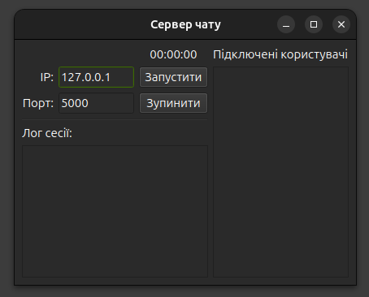
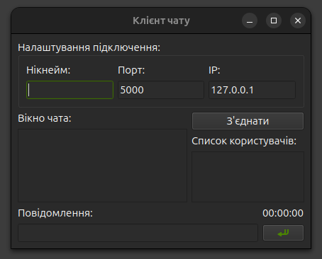

# Qt6 TCP Client-Server Chat
(Практичне заняття №1. ЗМ2. ЛЗ1.)

Навчальний проект, що реалізує базову клієнт-серверну систему чату з використанням Qt6 та C++23.

Проект розроблено в рамках курсу об'єктно-орієнтованого програмування та зосереджено на:
- Архітектурі застосунку Qt6 Widgets
- Структурі проекту на основі CMake
- Розділенні виконуваних файлів клієнта та сервера
- Підготовці до TCP-сокетного зв'язку за допомогою модуля Qt Network

---

# Технологічний стек

- C++23
- Qt 6 (Widgets, Network)
- CMake
- Ninja

## Структура проекту

```text
│
├── client/
│ ├── main.cpp
│ ├── client.h
│ ├── client.cpp
│ ├── client.ui
│ └── CMakeLists.txt
│
├── server/
│ ├── main.cpp
│ ├── server.h
│ ├── server.cpp
│ ├── server.ui
│ └── CMakeLists.txt
│
└── CMakeLists.txt
```

---

## Компоненти UI сервера

| Назва компоненту       | Тип компоненту | Значення               |
|------------------------|----------------|------------------------|
| Server(клас)           | QMainWindow    | Сервер чату            |
| centralWidget          | QWidget        |                        |
| mainLayout             | QVBoxLayout    |                        |
| controlLayout          | QGridLayout    |                        |
| clockLabel             | QLabel         | 00:00:00               |
| ipLabel                | QLabel         | IP:                    |
| ipLineEdit             | QLineEdit      | 127.0.0.1              |
| portLabel              | QLabel         | Порт:                  |
| portLineEdit           | QLineEdit      | 5000                   |
| startButton            | QPushButton    | Запустити              |
| stopButton             | QPushButton    | Зупинити               |
| sessionLogLayout       | QVBoxLayout    |                        |
| sessionLogLabel        | QLabel         | Лог сесії              |
| sessionLogTextEdit     | QTextEdit      |                        |
| connectedUsersLayout   | QVBoxLayout    |                        |
| connectedUsersLabel    | QLabel         | Підключені користувачі |
| connectedUsersTextEdit | QTextEdit      |                        |



---

## Компоненти UI клієнта

| Назва компоненту         | Тип компоненту | Значення                  |
|--------------------------|----------------|---------------------------|
| Client                   | QMainWindow    | Клієнт чату               |
| centralWidget            | QWidget        |                           |
| centralLayout            | QHBoxLayout    |                           |
| chatLayout               | QVBoxLayout    |                           |
| chatLabel                | QLabel         | Вікно чата:               |
| chatPlainTextEdit        | QPlainTextEdit |                           |
| usersListLayout          | QVBoxLayout    |                           |
| connectButton            | QPushButton    | З'єднати                  |
| usersListLabel           | QLabel         | Список користувачів:      |
| usersListWidget          | QListWidget    |                           |
| connectionSettingsLayout | QVBoxLayout    |                           |
| groupBox                 | QGroupBox      | Налаштування підключення: |
| ipLabel                  | QLabel         | IP:                       |
| ipLineEdit               | QLineEdit      | 127.0.0.1                 |
| nickLabel                | QLabel         | Нікнейм:                  |
| nickLineEdit             | QLineEdit      |                           |
| portLabel                | QLabel         | Порт:                     |
| portLineEdit             | QLineEdit      | 5000                      |
| inputLayout              | QGridLayout    |                           |
| clockLabel               | QLabel         | 00:00:00                  |
| inputLabel               | QLabel         | Повідомлення:             |
| inputLineEdit            | QLineEdit      |                           |
| sendButton               | QPushButton    | Надіслати                 |



- **usersListWidget**
  - Обраний `QListWidget`, бо список користувачів це набір дискретних елементів, його треба легко оновлювати і вибирати конкретного користувача для адресної відправки без парсингу тексту.
  - Застосовано `selectionMode` `SingleSelection` і `editTriggers: NoEditTriggers`, щоб можна було вибрати рівно одного адресата і щоб користувач не міг вручну редагувати нік у списку.

- **chatPlainTextEdit**
  - Обраний `QPlainTextEdit`, бо для логу повідомлень потрібен швидкий вивід великої кількості простого тексту і дешеве додавання рядків без важкого `rich text` механізму.
  - Порівняно з `QTextEdit`, `QPlainTextEdit` легший для такого сценарію і менше схильний до випадкового форматування.

---

## Модель роботи TCP у Qt6

- У проєкті використано асинхронну модель сокетів Qt.
  - Сервер використовує `QTcpServer`, який:
    - викликає `listen`
    - генерує сигнал newConnection
    - для кожного клієнта створює окремий `QTcpSocket`
  - Клієнт використовує `QTcpSocket`, який:
    - викликає `connectToHost`
    - генерує сигнал `connected`
    - приймає дані через сигнал `readyRead`
    - працює неблокуюче у подієвому циклі Qt
  - Обмін даними реалізовано поверх простого текстового протоколу з розділенням пакетів символом нового рядка `\n`.
  - Уся мережева логіка працює через сигнали та слоти без створення окремих потоків.

## Bash для запуску кількох клієнтів одночасно

У `CMakeLists.txt` має відповідати `project(chat_server)` та `project(chat_client)`.

```bash
#!/usr/bin/env bash

# Строгий режим виконання:
# -e  зупинити скрипт при будь-якій помилці
# -u  помилка при використанні неініціалізованої змінної
set -eu

# Кількість клієнтів
CLIENTS=4

# Шлях до каталогу збірки (cmake-build-*)
BASE="/шлях/до/білду"

# Шляхи до виконуваних файлів
SERVER="$BASE/server/chat_server"
CLIENT="$BASE/client/chat_client"

# Запуск сервера у фоновому режимі
"$SERVER" &
server_pid=$!

# Невелика пауза, щоб сервер встиг почати слухати порт
sleep 0.5

# Запуск кількох клієнтів
for ((i=1; i<=CLIENTS; i++)); do
    "$CLIENT" &
done

# Очікування завершення сервера
wait $server_pid
```
