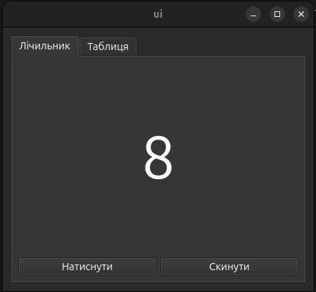
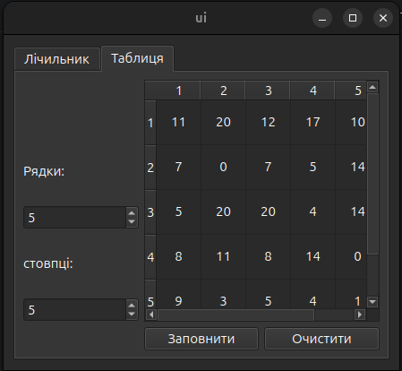

## Створення власних компонентів Qt6 
(Практичне заняття №2. ЗМ3. ЛЗ2.)
---

## Мета
Навчитися створювати власні компоненти засобами C++ та фреймворку Qt6
(адаптація завдання з Borland C++ Builder).

---

# Завдання 1

## Умова
Створити новий компонент, який запам’ятовує кількість натискань
та відображає цю інформацію.

## Реалізація в Qt6

Було створено клас `CounterTab`, який:

- працює з віджетами, створеними у `.ui`
- підписується на сигнал `QPushButton::clicked`
- зберігає внутрішній лічильник `int counterValue`
- оновлює `QLabel` після кожного натискання

### Поведінка
- Кнопка `counterButton` збільшує лічильник
- Кнопка `resetButton` обнуляє значення
- Значення відображається у `counterLabel`

Таб 1. Компоненти лічильника в .ui

| Назва                | Тип           | Значення за замовчуванням |
|----------------------|---------------|---------------------------|
| counterButton        | QPushButton   | Текст: "Натиснути"        |
| counterLabel         | QLabel        | Текст: "0"                |
| resetButton          | QPushButton   | Текст: "Скинути"          |

---

# Завдання 2

## Умова
Створити компонент нащадок `TStringGrid`, який:

- при натисканні F11 заповнює комірки випадковими числами 0..20
- при натисканні Esc очищує таблицю
- при кліку по комірці збільшує шрифт удвічі

## Адаптація до Qt6

Оскільки використовується Qt6, реалізовано клас `GridTab`,
який працює з `QTableWidget`.

Замість F11 використано клавішу `Insert`, оскільки функціональні клавіші зайняті середовищем.

## Реалізована функціональність

### 1. Заповнення випадковими числами
- Клавіша `Insert`
- Кнопка `fillButton`
- Метод `fillRandomCells()`

### 2. Очищення таблиці
- Клавіша `Esc`
- Кнопка `clearButton`
- Метод `clearCells()`

### 3. Зміна розміру шрифту клітинки
- Сигнал `cellClicked(int row, int column)`
- Метод `toggleCellFont()`
- Перемикання між базовим розміром та подвоєним

### 4. Зміна розмірності таблиці
- `rowSpinBox`
- `columnSpinBox`
- Методи `setRowCount()` та `setColumnCount()`

Таб 2. Компоненти таблиця в .ui

| Назва         | Тип          | Значення за замовчуванням |
|---------------|--------------|---------------------------|
| tableWidget   | QTableWidget | 5 рядків, 5 стовпців      |
| fillButton    | QPushButton  | Текст: "Заповнити"        |
| clearButton   | QPushButton  | Текст: "Очистити"         |
| rowLabel      | QLabel       | Текст: "Рядки:"           |
| rowSpinBox    | QSpinBox     | 5                         |
| columnLabel   | QLabel       | Текст: "Стовпці:"         |
| columnSpinBox | QSpinBox     | 5                         |

---

## Діаграма успадкувань від головного об'єкта Qt

## Контрольні питання

1. Що означає специфікатор DYNAMIC?  
   У Qt такого специфікатора немає. Динамічність забезпечується механізмом метаоб’єктів через `Q_OBJECT`, систему сигналів і слотів та RTTI.

2. Які елементи є основними у класі компонентів?
- Конструктор
- Внутрішній стан
- Публічний інтерфейс
- Сигнали
- Слоти
- Обробка подій

3. Який клас є базовим для усіх візуальних компонентів?  
   `QWidget`

4. Який клас є базовим для усіх віконних компонентів?  
   `QWidget`

5. Який клас є базовим для графічних компонентів?
- `QWidget`
- У підсистемі Graphics View — `QGraphicsItem`

6. Назвіть методи базового візуального компонента та їх призначення.
- `show()` - показ віджета
- `hide()` - приховування
- `resize()` - зміна розміру
- `setGeometry()` - встановлення позиції та розміру
- `paintEvent()` - відмальовування
- `keyPressEvent()` - обробка клавіатури
- `mousePressEvent()` - обробка миші

7. Методи контейнерного компонента та їх призначення.
- `setLayout()` - встановлення менеджера розмітки
- `addWidget()` - додавання дочірнього віджета через layout
- `findChild()` - пошук дочірнього об’єкта
- `setParent()` - встановлення батьківського об’єкта

8. Послідовність створення нового компонента.
- Створити клас
- Успадкувати від `QWidget` або `QObject`
- Додати `Q_OBJECT`
- Реалізувати конструктор
- Підключити сигнали та слоти
- Інтегрувати у форму або layout

9. Для чого потрібна інсталяція компонента?  
   Щоб використовувати його у `Qt Designer` як власний віджет через плагін.  
   Для звичайного використання у коді інсталяція не потрібна.
