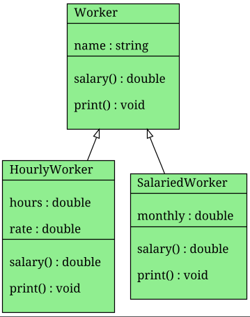

# Практичне заняття №3. ЗМ3. ЛЗ3.

---

### 1. Що таке поліморфізм і які є його типи.
  - Поліморфізм – це використання під одним іменем різних функцій, призначених для
    опрацювання даних різних типів. Є динамічний та статичний поліморфізм. 
### 2. Що таке раннє і пізнє звязування.
  - Раннє звязування коли вибір функції відбувається під час компіляції.
    - Виклик іде напряму через об’єкт. Перевантаження функцій, шаблони належать до раннього зв'язування.
  - Пізнє звязування коли вибір функції відбувається під час виконання програми.
    - Працює тількі коли метод є `virtual`. Виклик виконується через вказівник або посилання на базовий клас.
    - Об’єкт з `virtual` методами містить прихований покажчик на таблицю віртуальних функцій.
      Під час виклику програма бере адресу функції з цієї таблиці відповідно до реального типу об’єкта.
    - Приклад: Тип змінної `A*` але реальний об’єкт `B` і викликається `B::f()`
### 3. Який метод називається віртуальним і які його особливості.
  - Це метод класу, оголошений зі словом `virtual`, для якого вибір реалізації здійснюється під час виконання програми.
  - Особливості:
    - використовується для реалізації динамічного поліморфізму
    - може бути перевизначений у похідних класах
    - викликається за механізмом пізнього зв’язування
    - працює коректно при виклику через вказівник або посилання на базовий клас
    - не може бути static
    - може бути чисто віртуальним (`virtual void f() = 0;`), що робить клас абстрактним 
### 4. Як виключити поліморфізм віртуальних методів.
   - Явно вказати ім’я класу при виклику методу.
   ```cpp
   obj.A::f();
   ptr->A::f();
   ```
### 5. Які віртуальні методи є коваріантними.
  - Коваріантними називаються такі віртуальні методи, у яких під час перевизначення в похідному класі змінюється тип повернення на більш похідний(в тому ж кластері за методичкою) тип тієї ж ієрархії класів.
### 6. Що таке віртуальні операторні методи.
  - Віртуальні операторні методи це перевантажені оператори класу з іменем виду `operator+`, `operator++`, `operator=` та інши
  - Приклад:
    ```cpp
    virtual A& operator++()
    {
        ++x;
        return *this;
    }
    ```
### 7. Як реалізувати вказівники на віртуальні методи
  - Оголосити `virtual` метод у базовому класі і перевизначити його в похідному. 
  - Оголосити змінну типу вказівника на метод базового класу і присвоїти їй адресу методу `&Base::method`. 
  - Викликати через об’єкт або вказівник на об’єкт синтаксисом `obj.*pmf` або `ptr->*pmf`.
  - Приклад:
    ```cpp
    void (A::*pf)() const = &A::f;
    A* p = new B;
    (p->*pf)();   // викличе B::f, бо f virtual
    ```
### 8. Динамічні віртуальні методи.
  - У C++ усі `virtual` методи вже є динамічними. 
    Якщо клас має хоча б один `virtual` метод, компілятор створює для нього таблицю віртуальних функцій (`vtable`).
    Кожен об’єкт цього класу містить прихований покажчик на цю таблицю.
    Під час виклику `virtual` методу через вказівник або посилання використовується ця таблиця для визначення адреси функції.
### 9. Особливості застосування віртуальних деструкторів.
  - Віртуальний деструктор потрібен у поліморфних базових класах, щоб при видаленні об’єкта через вказівник на базовий клас коректно викликалися деструктори всієї ієрархії.
    Спочатку виконується деструктор похідного класу, потім базового. Якщо деструктор базового класу не `virtual`, виникає невизначена поведінка.
### 10. Що таке чисті віртуальні методи і для чого вони використовуються.
  - Чистий віртуальний метод це метод, оголошений як `virtual void f() = 0;`, який не має обов’язкової реалізації в базовому класі.
    Клас з таким методом є абстрактним і не може створювати об’єкти.
    Використовується для задання інтерфейсу і примусового перевизначення методу в похідних класах.
### 11. Що таке абстрактний і чистий абстрактний класи.
  - Абстрактний клас це клас, який має хоча б один чистий віртуальний метод, тобто метод виду `virtual ... = 0;`. Такий клас не можна інстанціювати, він використовується як базовий для успадкування і задає загальний інтерфейс або часткову реалізацію.
  - Чистий абстрактний клас це клас, у якому всі методи є чистими віртуальними і відсутня власна реалізація поведінки. Це інтерфейс, який містить лише контракт без конкретної логіки.
### 12. Пояснити приклад програми застосування абстрактних класів

#### Завдання 7
```cpp
/*
Приклад застосування абстрактних класів.

Ідея програми:
Базовий клас Worker є абстрактним і задає спільний інтерфейс
для всіх типів працівників. Він містить чисто віртуальний метод
salary(), що примушує похідні класи реалізувати власну формулу
нарахування зарплати.

Похідні класи реалізують різні способи обчислення зарплати.
Через масив вказівників на базовий клас демонструється
пізнє зв’язування: конкретна реалізація salary() вибирається
під час виконання залежно від фактичного типу об’єкта.
*/

class Worker
{
protected:
    // Спільне поле для всіх працівників
    std::string name;

public:
    // Конструктор ініціалізує ім’я
    explicit Worker(std::string name) : name(std::move(name)) {}

    // Віртуальний деструктор необхідний для коректного
    // знищення об’єктів через вказівник на базовий клас
    virtual ~Worker() = default;

    // Чисто віртуальний метод нарахування зарплати.
    // Робить клас абстрактним.
    virtual double salary() const = 0;

    // Віртуальний метод виводу загальної інформації.
    // Має спільну реалізацію для всіх похідних класів.
    virtual void print() const
    {
        std::cout << name;
    }
};

// Похідний клас з погодинною оплатою
class HourlyWorker : public Worker
{
    double hours; // кількість відпрацьованих годин
    double rate;  // ставка за годину

public:
    HourlyWorker(std::string name,
                 const double hours,
                 const double rate)
        : Worker(std::move(name)),
          hours(hours),
          rate(rate) {}

    // Реалізація формули зарплати для погодинної оплати
    double salary() const override
    {
        return hours * rate;
    }

    // Розширення базового виводу інформації
    void print() const override
    {
        Worker::print();
        std::cout << " (погодинно: "
                  << hours << " год, "
                  << rate << " грн/год)";
    }
};

// Похідний клас з фіксованим окладом
class SalariedWorker : public Worker
{
    double monthly; // місячний оклад

public:
    SalariedWorker(std::string name, double monthly)
        : Worker(std::move(name)),
          monthly(monthly) {}

    // Реалізація формули зарплати для окладу
    double salary() const override
    {
        return monthly;
    }

    // Розширення базового виводу інформації
    void print() const override
    {
        Worker::print();
        std::cout << " (оклад: "
                  << monthly << " грн)";
    }
};

int main()
{
    // Створення конкретних об’єктів похідних класів
    HourlyWorker w1("Іван", 120, 150);
    SalariedWorker w2("Олена", 25000);

    // Масив вказівників на базовий клас.
    // Демонстрація поліморфізму.
    Worker* staff[2];
    staff[0] = &w1;
    staff[1] = &w2;

    // Виклик virtual методів через базовий інтерфейс.
    // Реалізація salary() визначається під час виконання.
    for (Worker* p : staff)
    {
        p->print();
        std::cout << ", зарплата = "
                  << p->salary()
                  << std::endl;
    }
}
```

---

#### Діаграма класів ієрархії Worker

