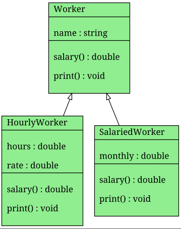

# Практичне заняття №3. ЗМ3. ЛЗ3.

## Що таке поліморфізм і які є його типи.
  - Поліморфізм – це використання під одним іменем різних функцій, призначених для
    опрацювання даних різних типів. Є динамічний та статичний поліморфізм.

## Що таке раннє і пізнє звязування.
  - Раннє звязування коли вибір функції відбувається під час компіляції.
    - Виклик іде напряму через об’єкт. Перевантаження функцій, шаблони належать до раннього зв'язування.
  - Пізнє звязування коли вибір функції відбувається під час виконання програми.
    - Працює тількі коли метод є `virtual`. Виклик виконується через вказівник або посилання на базовий клас.
    - Об’єкт з `virtual` методами містить прихований покажчик на таблицю віртуальних функцій.
      Під час виклику програма бере адресу функції з цієї таблиці відповідно до реального типу об’єкта.
    - Приклад: Тип змінної `A*` але реальний об’єкт `B` і викликається `B::f()`

## Який метод називається віртуальним і які його особливості.
  - Це метод класу, оголошений зі словом `virtual`, для якого вибір реалізації здійснюється під час виконання програми.
  - Особливості:
    - використовується для реалізації динамічного поліморфізму
    - може бути перевизначений у похідних класах
    - викликається за механізмом пізнього зв’язування
    - працює коректно при виклику через вказівник або посилання на базовий клас
    - не може бути static
    - може бути чисто віртуальним (`virtual void f() = 0;`), що робить клас абстрактним 

## Як виключити поліморфізм віртуальних методів.
   - Явно вказати ім’я класу при виклику методу.

```cpp
obj.A::f();
ptr->A::f();
```

## Які віртуальні методи є коваріантними.
  - Коваріантними називаються такі віртуальні методи, у яких під час перевизначення в похідному класі змінюється тип повернення на більш похідний(в тому ж кластері за методичкою) тип тієї ж ієрархії класів.

## Що таке віртуальні операторні методи.
  - Віртуальні операторні методи це перевантажені оператори класу з іменем виду `operator+`, `operator++`, `operator=` та інши
Приклад:

```cpp
virtual A& operator++()
{
    ++x;
    return *this;
}
```

## Як реалізувати вказівники на віртуальні методи
  - Оголосити `virtual` метод у базовому класі і перевизначити його в похідному. 
  - Оголосити змінну типу вказівника на метод базового класу і присвоїти їй адресу методу `&Base::method`. 
  - Викликати через об’єкт або вказівник на об’єкт синтаксисом `obj.*pmf` або `ptr->*pmf`.
Приклад:

```cpp
void (A::*pf)() const = &A::f;
A* p = new B;
(p->*pf)();   // викличе B::f, бо f virtual
```

## Динамічні віртуальні методи.
  - У C++ усі `virtual` методи вже є динамічними. 
    Якщо клас має хоча б один `virtual` метод, компілятор створює для нього таблицю віртуальних функцій (`vtable`).
    Кожен об’єкт цього класу містить прихований покажчик на цю таблицю.
    Під час виклику `virtual` методу через вказівник або посилання використовується ця таблиця для визначення адреси функції.

## Особливості застосування віртуальних деструкторів.
  - Віртуальний деструктор потрібен у поліморфних базових класах, щоб при видаленні об’єкта через вказівник на базовий клас коректно викликалися деструктори всієї ієрархії.
    Спочатку виконується деструктор похідного класу, потім базового. Якщо деструктор базового класу не `virtual`, виникає невизначена поведінка.

## Що таке чисті віртуальні методи і для чого вони використовуються.
  - Чистий віртуальний метод це метод, оголошений як `virtual void f() = 0;`, який не має обов’язкової реалізації в базовому класі.
    Клас з таким методом є абстрактним і не може створювати об’єкти.
    Використовується для задання інтерфейсу і примусового перевизначення методу в похідних класах.

## Що таке абстрактний і чистий абстрактний класи.
  - Абстрактний клас це клас, який має хоча б один чистий віртуальний метод, тобто метод виду `virtual ... = 0;`. Такий клас не можна інстанціювати, він використовується як базовий для успадкування і задає загальний інтерфейс або часткову реалізацію.
  - Чистий абстрактний клас це клас, у якому всі методи є чистими віртуальними і відсутня власна реалізація поведінки. Це інтерфейс, який містить лише контракт без конкретної логіки.


# Завдання 2 (№7)
## Пояснити приклад програми застосування абстрактних класів
Клас Worker є абстрактним, бо має чистий віртуальний метод salary(). Він задає спільний інтерфейс для всіх працівників.
`HourlyWorker` і `SalariedWorker` перевизначають `salary()` по різному. У `main` використовується масив `Worker*`, що дозволяє через пізнє зв’язування викликати відповідну реалізацію методу залежно від реального типу об’єкта.

## Лістинг програми
```cpp
class Worker
{
protected:
    std::string name;

public:
    explicit Worker(std::string name) : name(std::move(name)) {}

    virtual ~Worker() = default;

    virtual double salary() const = 0;

    virtual void print() const
    {
        std::cout << name;
    }
};

class HourlyWorker : public Worker
{
    double hours;
    double rate;

public:
    HourlyWorker(std::string name,
                 const double hours,
                 const double rate)
        : Worker(std::move(name)),
          hours(hours),
          rate(rate) {}

    double salary() const override
    {
        return hours * rate;
    }

    void print() const override
    {
        Worker::print();
        std::cout << " (погодинно: "
                  << hours << " год, "
                  << rate << " грн/год)";
    }
};

class SalariedWorker : public Worker
{
    double monthly;

public:
    SalariedWorker(std::string name, double monthly)
        : Worker(std::move(name)),
          monthly(monthly) {}

    double salary() const override
    {
        return monthly;
    }

    void print() const override
    {
        Worker::print();
        std::cout << " (оклад: "
                  << monthly << " грн)";
    }
};

int main()
{
    HourlyWorker w1("Іван", 120, 150);
    SalariedWorker w2("Олена", 25000);

    Worker* staff[2];
    staff[0] = &w1;
    staff[1] = &w2;
я.
    for (Worker* p : staff)
    {
        p->print();
        std::cout << ", зарплата = "
                  << p->salary()
                  << std::endl;
    }
}
```

---

# Додаток
## Діаграма класів ієрархії Worker




```bash
pandoc README.md -s \
  --pdf-engine=xelatex \
  -V mainfont="DejaVu Serif" \
  -V monofont="DejaVu Sans Mono" \
  -V fontsize=12pt \
  -V linestretch=1.15 \
  -V geometry:a4paper \
  -V geometry:margin=20mm \
  --toc --toc-depth=3 \
  --number-sections \
  --metadata title="Поліморфізм 3" \
  -o README.pdf
```