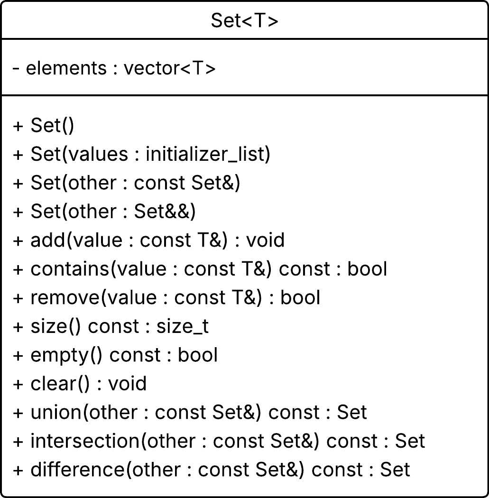
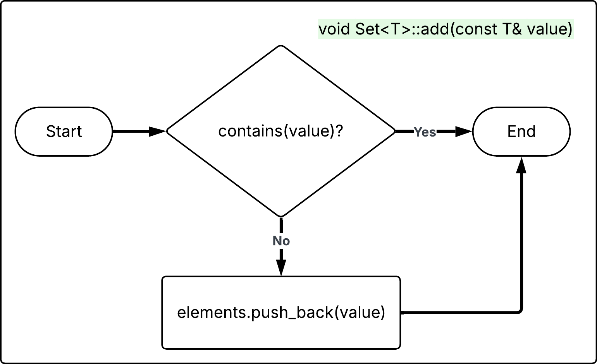
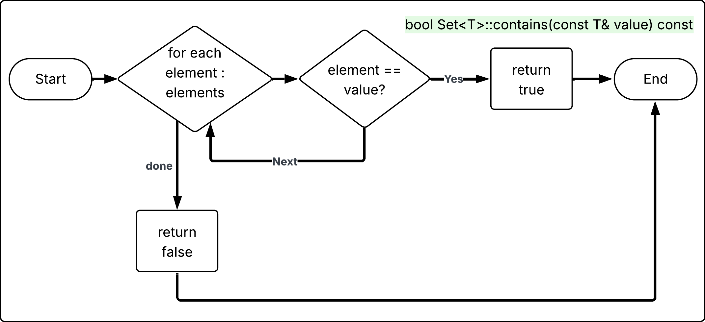
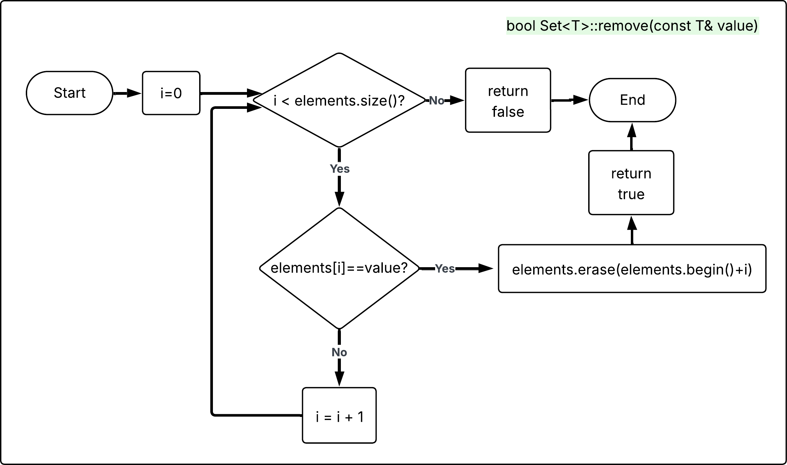
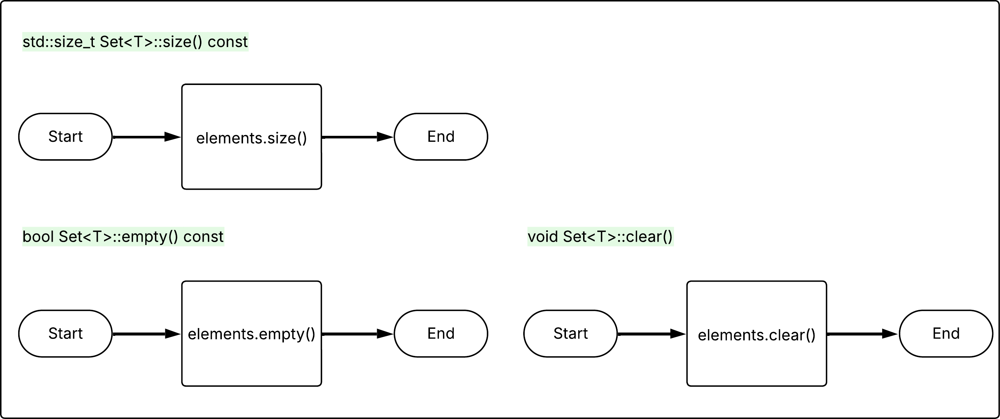
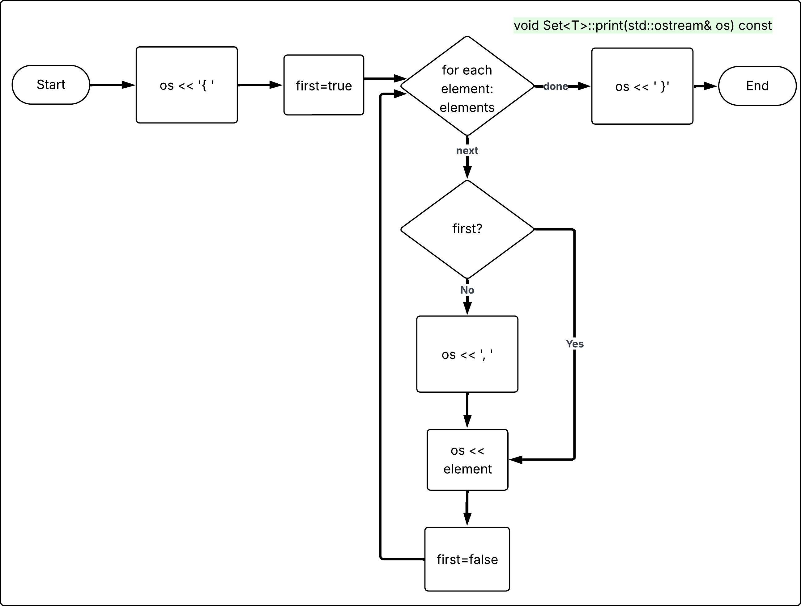
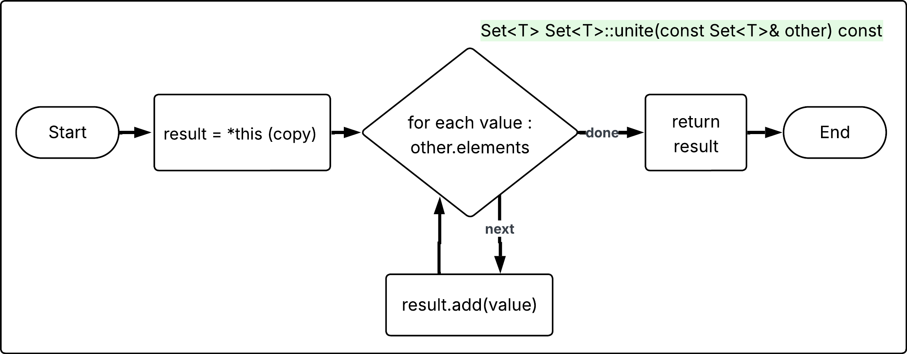
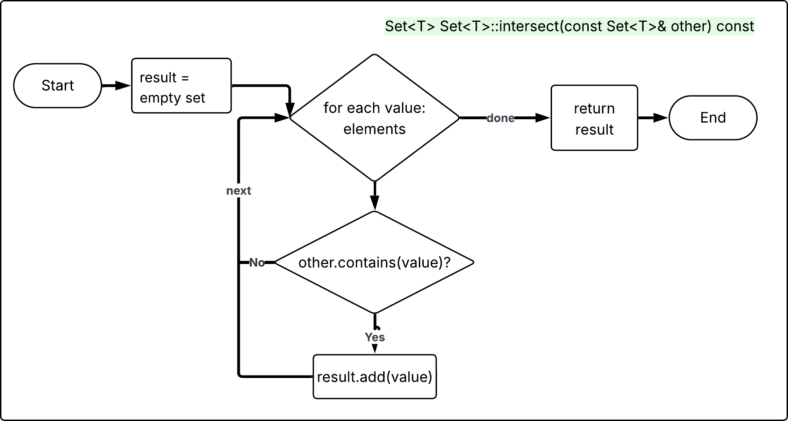
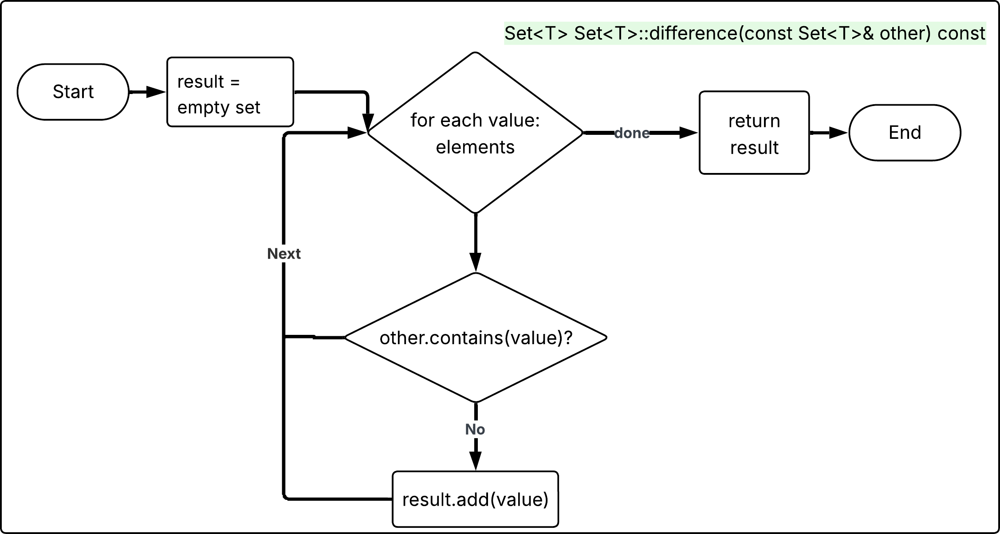

# Лабораторна робота No 9. Бібліотека стандартних шаблонів

## Мета роботи: 
Вивчення і практичне використання бібліотеки стандартних шаблонів.

## Завдання

Створити шаблонний клас МНОЖИНА, призначений для збереження елементів і
виконання операцій над множинами. Реалізувати класичні операції над множинами:
`об’єднання`, `перетину`, `різниці`.

## Опис методів, їх сигнатур та типів повернення

| сигнатура методу                             | опис                                                                                                                                   |
|----------------------------------------------|----------------------------------------------------------------------------------------------------------------------------------------|
| void add(const T& value)                     | Додає елемент `value` до множини, якщо такий елемент ще відсутній. Забезпечує унікальність елементів у множині.                        |
| bool contains(const T& value) const          | Перевіряє, чи належить елемент `value` поточній множині. Повертає true якщо елемент присутній.                                         |
| bool remove(const T& value)                  | Видаляє елемент `value` з множини, якщо він існує. Повертає `true` якщо елемент був знайдений і видалений.                             |
| std::size_t size() const                     | Повертає кількість елементів, що зберігаються у множині.                                                                               |
| bool empty() const                           | Перевіряє, чи є множина порожньою. Повертає `true` якщо множина не містить жодного елемента.                                           |
| void print(std::ostream& os) const           | Друкує множину виду `{ 1, 2, 3 }`                                                                                                      |
| void clear()                                 | Видаляє всі елементи з множини, переводячи її у порожній стан.                                                                         |
| Set<T> unite(const Set<T>& other) const      | Виконує операцію об'єднання двох множин. Повертає нову множину, що містить всі унікальні елементи поточної множини та множини `other`. |
| Set<T> intersect(const Set<T>& other) const  | Виконує операцію перетину двох множин. Повертає нову множину, що містить тільки елементи, які одночасно належать обом множинам.        |
| Set<T> difference(const Set<T>& other) const | Виконує операцію різниці множин. Повертає нову множину, що містить елементи поточної множини, які відсутні у множині `other`.          |

## Конструктори

| сигнатура конструктора               | опис                                                                                                                            |
|--------------------------------------|---------------------------------------------------------------------------------------------------------------------------------|
| Set()                                | Конструктор за замовчуванням. Створює порожню множину без елементів.                                                            |
| Set(std::initializer_list<T> values) | Створює множину та ініціалізує її елементами зі списку `values`. При додаванні зберігається властивість унікальності елементів. |
| Set(const Set<T>& other)             | Конструктор копіювання. Створює нову множину як копію існуючої множини `other`.                                                 |
| Set(Set<T>&& other)                  | Конструктор переміщення. Передає внутрішні дані з множини `other` у новий об'єкт без копіювання.                                |

# Діаграми



















# Висновок

У ході виконання лабораторної роботи було реалізовано шаблонний клас Set<T>, призначений для збереження елементів довільного типу та виконання базових операцій над множинами. Реалізація виконана із використанням механізму шаблонів мови C++, що дозволяє застосовувати один і той самий клас для різних типів даних без зміни коду.

Для збереження елементів множини використано контейнер стандартної бібліотеки std::vector. У класі реалізовано основні операції роботи з множинами. Додавання елемента add, перевірка наявності елемента contains, видалення елемента remove, отримання кількості елементів size, перевірка на порожність empty, очищення множини clear, а також класичні операції теорії множин unite, intersect та difference. Додатково реалізовано метод print, який забезпечує текстове представлення множини.

Для створення тестових даних використано окремі шаблонні функції генерації випадкових множин. Функція random_set формує множину випадкової довжини у заданому діапазоні значень, а функція typed_random_value генерує випадкові значення відповідного типу. Для цілих типів використовується std::uniform_int_distribution, а для дійсних типів std::uniform_real_distribution. Для дійсних чисел реалізовано можливість керування точністю значень за допомогою параметра масштабу.

Тестування реалізовано у вигляді окремих функцій демонстрації роботи методів класу. Функція show_generated виводить згенеровані множини. Функція show_operations демонструє результати операцій об'єднання, перетину та різниці множин. Функція show_contains перевіряє роботу методу contains. Функції show_add та show_remove демонструють додавання та видалення елементів. Функція show_state перевіряє роботу методів size, empty та clear.

Таким чином, у роботі було практично застосовано можливості бібліотеки стандартних шаблонів та механізму шаблонів мови C++, реалізовано універсальний контейнер для роботи з множинами та виконано тестування його функціональності з використанням генерації випадкових даних.

- Конвертування markdown у PDF
```bash
pandoc README.md -s \
  --pdf-engine=xelatex \
  -V mainfont="DejaVu Serif" \
  -V monofont="DejaVu Sans Mono" \
  -V fontsize=12pt \
  -V linestretch=1.15 \
  -V geometry:a4paper \
  -V geometry:margin=20mm \
  --toc --toc-depth=3 \
  --number-sections \
  --metadata title="Об'єктно орієнтоване програмування" \
  --metadata subtitle="Практичне заняття №4. ЗМ3. ЛЗ5. Бібліотека стандартних шаблонів." \
  --metadata author="Тищенко Сергій, alk-43" \
  --metadata date="2026-03-09" \
  -H ../../header.tex \
  -o README.pdf
```