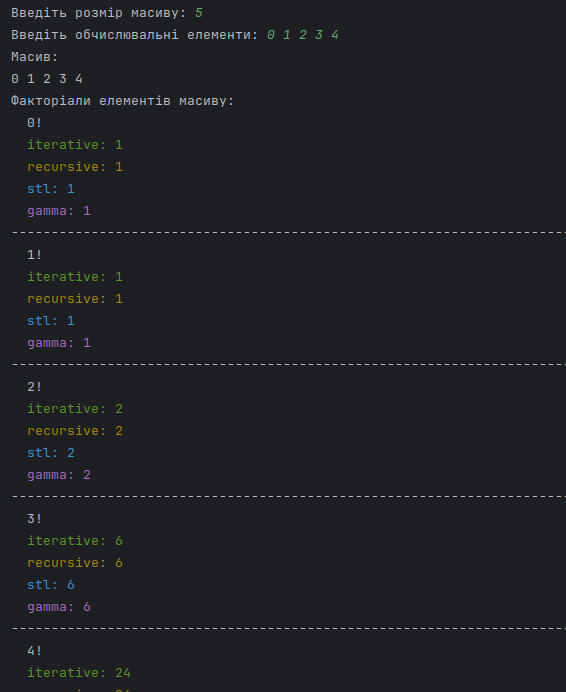

# Аналіз роботи базового і похідного класів у C++

Практичне заняття №7. ЗМ3. ЛЗ8.

## Мета

Розробка та реалізація ієрархії класів мовою C++ із використанням наслідування і віртуальних функцій, організації обчислення факторіала для окремого числа та елементів масиву, а також дослідження особливостей роботи методів базового класу при зверненні через вказівники на базовий клас.


## Класи, наслідування, віртуальні методи, динамічний поліморфізм

У роботі використано два класи:

- базовий клас `Chislo`
- похідний клас `Matrix`

Наслідування реалізовано як:

```cpp
class Matrix : public Chislo
```


Це означає, що `Matrix` отримує доступ до публічних та захищених членів `Chislo`.

### Віртуальні методи

У базовому класі визначено:

```cpp
virtual long factorial(long n) const;
```

Це дозволяє викликати метод через вказівник на базовий клас:

```cpp
Chislo *chislo = new Matrix;
chislo->factorial(10);
```

### Динамічний поліморфізм

Динамічний поліморфізм означає, що виклик функції визначається під час виконання програми, а не компіляції.

У роботі продемонстровано принцип підстановки, коли об’єкт має тип `Matrix` а використовується через `Chislo*`, тобто об’єкт похідного класу може використовуватись як об’єкт базового класу.

## Модифікатори доступу, конструктори, деструктори

| Модифікатор | Доступ                 |
|-------------|------------------------|
| private     | тільки всередині класу |
| protected   | клас + похідні         |
| public      | доступ звідусіль       |

У класі `Chislo`:

```cpp
private:
  long value_;
```

Інваріант захищений від прямого доступу.

Конструктор

```cpp
Chislo::Chislo(const long value)
{
    validate_positive_value(value);
}
```

Гарантує коректний стан об’єкта.

Деструктор

```cpp
virtual ~Chislo();
```

Необхідний для коректного видалення через базовий вказівник:

```cpp
Chislo* ptr = new Matrix(...);
delete ptr;
```

### Інваріанти, перевірки, обробка помилок
Інваріанти `value_ > 0` елементи масиву `>= 0`

Валідація та обробка виключень

```cpp
void validate_positive_value(long value);
void validate_non_negative(long n);

throw std::invalid_argument("...");
```
```cpp
try
{
    f();
}
catch (const std::exception& e)
{
    std::cerr << e.what();
}
```

## Шаблони

Продемонстровано використання шаблонної функції на прикладі печаті результатів обчислення факторіала різних реалізацій.
Це приклад параметричного поліморфізму:

```cpp
template <typename M, typename C>
void print_type_factorial(M matrix, C chislo)
```

## Вибір функції та обгортка

Вибір реалізації здійснюється через `enum`:

```cpp
enum class factorial_type
{
    iterative,
    recursive,
    stl,
    gamma
};

// Використання:
switch (type)
```


Перевантажена обгортка дозволяє спростити виклик, уникнути дублювання коду, задати значення за замовчуванням 
а також забезпечує можливість зміни реалізації без зміни клієнтського коду:

```cpp

long factorial(long n) const
{
    return factorial(n, factorial_type::iterative);
}
```

## Методи обчислення факторіала

### Ітеративний

$$n!=\prod_{i=1}^{n} i$$

```cpp
for (long i = 2; i <= n; ++i)
    result *= i;
```

### Рекурсивний

$$n!=n\cdot(n-1)!$$

```cpp
return n * factorial_recursive(n - 1);
```

### STL

Використання стандартних алгоритмів:

```cpp
std::iota(...)
std::accumulate(...)
```

### Через гамма-функцію

$$n!=\Gamma(n+1)$$

```cpp
std::tgamma(n + 1)
```

Порівняння методів

| Метод     | Простота | Швидкість | Надійність               |
|-----------|----------|-----------|--------------------------|
| iterative | висока   | висока    | висока                   |
| recursive | середня  | нижча     | ризик переповнення стеку |
| stl       | висока   | середня   | залежить від контейнера  |
| gamma     | висока   | висока    | похибка округлення       |

### Виконання



## Висновок

У роботі реалізовано ієрархію класів із використанням наслідування та віртуальних функцій. Продемонстровано механізм динамічного поліморфізму через використання вказівників на базовий клас. Забезпечено контроль інваріантів та обробку виключень. Реалізовано декілька алгоритмів обчислення факторіала та проведено їх порівняння. Використання шаблонів дозволило узагальнити функціональність і підвищити гнучкість програмної реалізації.

---
# -V geometry:landscape \

```bash
pandoc README.md -s \
--pdf-engine=xelatex \
-V mainfont="DejaVu Serif" \
-V monofont="DejaVu Sans Mono" \
-V fontsize=12pt \
-V linestretch=1.15 \
-V geometry:a4paper \
-V geometry:margin=20mm \
--toc-depth=3 \
--number-sections \
--metadata title="Об'єктно орієнтоване програмування" \
--metadata subtitle="Практичне заняття №7. ЗМ3. ЛЗ8." \
--metadata author="Тищенко Сергій, alk-43" \
--metadata date="2026-03-22" \
-H ../../header.tex \
-o README.pdf
```
