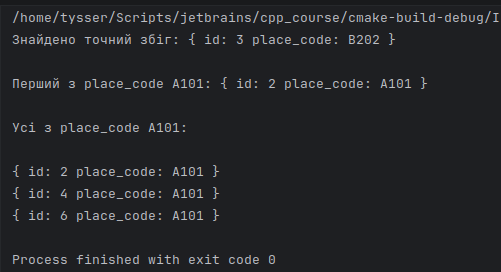

# Шаблонний клас пошуку елементів у контейнері з використанням ітераторів, предикатів та лямбда виразів у сучасному C++

## Мета

Ознайомитися з можливостями стандартної бібліотеки C++ для узагальненого програмування, 
з використанням шаблонів, контейнерів, ітераторів, алгоритмів, предикатів та лямбда виразів. 
Практично реалізовувати універсальні механізми пошуку елементів у колекціях із застосуванням сучасних засобів мови C++.

## Опис завдання

Реалізувати шаблонний клас для виконання послідовного пошуку елементів у контейнері. 
Клас повинен підтримувати роботу з різними типами даних та забезпечувати:

- пошук першого елемента за точним значенням  
- пошук першого елемента за умовою  
- пошук усіх елементів, що задовольняють задану умову

Реалізація повинна бути узагальненою та використовувати стандартні алгоритми і механізми сучасного C++.

## Опис реалізації

Клас `Finder<T>` параметризується типом `T`, що дозволяє застосовувати його до будь яких типів даних, 
які підтримують необхідні операції. В якості внутрішнього сховища використано контейнер `std::vector<T>`. 
Це забезпечує:

- ефективний доступ до елементів за індексом  
- безперервне розміщення даних у памʼяті  
- добре кешування при ітерації

Для реалізації пошуку використано алгоритми стандартної бібліотеки з простору імен `std::ranges`. 
Це відповідає сучасному стилю C++20 і вище.

- Метод `find_first` використовує алгоритм `std::ranges::find`, який виконує пошук першого елемента, 
що дорівнює заданому значенню. 
Для цього тип `T` має підтримувати операцію порівняння на рівність.

- Метод `find_first_if` використовує алгоритм `std::ranges::find_if`. 
У якості параметра передається предикат, який визначає умову пошуку. 
Це дозволяє виконувати пошук за довільними критеріями.

- Метод `find_all_if` реалізує пошук усіх елементів, що задовольняють умові. 
Для цього використовується ітерація по контейнеру з перевіркою предиката та накопиченням результатів 
у новому контейнері.

У якості предикатів використовуються лямбда вирази. 
Це дозволяє задавати умови без створення окремих функцій або функціональних обʼєктів.

Клас надає методи `begin` та `end`, які повертають ітератори до внутрішнього контейнера. 
Це дозволяє використовувати обʼєкт класу як джерело даних для стандартних алгоритмів, 
для прикладу `std::for_each` був застосован у тесті.
`std::for_each` це класичний алгоритм стандартної бібліотеки з `<algorithm>`.
Він працює через пару ітераторів:

```cpp
std::for_each(begin, end, func);
```




## Висновок

Реалізовано узагальнений шаблонний клас для пошуку елементів у контейнері.
Продемонстровано застосування сучасних можливостей мови - `std::ranges`, 
лямбда вирази та узагальнені алгоритми.
Показано, як алгоритми, відокремлено від структур даних, взаємодіють з ними через ітератори.

---
# -V geometry:landscape \

```bash
pandoc README.md -s \
--pdf-engine=xelatex \
-V mainfont="DejaVu Serif" \
-V monofont="DejaVu Sans Mono" \
-V fontsize=12pt \
-V linestretch=1.15 \
-V geometry:a4paper \
-V geometry:margin=20mm \
--toc-depth=3 \
--number-sections \
--metadata title="Об'єктно орієнтоване програмування" \
--metadata subtitle="Практичне заняття №5. ЗМ2. ЛЗ6." \
--metadata author="Тищенко Сергій, alk-43" \
--metadata date="2026-03-22" \
-H ../../header.tex \
-o README.pdf
```