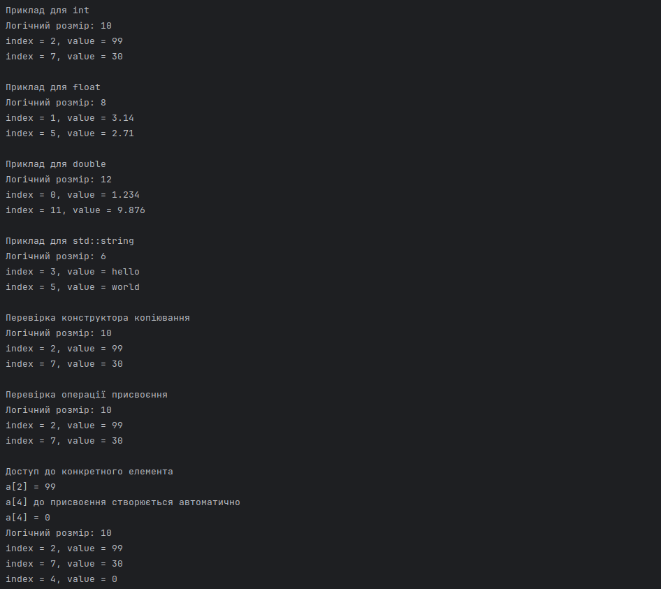

# Шаблони. Параметричний поліморфізм

## Мета роботи

Ознайомитися з використанням шаблонів у C++ та принципами побудови родових класів для роботи з даними довільного типу. 
Реалізувати шаблонний клас розрідженого одновимірного масиву з використанням стандартного контейнера та ітераторів. 
Закріпити навички перевантаження оператора індексації та організації доступу до елементів із автоматичним 
створенням відсутніх значень.

На прикладі завдання реалізовано шаблонний клас розрідженого одновимірного масиву, 
який логічно має фіксований розмір, але фізично зберігає лише ті елементи, 
які були явно задані користувачем.

---

## Реалізація

## Клас SparseItem

Клас `SparseItem<T>` представляє один елемент розрідженого масиву.  
Він використовується для зберігання логічного індексу елемента та його значення.  
Тип `T` визначає тип даних, що зберігається в елементі.

### Поля класу

- `logical_index_` зберігає логічний індекс елемента у масиві
- `value_` зберігає значення елемента типу `T`

### Методи класу

- `SparseItem()`  
  Конструктор за замовчуванням. Створює елемент із нульовим індексом і значенням за замовчуванням.

- `SparseItem(std::size_t logical_index, const T& value)`  
  Конструктор з параметрами. Створює елемент із заданим індексом і значенням.

- `std::size_t logical_index() const`  
  Повертає логічний індекс елемента.

- `T& value()`  
  Повертає посилання на значення елемента для можливості його зміни.

- `const T& value() const`  
  Повертає константне посилання на значення елемента без можливості зміни.

---

## Клас SparseArray

Клас `SparseArray<T>` реалізує розріджений одновимірний масив.  
Логічний розмір масиву задається під час створення об’єкта.  
Фізично зберігаються лише ті елементи, які були явно додані або змінені.

### Поля класу

- `logical_size_` зберігає логічний розмір масиву
- `data_` зберігає фізичний масив елементів у вигляді контейнера `std::list<SparseItem<T>>`

### Методи класу

- `SparseArray()`  
  Конструктор за замовчуванням. Створює масив нульового розміру.
  У цій реалізації немає сенсу, бо після створення об'єкта він завжди буде мати нульовий розмір.

- `explicit SparseArray(std::size_t logical_size)`  
  Конструктор з параметром. Створює масив із заданим логічним розміром.

- `SparseArray(const SparseArray<T>& other)`  
  Конструктор копіювання. Створює копію існуючого об’єкта.

- `SparseArray<T>& operator=(const SparseArray<T>& other)`  
  Оператор присвоєння. Використовується для копіювання одного об’єкта в інший.

- `std::size_t logical_size() const`  
  Повертає логічний розмір масиву.

- `std::size_t physical_size() const`  
  Повертає кількість фактично збережених елементів.

- `T& operator`  
  Операція індексування. Повертає посилання на елемент із заданим індексом.  
  Якщо елемент відсутній, створює новий елемент і додає його до фізичного масиву.

- `const T& at(std::size_t index) const`  
  Повертає значення існуючого елемента без створення нового.  
  Якщо елемент відсутній, генерується виняток.

- `void show() const`  
  Виводить усі збережені елементи розрідженого масиву.

### Приватні методи

- `find_item(std::size_t index)`  
  Виконує пошук елемента за логічним індексом у фізичному масиві.

- `find_item(std::size_t index) const`  
  Константна версія пошуку елемента за логічним індексом.

---

## Принцип роботи програми

Під час звернення до елемента через оператор індексації виконується пошук елемента у фізичному масиві.  
Якщо елемент знайдено, повертається посилання на його значення.  
Якщо елемент відсутній, створюється новий об’єкт `SparseItem<T>` із заданим індексом і значенням за замовчуванням, після чого він додається до контейнера.

Для зберігання фізичного масиву використовується контейнер `std::list`, а для пошуку елемента застосовується стандартний алгоритм `std::find_if`.  
Для виведення елементів використовується алгоритм `std::for_each`.

---

# Демонстрація роботи

У головній частині програми створюються об’єкти класу `SparseArray` для різних типів даних, наприклад:

- `int`
- `float`
- `double`
- `std::string`

У програмі демонструється:

- створення об’єктів шаблонного класу
- запис і читання значень через оператор `[]`
- автоматичне створення нового елемента при відсутності індексу
- робота конструктора копіювання
- робота оператора присвоєння
- виведення елементів масиву за допомогою функції `show()`

---

# Висновок

У ході виконання роботи було реалізовано шаблонний клас для подання розрідженого одновимірного масиву.  
Було використано механізм шаблонів, стандартний контейнер `std::list`, ітератори та стандартні алгоритми.  
Отримані результати підтверджують правильність реалізації та відповідність програми вимогам завдання.

---

