# Практичне заняття №9. ЗМ3. ЛЗ10.

Проектування і опрацювання програми з власними маніпуляторами і власними функціями введення-виведення

---

## Мета

Засвоєння загальних принципів і набуття практичних навичок роботи із системою введення-виведення;
Набуття практичних навичок створення власних функцій введення-виведення та власних маніпуляторів.

---

## Вимоги

- 1. Реалізувати шаблонний клас `Function` з динамічними масивами `x_values_` та `y_values_` для збереження дискретної функції.
- 2. Забезпечити конструктори, деструктор і керування памʼяттю через `resize_storage` та `free_memory`.
- 3. Реалізувати зчитування даних з потоку у форматі `x y1 y2` з вибором стовпчика `y` через параметр `y_column_`.
- 4. Створити два об’єкти `Function` для одного файлу, кожен читає той самий файл але різний стовпчик `y`.
- 5. Перевантажити оператори `>>` та `<<` для делегування `read_from_stream` і `write_to_stream`.
- 6. Реалізувати побудову `ASCII` графіка функції з масштабуванням по вертикалі через `GRAPH_HEIGHT` і по горизонталі через `HORIZONTAL_SCALE`.
- 7. Реалізувати відображення осей, шкали `Y` та підписів значень.
- 8. Реалізувати дружню функцію `print_min_max` для знаходження і виводу мінімального і максимального значення.
- 9. Реалізувати функцію конвертації файлу `convert_file_format` з форматуванням `fixed`, `precision 3`, ширина `10`, табуляція між колонками, знак числа завжди відображається.
- 10. Забезпечити демонстрацію роботи через main з читанням файлу, побудовою двох графіків і виводом `min` та `max`.

---

## Реалізація:

| функція сигнатура                                                                              | тип                | достатньо чіткий опис роботи                                                                |
|------------------------------------------------------------------------------------------------|--------------------|---------------------------------------------------------------------------------------------|
| Function()                                                                                     | публічна           | створює порожній об’єкт без виділеної пам’яті, ініціалізує поля нульовими значеннями        |
| Function(std::size_t size, int y_column)                                                       | публічна           | створює об’єкт із виділенням пам’яті під масиви та задає номер стовпчика y для читання      |
| ~Function()                                                                                    | публічна           | звільняє динамічну пам’ять масивів через free_memory                                        |
| std::size_t get_size() const                                                                   | публічна           | повертає кількість збережених точок                                                         |
| int get_y_column() const                                                                       | публічна           | повертає номер обраного стовпчика ординат                                                   |
| void resize_storage(std::size_t new_size)                                                      | публічна допоміжна | перевиділяє пам’ять під масиви x та y відповідно до нового розміру                          |
| void free_memory()                                                                             | публічна допоміжна | очищає пам’ять масивів і скидає стан об’єкта                                                |
| void set_point(std::size_t index, T x, T y)                                                    | публічна допоміжна | записує одну точку у масиви за вказаним індексом                                            |
| void read_from_stream(std::istream& in)                                                        | публічна           | зчитує дані з потоку у форматі x y1 y2 і заповнює масиви з урахуванням обраного стовпчика y |
| void write_to_stream(std::ostream& out) const                                                  | публічна           | виводить функцію у потік, фактично делегує побудову ASCII графіка                           |
| static void convert_file_format(const std::string& input_path, const std::string& output_path) | публічна статична  | читає файл і записує його у новий з форматуванням чисел і табуляцією                        |
| static void tab_separated_fixed(std::istream& in, std::ostream& out)                           | приватна допоміжна | виконує форматування даних з потоку у вигляді фіксованої крапки, ширини поля і табуляції    |
| std::istream& operator>>(std::istream& in, Function<T>& function)                              | дружня             | делегує зчитування даних у метод read_from_stream                                           |
| std::ostream& operator<<(std::ostream& out, const Function<T>& function)                       | дружня             | делегує вивід даних у метод write_to_stream                                                 |
| void print_min_max(const Function<T>& function, std::ostream& out)                             | дружня             | викликає метод обчислення мінімуму і максимуму та виводить їх                               |
| void draw_ascii_graph(std::ostream& out) const                                                 | публічна           | будує ASCII графік функції з урахуванням масштабування і виводить його                      |
| void print_min_max(std::ostream& out) const                                                    | публічна           | знаходить мінімальне і максимальне значення y та виводить їх                                |
| std::string build_row(std::size_t row, T y_min, T y_max) const                                 | приватна           | формує один рядок графіка, визначаючи позиції точок відповідно до значень y                 |
| void print_axis_line(std::ostream& out, std::size_t width) const                               | приватна           | виводить вісь X і горизонтальну лінію графіка                                               |
| void print_y_scale(std::ostream& out, T y_min, T y_max) const                                  | приватна допоміжна | виводить інформацію про межі значень по осі Y                                               |

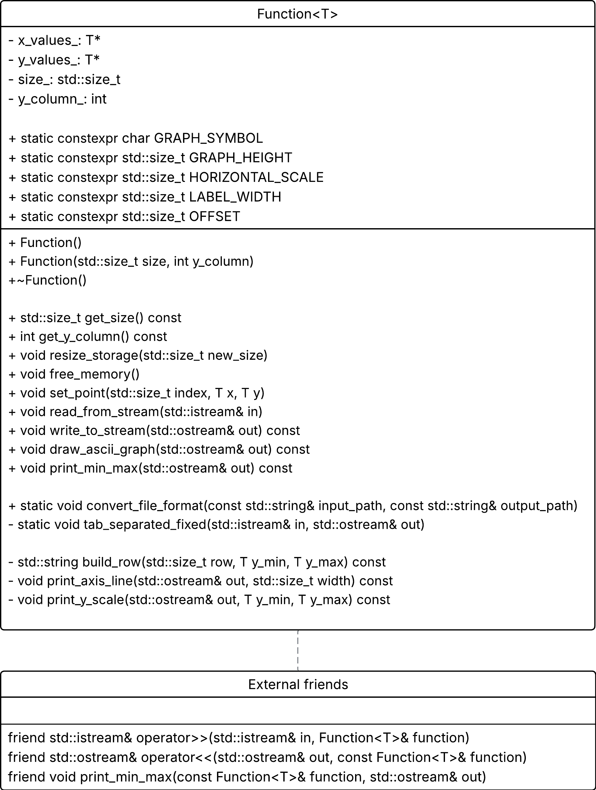

---

## Тестування

Для тестування використовується реєстр функцій `make_function_registry` і генератор файлів `generate_from_registry`
який застосовує цей реєстр для наповнення файлів значеннями. 

Реєстр функцій представляє собою відображення між рядковими іменами та відповідними математичними функціями 
у вигляді лямбда виразів. Він виконує роль фабрики, що дозволяє динамічно обирати і застосовувати функцію 
за її текстовим ідентифікатором.

| ключ в реджістрі | функція                                                                       | опис                                                                                                                |
|------------------|-------------------------------------------------------------------------------|---------------------------------------------------------------------------------------------------------------------|
| sin              | $\sin(x)$                                                                     | тригонометрична функція що описує періодичні коливання. графік має хвильову форму з амплітудою 1 і періодом 2π      |
| cos              | $\cos(x)$                                                                     | тригонометрична функція з фазовим зсувом відносно синуса. графік аналогічний синусу але зміщений по осі x           |
| exp              | $e^x$                                                                         | експоненційна функція що описує швидке зростання. графік монотонно зростає і швидко йде вгору                       |
| log              | $\ln(x)$                                                                      | обернена до експоненти функція визначена для x > 0. графік повільно зростає і має вертикальну асимптоту при x = 0   |
| square           | $x^2$                                                                         | степенева функція другого порядку. графік є параболою що відкривається вгору і симетрична відносно осі y            |
| cube             | $x^3$                                                                         | степенева функція третього порядку. графік має S подібну форму і точку перегину в нулі                              |
| linear           | $x$                                                                           | лінійна функція першого порядку. графік є прямою під кутом 45 градусів через початок координат                      |
| sqrt             | $\sqrt{x}$                                                                    | функція кореня визначена для x ≥ 0. графік починається в нулі і зростає зі спадною швидкістю                        |
| inv              | $\frac{1}{x+1}$                                                               | раціональна функція з асимптотою при x = -1. графік має дві гілки що прямують до осей                               |
| diode            | $$f(x)=\begin{cases}0, & x < 0.6 \\ e^{10(x - 0.6)}, & x \ge 0.6\end{cases}$$ | функція з порогом при x ≈ 0.6 що імітує поведінку діода. графік дорівнює нулю до порогу і різко зростає після нього |
| tanh             | $\tanh(x)$                                                                    | гіперболічна функція що насичується. графік має S подібну форму і обмежений в межах [-1,1]                          |
| sigmoid          | $\frac{1}{1+e^{-x}}$                                                          | сигмоїдна функція що моделює плавний перехід. графік має S подібну форму і обмежений в межах [0,1]                  |
| abs              | $\|x\|$                                                                       | функція модуля що повертає абсолютне значення. графік має V подібну форму з вершиною в нулі                         |
| saw              | $x - \lfloor x \rfloor$                                                       | періодична кусочно лінійна функція. графік має пилкоподібну форму з різкими спаданнями                              |
| gauss            | $e^{-x^2}$                                                                    | гаусова функція що описує нормальний розподіл. графік має дзвоноподібну форму з максимумом у нулі                   |

Наступним кроком застосовується функція `generate_from_registry`, яка використовує реєстр для генерації 
тестових файлів із дискретними значеннями функцій. Вона обчислює значення двох обраних функцій 
на заданому інтервалі та записує їх у файл у вигляді трьох стовпчиків: `x, y1, y2`.

Таким чином формується вхідний набір даних для подальшого тестування класу `Function`.

### Тест 1

Для демонстрації роботи реалізовано функцію `test_1`, яка виконує наступні дії:
- відкриває згенерований файл з даними
- створює два об’єкти класу `Function`, кожен з яких відповідає окремій функції
- зчитує дані з одного файлу двічі з різними значеннями `y_column_`
- виводить ASCII графіки обох функцій у стандартний потік
- обчислює та виводить мінімальні та максимальні значення для кожної функції

Це дозволяє перевірити коректність роботи потокового введення, обробки даних та побудови графіків.

### Тест 2

Функція `test_2` перевіряє роботу форматування файлів. Вона читає вихідний файл і створює новий, 
у якому всі значення записані у фіксованому форматі з точністю до трьох знаків після коми, 
з вирівнюванням по ширині та використанням табуляції як роздільника.

## Висновок

У ході тестування було підтверджено коректність роботи програми на всіх основних етапах обробки даних. 
Реалізація забезпечує правильне зчитування значень з файлу, коректний вибір потрібного стовпчика ординат, 
побудову ASCII графіка, обчислення мінімального та максимального значень, а також форматоване перетворення 
вхідного файлу у вихідний. Окремо перевірено механізм роботи з динамічною пам’яттю. Функції `resize_storage` і `free_memory` 
забезпечують коректне виділення, очищення та перевиділення масивів, підтримують цілісність внутрішнього 
стану об’єкта і запобігають некоректній роботі з пам’яттю. Клас придатний для безпечного зберігання та обробки 
дискретних значень функцій.

---

## Приклади виводу

### tanh

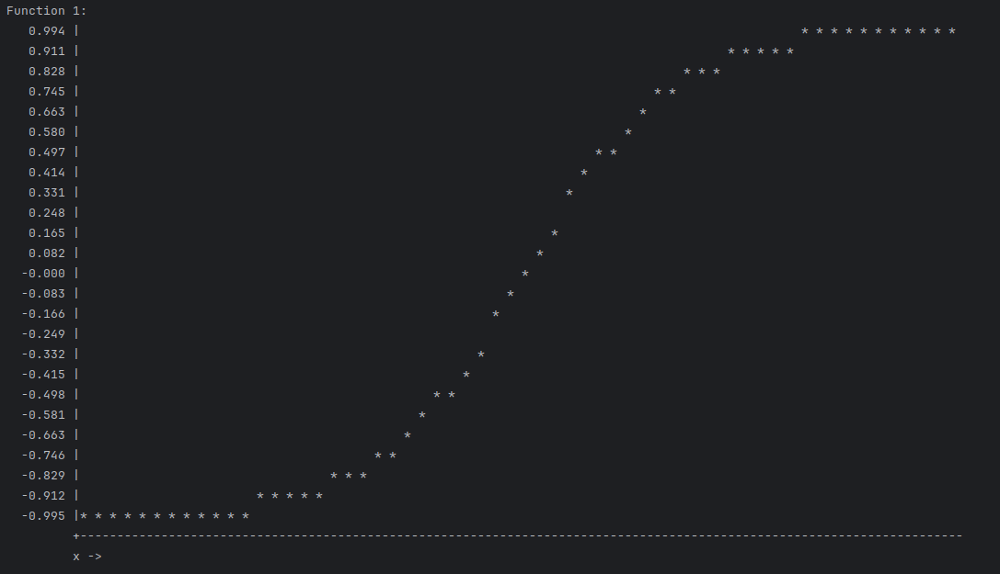

### gauss

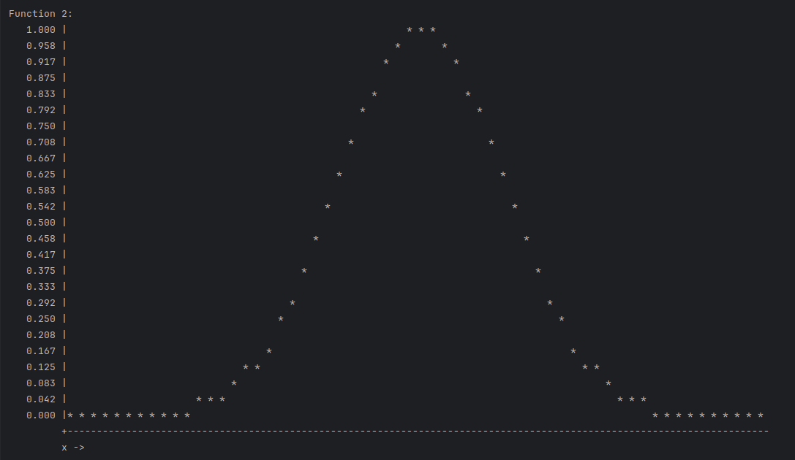

### abs

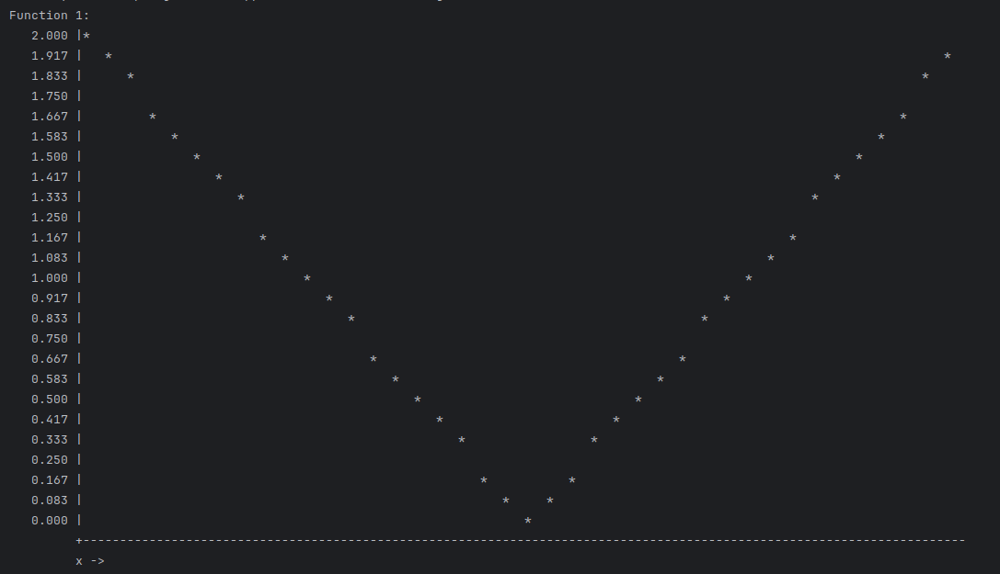

### saw

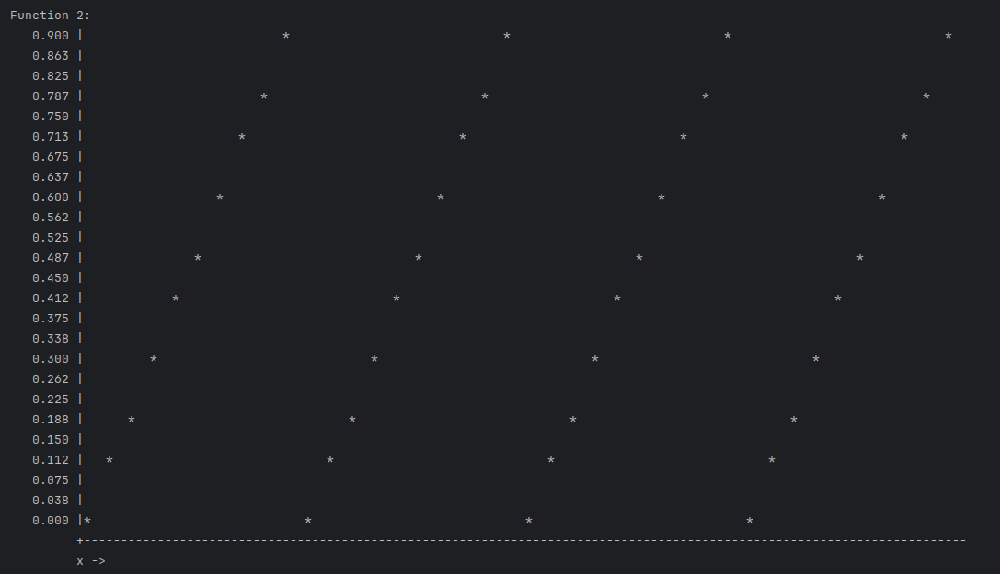

### sin

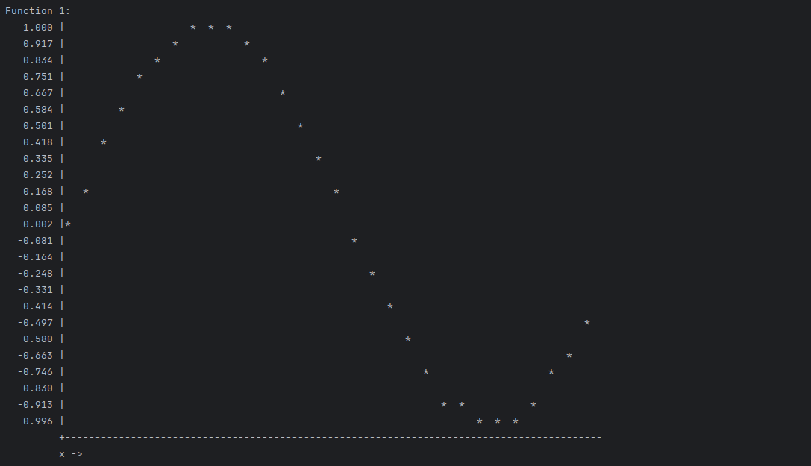

### cos

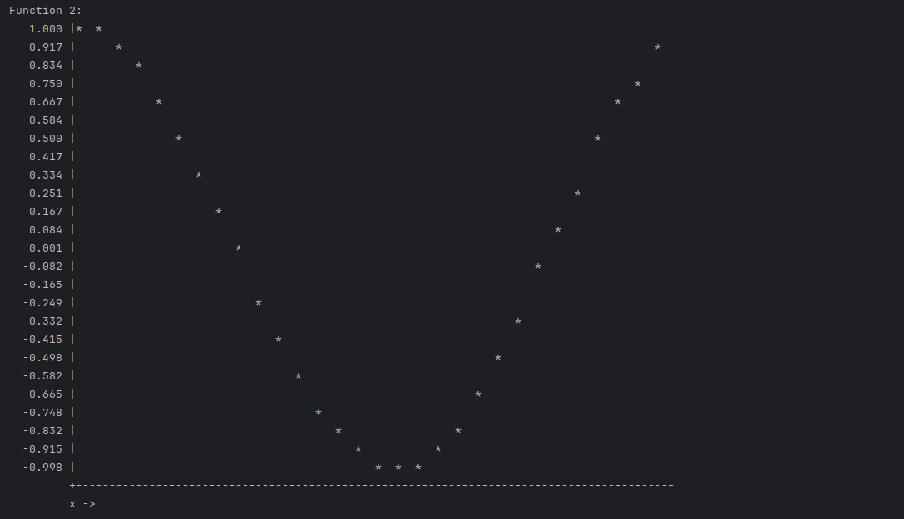

### diode

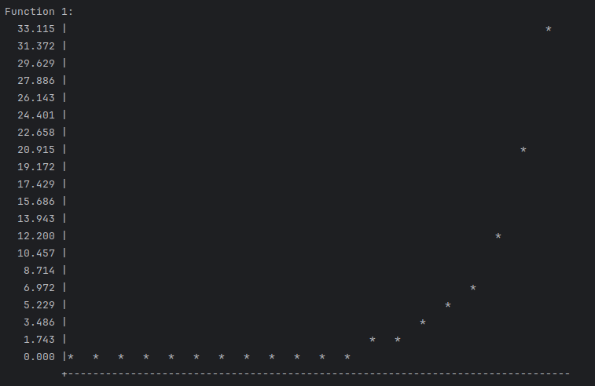

### inv

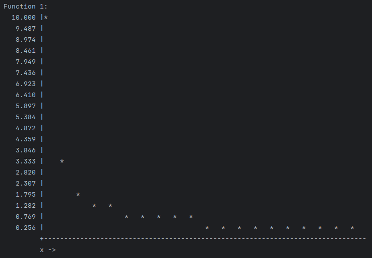

### linear

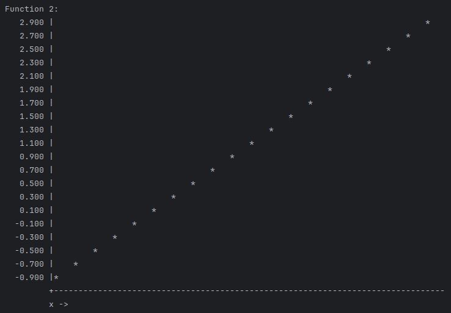


### log

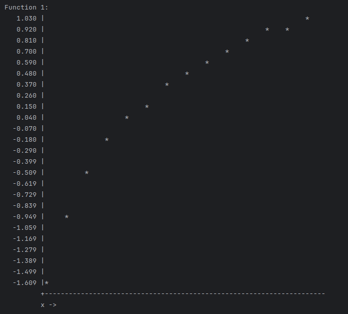

### exp

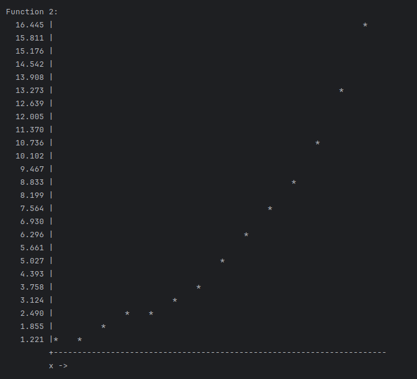

```bash
pandoc README.md -s \
  --pdf-engine=xelatex \
  -V mainfont="DejaVu Serif" \
  -V monofont="DejaVu Sans Mono" \
  -V fontsize=12pt \
  -V linestretch=1.15 \
  -V geometry:a4paper \
  -V geometry:margin=20mm \
  -V geometry:landscape \
  --toc --toc-depth=3 \
  --number-sections \
  --metadata title="Об'єктно орієнтоване програмування" \
  --metadata subtitle="Практичне заняття №9. ЗМ3. ЛЗ10." \
  --metadata author="Тищенко Сергій, alk-43" \
  --metadata date="2026-04-10" \
  -H ../../header_sub.tex \
  -o README.pdf
```
