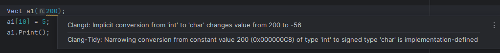
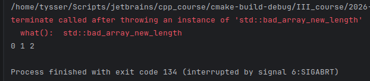
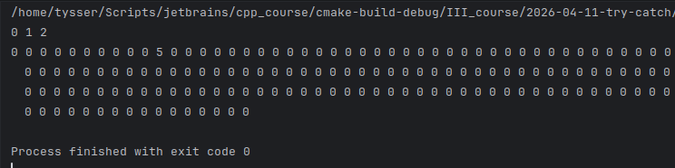

# ЛАБОРАТОРНА РОБОТА

Проектування і опрацювання програми з обробленням виняткових ситуацій

---

## Мета

Мета роботи - засвоєння поняття виняткової ситуації та
засобів її перехоплення; набуття практичних прийомів
перехоплення виняткової ситауції.

## Вимоги

* Набрати та запустити код, проаналізувати
* Реалізувати перехоплення виявлених помилок
* Реалізувати перехоплення у конструкторі та деструкторі
* Оброблення виняткових ситуацій у програмі
* Продемонструвати роботу
* Теоретична частина і висновки

---

## Аналіз коду й поверненого результату

### Проблема 1

Аварійне завершення виникає при створенні об’єкта `Vect a1(200)` через некоректну 
інтерпретацію значення типу `char`.

Тип `char` є знаковим, тому має діапазон від `-128` до `127`. Значення `200` у двійковому вигляді дорівнює `11001000`. 
Старший біт дорівнює 1, отже число інтерпретується як від’ємне.

Для знакових типів використовується [доповняльний код](https://uk.wikipedia.org/wiki/Доповняльний_код).

| Десяткове | Прямий код | Обернений код | Доповняльний код |
|-----------|------------|---------------|------------------|
| 127       | 01111111   | 01111111      | 01111111         |
| 1         | 00000001   | 00000001      | 00000001         |
| 0         | 00000000   | 00000000      | 00000000         |
| -0        | 10000000   | 11111111      | ---              |
| -1        | 10000001   | 11111110      | 11111111         |
| -2        | 10000010   | 11111101      | 11111110         |
| -3        | 10000011   | 11111100      | 11111101         |
| -4        | 10000100   | 11111011      | 11111100         |
| -5        | 10000101   | 11111010      | 11111011         |
| -6        | 10000110   | 11111001      | 11111010         |
| -7        | 10000111   | 11111000      | 11111001         |
| -8        | 10001000   | 11110111      | 11111000         |
| -9        | 10001001   | 11110110      | 11110111         |
| -10       | 10001010   | 11110101      | 11110110         |
| -11       | 10001011   | 11110100      | 11110101         |
| -127      | 11111111   | 10000000      | 10000001         |
| -128      | ---        | ---           | 10000000         |

Прочерк означає, що значення не має представлення у даному коді при фіксованій розрядності 8 біт. 
Це відбувається або через обмежений діапазон як у прямому і оберненому коді для `−128`, або через 
відсутність окремого представлення як для `−0` у доповняльному коді.

Щоб отримати значення, потрібно інвертувати біти і додати 1. 
У результаті отримуємо значення `-56`.



Звужувальне перетворення з константного значення `200 (0x000000C8)` (це те саме що і `11001000` але у шістнадцятковому представленні) 
типу `int` до `signed` типу `char` є реалізаційно-залежним, і в конструктор передається не `200`, а `-56`, і виконується

```cpp
p_ = new int[size_];
```

як

```cpp
p_ = new int[-56];
```

Це призводить до генерації винятку `std::bad_array_new_length`.



### Проблема 2

Відсутня перевірка меж у `operator[]`, що дозволяє некоректний доступ до пам’яті. 

### Проблема 3

Перевірка `if (!p_)` є некоректною, оскільки `new` у сучасному C++ генерує виняток, 
а не повертає нульовий вказівник. 

### Проблема 4

Деструктор не містить захисту від винятків.

---

## Реалізація перехоплення. Перехоплення у конструкторі та деструкторі

Для усунення виявлених проблем та реалізації оброблення виняткових ситуацій додаємо наступні зміни:

У конструкторі:

* Ключове слово `explicit` додано для заборони небажаних неявних викликів конструктора, наприклад `Vect a = 5;`. 
Однак основна проблема, саме з `Vect a1(200)` пов’язана не з цим, а зі звужувальним перетворенням аргументу типу 
`int` до `char`, про що компілятор і видавав попередження.

* Розмір масиву інтерпретується як невід’ємне значення через приведення до `unsigned char` (`0...255`)

```cpp
const unsigned char real_size = static_cast<unsigned char>(size_);
p_ = new int[real_size];
```

* Додано перехоплення винятків:

```cpp
catch (const std::exception& ex)
{
    std::cerr << "Помилка конструктора: " << ex.what() << std::endl;
    throw;
}
```

В операторі індексації реалізовано перевірку меж і генерацію винятку:

```cpp
int& operator[](const int i)
{
    if (p_ == nullptr) throw std::logic_error("Пам'ять не виділена");

    const auto real_size = static_cast<unsigned char>(size_);

    if (i < 0 || i >= real_size) throw std::out_of_range("Індекс поза діапазоном");

    return p_[i];
}
```

Деструктор зроблено безпечним також через перехоплення винятків з використанням `try-catch`:

```cpp
~Vect()
{
    try
    {
        delete[] p_;
        p_ = nullptr;
    }
    catch (...)
    {
        std::cerr << "Помилка деструктора" << std::endl;
    }
}
```

---

## Оброблення виняткових ситуацій у програмі

У функції `implementation` додано оброблення винятків:

```cpp
 try
 {
     Vect a(3);
     a[0] = 0;
     a[1] = 1;
     a[2] = 2;
     a.Print();

     Vect a1(200);
     a1[10] = 5;
     a1.Print();
 }

 catch (const std::exception& ex)
 {
     std::cerr << "Помилка: " << ex.what() << std::endl;
 }
```



---

## Висновок

У ході роботи було досліджено механізм виникнення виняткових ситуацій у C++ та способи їх оброблення. 
Встановлено, що помилки можуть виникати як через логічні недоліки реалізації, так і через особливості типів даних 
та їх перетворення. Було реалізовано перехоплення винятків у конструкторі, деструкторі 
та під час використання об’єкта, що дозволило запобігти аварійному завершенню програми. 
Отримано практичні навички використання конструкцій `try`, `catch` та `throw` для забезпечення надійності програм.

---

```bash
pandoc README.md -s \
  --pdf-engine=xelatex \
  -V mainfont="DejaVu Serif" \
  -V monofont="DejaVu Sans Mono" \
  -V fontsize=12pt \
  -V linestretch=1.15 \
  -V geometry:a4paper \
  -V geometry:margin=20mm \
  -V geometry:landscape \
  --toc --toc-depth=3 \
  --number-sections \
  --metadata title="Об'єктно орієнтоване програмування" \
  --metadata subtitle="Проектування і опрацювання програми
з обробленням виняткових ситуацій" \
  --metadata author="Тищенко Сергій, alk-43" \
  --metadata date="2026-04-11" \
  -H ../../header_sub.tex \
  -o README.pdf
```

