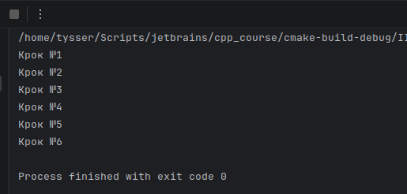
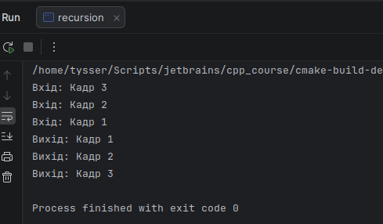
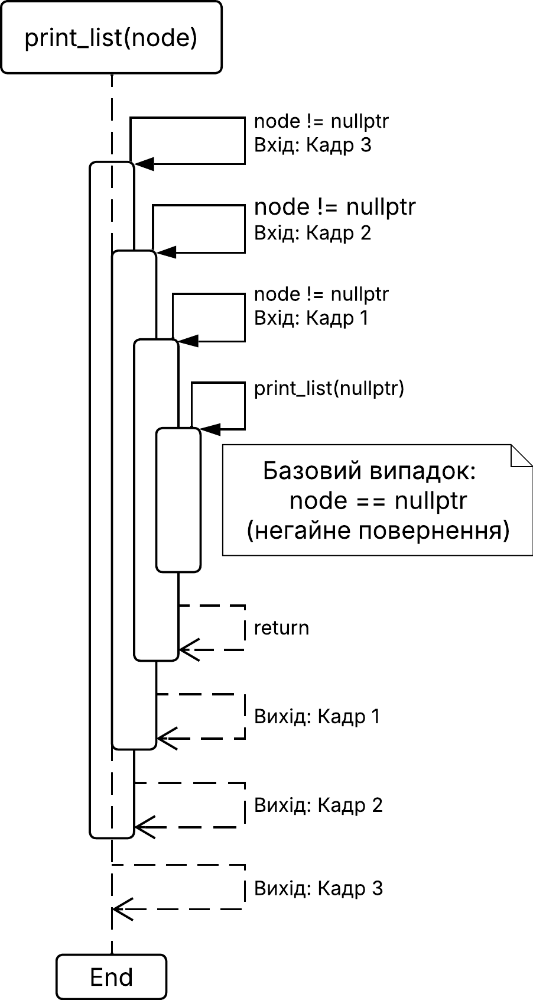

# Рекурсія 

- це визначення об'єкту через самого себе. За допомогою рекурсії в математиці 
  визначаються багато нескінченних множин, наприклад безліч натуральних чисел.

- У програмуванні рекурсія це виклик функцією самої себе, при якому кожен виклик 
  створює новий кадр у стеку викликів.

# Мета

Оволодіння практичними навичками роботи з рекурсивними функціями в мовах С/С++

---

## Як будується рекурсія

- Для побудови рекурсії спочатку необхідно визначити базовий випадок або умову виходу. 
  Це умова, при якій нові рекурсивні виклики не створюються і починається повернення зі стеку викликів.
- Математична модель рекурсії не обмежена ресурсами, але під час виконання програми існують обмеження, 
  це максимальна глибина стеку викликів. Кожен рекурсивний виклик створює окремий кадр у стеку,
  тому надмірна глибина може призвести до переповнення.
- Далі визначається рекурсивний крок. Це частина функції, яка виконується перед створенням наступного 
  виклику самої себе. На цьому етапі формується новий стан задачі.
- Також необхідний параметр або набір параметрів, які змінюються на кожному кроці і забезпечують
  наближення до базового випадку. Саме ці зміни гарантують завершення рекурсії.
- Після досягнення базового випадку починається процес повернення. Кадри функцій послідовно знімаються
  зі стеку викликів, і виконання продовжується у зворотному порядку викликів.

## Імітація. Що виглядає як рекурсія, але не є нею

**Розглянемо імітацію відкладеного рекурсивного виклику.**

Цей приклад не є класичною рекурсією у строгому сенсі, бо наступний виклик виконується не в тому самому стеку,
а в новому потоці після затримки. Тому стек рекурсії та кадри викликів тут не накопичуються
і процес повернення не формується. Але такий підхід дозволяє наочно побачити сам факт повторного виклику
функції і послідовність кроків виконання.

> Це також показує, що не кожен виклик функції самої себе є рекурсією у строгому сенсі, а лише той, 
> що призводить до формування стеку викликів і подальшого повернення з нього.

```cpp
void recursive_timer(int& i)
{
    i++;
    std::cout << "Крок №" << i << std::endl;

    if (i > 5) return;

    thread([&i](){
        sleep_for(seconds(1));

        recursive_timer(i);
    }).detach();
}
```

- Спочатку викликається `recursive_timer(i)`. Значення `i` збільшується до `1` і виводиться в консоль.
- Далі, оскільки умова `i > 5` ще не виконується, створюється новий потік. 
  У лямбді цей потік зупиняється на `1` секунду за допомогою `sleep_for(seconds(1))`, 
  а потім знову викликає `recursive_timer(i)`.
- Метод `detach()` від’єднує потік. Це означає, що основний потік не чекає його завершення
  і не має прямого контролю над ним. Від’єднаний потік працює самостійно.
- Через секунду цей потік прокидається і викликає `recursive_timer(i)` вдруге. 
  Після цього знову відбувається збільшення `i`, вивід у консоль і створення наступного від’єднаного потоку.
  Так виконання продовжується, поки значення `i` не стане більшим за `5`.

Виклик `sleep_for(seconds(6))` у функції `main` потрібен для того, щоб головний потік не завершив програму раніше, 
ніж від’єднані потоки встигнуть виконати свої відкладені виклики.

```cpp
int main()
{
    int i = 0;
    recursive_timer(i);

    // тримаємо main 6 секунд, щоб усі потоки відпрацювали
    sleep_for(seconds(6));
}
```

Без цієї затримки `main` завершиться майже одразу після першого виклику `recursive_timer(i)`, процес буде завершено, 
а від’єднані потоки не встигнуть вивести всі повідомлення в консоль.

Оскільки кожен крок працює одну секунду, а виклик `sleep_for(seconds(6))` тримає `main` в активному стані
ми побачимо кожен з 6 кроків іметованих кадрів рекурсії:



---

## Чиста рекурсія

### Наївний приклад обчислення факторіала

```cpp
int factorial(int n)
{
    if (n <= 1) return 1;
    return n * factorial(n - 1);
}
```

---

### Однозв’язний список

```cpp
struct Node
{
    string value;
    Node* next;
};

void print_list(const Node* node)
{
    if (node == nullptr) return;
    
    std::cout << "Вхід: " << node->value << std::endl;
    
    std::cout << node->value << std::endl;
    print_list(node->next);
    
    std::cout << "Вихід: " << node->value << std::endl;
}
```

- Тут рекурсія проявляється через структуру даних:
  - кожен вузол обробляється і передає керування наступному
  - кожен виклик додається у стек
  - коли доходимо до `nullptr`, спрацьовує базовий випадок
  - після цього відбувається повернення назад по стеку

Зв’яжемо вузли наступним чином і викличемо рекурсивну функцію
`print_list(&a)`, передавши вказівник на перший вузол списку,
щоб роздрукувати всі елементи списку.

```cpp
void l_list()
{
    Node c{"Кадр 1", nullptr};
    Node b{"Кадр 2", &c};
    Node a{"Кадр 3", &b};

    print_list(&a);
}
```



У цьому прикладі видно дві фази рекурсивного виконання. 
Повідомлення `Вхід` виводяться під час занурення у рекурсію,
коли кожен новий виклик додається у стек. 



Після досягнення базового випадку `node == nullptr`
починається повернення з рекурсивних викликів. Повідомлення `Вихід`
виводяться у зворотному порядку: спочатку для `Кадр 1`, 
потім для `Кадр 2`, а потім для `Кадр 3`.

---

## Висновок

- У роботі було розглянуто сутність рекурсії як механізму виклику функції самої себе,
  при якому кожен виклик формує окремий кадр у стеку виконання.
  Встановлено, що обов’язковими елементами рекурсії є базовий випадок, рекурсивний крок
  та параметри, які забезпечують наближення до завершення обчислення.

- На прикладі імітації відкладеного виклику показано, що не кожен самовиклик функції
  є рекурсією у строгому сенсі, оскільки відсутність спільного стеку викликів
  та процесу повернення виключає класичну рекурсивну модель виконання.

- Реалізація обчислення факторіала та обходу однозв’язного списку продемонструвала чисту рекурсію.
  На прикладі списку було наочно показано дві фази рекурсії: занурення у виклики та повернення з них.

- Рекурсія є ефективним інструментом для роботи зі структурами даних та задачами,
  які природно описуються через самоподібні підзадачі. Водночас у програмній реалізації
  необхідно враховувати обмеження глибини стеку викликів і коректно визначати базовий випадок.

---
-V geometry:landscape \
```bash
pandoc README.md -s \
  --pdf-engine=xelatex \
  -V mainfont="DejaVu Serif" \
  -V monofont="DejaVu Sans Mono" \
  -V fontsize=12pt \
  -V linestretch=1.15 \
  -V geometry:a4paper \
  -V geometry:margin=20mm \
  --toc --toc-depth=3 \
  --number-sections \
  --metadata title="Об'єктно орієнтоване програмування" \
  --metadata subtitle="Рекурсія" \
  --metadata author="Тищенко Сергій, alk-43" \
  --metadata date="2026-04-24" \
  -H ../../header_sub.tex \
  -o README.pdf
```
