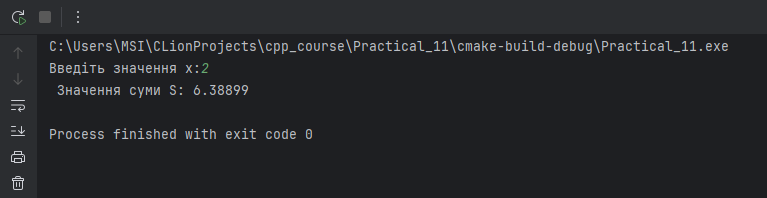
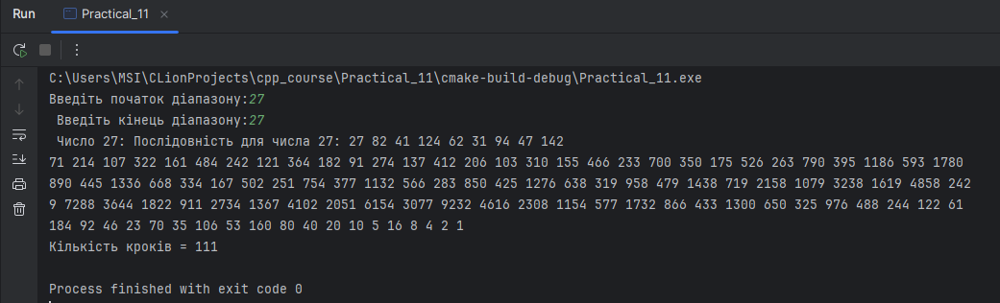
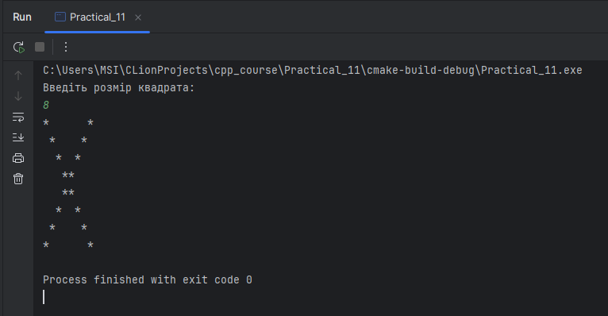

# Задача: Обчислення суми ряду

Скласти програму для обчислення суми ряду:

$$
S = \sum_{k=1}^{10} \frac{x^{2k}}{2^k \cdot k!}
$$

де \(x\) вводиться користувачем.

### Опис функцій

1. **Функція `calculateSeriesSum`** обчислює суму ряду.
    - Використовується цикл `for`, який обчислює кожний член ряду для значень \(k\) від 1 до 10.
    - На кожній ітерації обчислюється поточний член ряду за формулою і додається до суми `sum`.

2. **Функція `executeSeriesCalculation`** відповідає за введення значення \(x\), виклик функції `calculateSeriesSum` та виведення результату суми \(S\).



# Задача: Доведення гіпотези Сиракуз на діапазоні чисел

Скласти програму для перевірки гіпотези Сиракуз, яка стверджує:

**Для будь-якого натурального числа, в результаті застосування наступних дій, число завжди зводиться до 1:**

1. Якщо число парне, розділити його на 2.
2. Якщо число непарне, помножити його на 3, додати 1 і поділити на 2.

### Опис функцій

1. **Функція `collatzSteps`** виконує обчислення послідовності для одного числа.
   - Використовує цикл `while`, який завершується, коли число дорівнює 1.
   - Повертає кількість кроків, необхідних для зведення числа до 1.

2. **Функція `checkSyracuseRange`** перевіряє гіпотезу Сиракуз для всього діапазону чисел.
   - Виконує обчислення для кожного числа в діапазоні.
   - Виводить послідовність кроків для кожного числа.

3. **Функція `executeSyracuseCheck`** запитує у користувача початок і кінець діапазону, викликає `checkSyracuseRange` та відображає результати.



# Задача: Виведення символів * по діагоналях квадрата

Скласти програму, яка виводить символи `*` по діагоналях уявного квадрата.
Користувач вводить розмір квадрата, і програма будує його діагоналі таким чином:

- Символи `*` розташовуються на головній та побічній діагоналях.

Наприклад, для розміру квадрата `8` результат виглядає так:

```
*      *
 *    *
  *  *
   **
   **
  *  *
 *    *
*      *
```

### Опис функцій

1. **Функція `printDiagonals`** виконує побудову квадрата за допомогою вкладених циклів.
   - Виконує перевірку для діагоналей (`i == j` та `i + j == size - 1`).

2. **Функція `executeDiagonalPrinting`** відповідає за введення розміру квадрата, перевірку його валідності та виклик функції `printDiagonals`.

