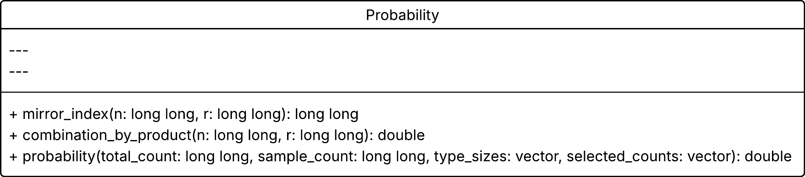
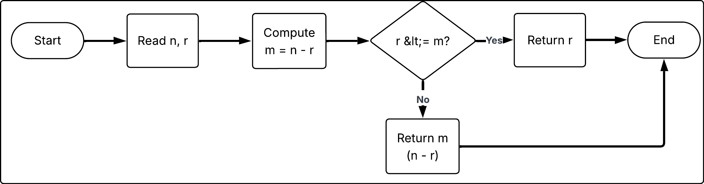
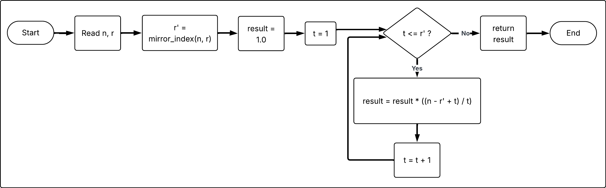
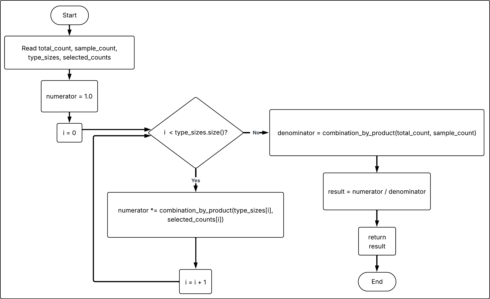
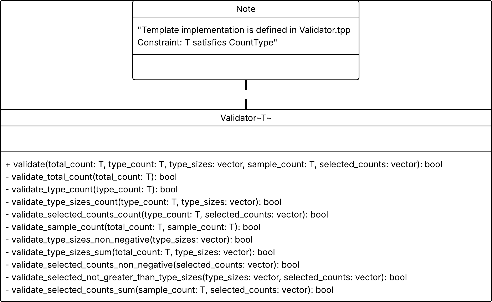
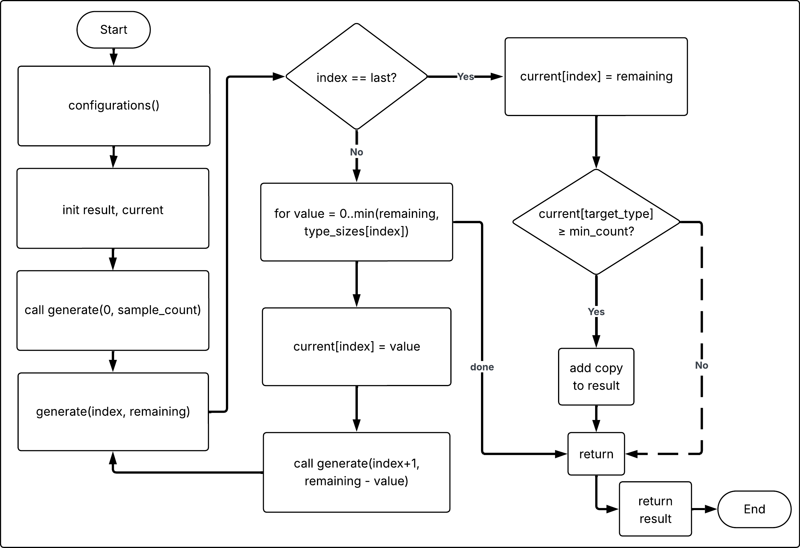
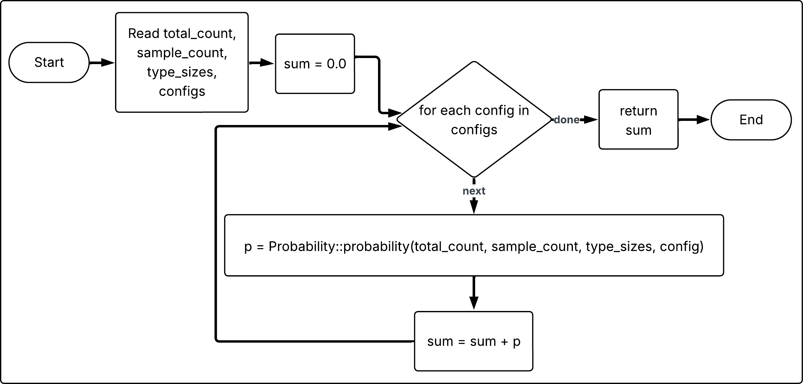

# Практичне заняття №4

## Тема 3.

## Мета: 

Опрацювання основних теоретичних положень теорії ймовірностей, правил додавання і множення ймовірностей, умовної ймовірності та властивостей залежних і незалежних подій. У роботі також розглядається формалізація типових імовірнісних задач та побудова узагальненої обчислювальної моделі на основі задачі 29, в якої побудовано узагальнену математичну модель обчислення ймовірності для вибірки з ($N$) об’єктів, поділених на $k$ типів, що дозволяє задавати різні параметри експерименту без прив’язки до конкретної задачі. Модель реалізує декомпозицію формули розподілу, містить перевірки коректності параметрів та використовує оптимізоване обчислення біноміальних коефіцієнтів без прямого використання факторіалів.

## Математична модель обчислення ймовірності

## Формулювання задачі.

### Приклад задачі що рішає модель.

Серед 12 телевізорів, які надійшли у ремонт, у п’яти з них треба замінити електронні компоненти, а у інших замінити деталі корпусу. Яка ймовірність того, що серед чотирьох телевізорів, взятих навмання майстром для ремонту, хоча б двом треба замінити електронні компоненти.

Для розв’язання задачі спочатку будуємо математичну модель вибірки без повернення з множини об’єктів, поділених на  типів. Модель дозволяє обчислювати ймовірність конкретної конфігурації кількостей об’єктів різних типів у вибірці. Після цього ймовірність події задачі визначається як сума ймовірностей всіх конфігурацій, що задовольняють умову події.

---

## Математична модель вибірки.

Нехай $N$ об’єктів (12 телевізорів), розбитих на $k$ типів (`2 типи в задачі{5 електр.комп.; 7 корпус}`)

Кількість об’єктів кожного типу:

$$N_1, N_2, ... ,N_k$$

де 

$$N_i  \geq 0$$ 

$$i = 1, ... , k$$

Виконується умова узгодженості кількостей

$$N = N_1 + N_2, \cdots + N_k$$

або  

$$N = \sum_{i=1}^{k}N_i$$

Нехай серед вибраних $m$ об’єктів виявилося $x_1, x_2, ... , x_k$ об’єктів відповідно $1, 2, ... , k$-го типу. 

Тоді $0\leq x_i\leq Ni$ де $i = 1, ... , k$ 

та 

$$m = x_1+x_2+ ... +x_k$$

або 

$$\sum_{i=1}^{k}x_i = m$$

Ймовірність того, що у вибірці з $m$ об’єктів буде рівно $x_1,x_2, ...  ,x_k$ об’єктів відповідних типів, задається розподілом:

$$P(x_1, x_2, ... , x_k) = \frac{\binom{N_1}{x_1}\binom{N_2}{x_2}\cdots\binom{N_k}{x_k}}{\binom{N}{m}}$$

де 

$$\binom{n}{r}=\frac{n!}{r!(n-r)!}$$

Це комбінація, без повторень, порядок слідування не враховується.

---

## Перетворення формули ймовірності.

Підставляємо означення біноміального коефіцієнта:

$$P(x_1,x_2,\dots,x_k)=\frac{\frac{N_1!}{x_1!(N_1-x_1)!}\cdot\frac{N_2!}{x_2!(N_2-x_2)!}\cdots\frac{N_k!}{x_k!(N_k-x_k)!}}{\frac{N!}{m!(N-m)!}}=\frac{\prod_{i=1}^{k}\frac{N_i!}{c_i!(N_i-c_i)!}}{m!\frac{N!}{(N-m)!}}$$

Перевертаємо знаменник:

$$P(x_1,\ldots,x_k)=\frac{m!(N-m)!}{N!}\cdot\prod_{i=1}^{k}\frac{N_i!}{x_i!(N_i-x_i)!}$$

---

## Декомпозиція обчислення.

Глобальний множник:

$$A(N,m)=\frac{m!(N-m)!}{N!}$$

Добуток по типах

$$B(N_i,x_i)=\frac{N_i!}{x_i!(N_i-x_i)!}$$

Тепер формула має вигляд:

$$P(x_1,\ldots,x_k)=A(N,m)\cdot\prod_{i=1}^{k}B(N_i,x_i)$$

---

## Ефективне обчислення біноміальних коефіцієнтів.

Так як біноміальний коефіцієнт має симетрію:

$$\binom{n}{r}=\binom{n}{n-r}$$

Ми можемо обрати  найменший параметр для обчислення:

$$r'=\begin{cases} 
r,& r\le n-r \\
n-r,& r>n-r 
\end{cases}$$

Тоді 

$$r' = min(r, n-r)$$

маємо добуток з найменшою кількістю кроків.

Замінимо факторіальну реалізацію біноміальної функції `B` на еквівалентне обчислення через послідовний добуток дробів, бо факторіали дуже швидко ростуть:

$$\binom{n}{r}=\frac{n(n-1)(n-2)\cdots(n-r+1)}{r!}$$

$$\binom{n}{r}=\prod_{t=1}^{r'}\frac{n-{r'}+t}{t}$$

Наприклад якщо $n = 100, r = 97$ то рахувати через 97 множень неэффективно, але $n - r = 3$, $r' = min(97, 3)=3$

$$\binom{100}{97}=\prod_{t=1}^{3}\frac{100-3+t}{t}=\frac{98}{1}\cdot\frac{99}{2}\cdot\frac{100}{3}$$

$\binom{100}{97}$ теж саме що $\binom{100}{3}$, але кроків лише 3.

---

## Остаточна формула розподілу.

Повертаємося до формули ймовірності і замінюємо функції $A(N,m)$, $B(N_i,x_i)$ добутком.

Оскільки:

$$\binom{N}{m}=\frac{N!}{m!(N-m)!}$$

Ми можемо обернути дріб:

$$\frac{1}{\binom{N}{m}}=\frac{1}{\frac{N!}{m!(N-m)!}}$$

Отримаємо:

$$A(N,m)=\frac{m!(N-m)!}{N!}=\frac{1}{\binom{N}{m}}$$

Покажемо `B` як $\binom{N_i}{x_i}$:

$$P(x_1,\ldots,x_k)=A(N,m)\cdot\prod_{i=1}^{k}\binom{N_i}{x_i}$$

Заміняємо `А` оберненою:

$$P(x_1,\ldots,x_k)=\frac{1}{\binom{N}{m}}\cdot\prod_{i=1}^{k}\binom{N_i}{x_i}$$

Переносимо множник у знаменник дробу:

$$P(x_1,\ldots,x_k)=\frac{\prod_{i=1}^{k}\binom{N_i}{x_i}}{\binom{N}{m}}$$

Всі біноміальні коефіцієнти ми обчислюємо через добуток:

$$C(n,r) = \binom{n}{r}=\prod_{t=1}^{\min(r,n-r)}\frac{n-\min(r,n-r)+t}{t}$$

Остаточна формула розподілу для $x_1,\ldots,x_k$:

Модель дозволяє обчислити ймовірність будь-якої конкретної конфігурації.

$$P(x_1,\ldots,x_k)=\frac{\prod_{i=1}^{k}C(N_i,x_i)}{C(N,m)}$$

### Таблиця функцій алгоритму моделі

| Мат модель                                                    | Опис                                                                                                                                      | Програмна реалізація      |
|---------------------------------------------------------------|-------------------------------------------------------------------------------------------------------------------------------------------|---------------------------|
| $r' = min(r, n-r)$                                            | Повертає $r'$ який використовується у функції $C(n,r)$                                                                                    | `mirror_index`            |
| $C(n,r) =\prod_{t=1}^{r'}\frac{n-{r'}+t}{t}$                  | Функція обчислює комбінацію через добуток, використовує `mirror_index`, для скорочення кроків.                                            | `combination_by_product`  |
| $P(x_1,\ldots,x_k)=\frac{\prod_{i=1}^{k}C(N_i,x_i)}{C(N,m)}$  | Загальна модель розподілу де $$\sum_{i=1}^{k} N_i = N$$ та $$\sum_{i=1}^{k} x_i = m$$ для однієї конкретної конфігурації $x_1,\ldots,x_k$ | `probability`             |

- `Probability`

- `Probability::mirror_index`

- `Probability::combination_by_product`

- `Probability::probability` 

Таблиця перевірок в `Validator`

| №  | Перевірка                    | Пояснення                                                                                      | Функція в коді                                  |
|----|------------------------------|------------------------------------------------------------------------------------------------|-------------------------------------------------|
| 1  | $N \ge 0$                    | Загальна кількість об'єктів не може бути від'ємною.                                            | `validate_total_coun`                           |
| 2  | $k \ge 0$                    | Кількість типів об'єктів не може бути від'ємною.                                               | `validate_type_count`                           |
| 3  | $N_i \ge 0,\; i=1,\ldots,k$  | Кількість об'єктів кожного типу не може бути від'ємною.                                        | `validate_type_sizes_non_negative`              |
| 4  | $\sum_{i=1}^{k} N_i = N$     | Сума кількостей об'єктів усіх типів повинна дорівнювати загальній кількості.                   | `validate_type_sizes_sum`                       |
| 5  | $0 \le m \le N$              | Кількість вибраних об'єктів повинна бути в межах від нуля до загальної кількості.              | `validate_sample_count`                         |
| 6  | $x_i \ge 0,\; i=1,\ldots,k$  | Кількість вибраних об'єктів кожного типу не може бути від'ємною.                               | `validate_selected_counts_non_negative`         |
| 7  | $x_i \le N_i,\; i=1,\ldots,k$ | Неможливо вибрати більше об'єктів певного типу, ніж існує у сукупності.                        | `validate_selected_not_greater_than_type_sizes` |
| 8  | $\sum_{i=1}^{k} x_i = m$     | Сума вибраних об'єктів усіх типів повинна дорівнювати загальній кількості вибірки.             | `validate_selected_counts_sum`                  |
| 9  | `\|type_sizes\|` = $k$       | Кількість елементів у контейнері `type_sizes` повинна дорівнювати кількості типів `type_count` | `validate_type_sizes_count`                     |
| 10 | `\|selected_counts\|` = $k$  | Кількість елементів у контейнері selected_counts також повинна дорівнювати `type_count`        | `validate_selected_counts_count`                |

---

## Обчислення ймовірності події.

Ймовірність події задачі з телевізорами `(39)` визначається як сума ймовірностей усіх конфігурацій, для яких кількість об’єктів першого типу у вибірці задовольняє умову $x_1 \geq 2$.

Маємо:

$$N_1 = 5, N_2 = 7, m = 4$$ 

та подію $x_1 \geq 2$

Тепер нам потрібно знайти всі допустимі конфігурації $(x_1, x_2)$, для яких:

$$x_1 + x_2 = 4,\ 0 \le x_1 \le 5,\ 0 \le x_2 \le 7,\ x_1 \ge 2$$

Тобто ми повинні застосувати нашу модель для $(2, 2), (3, 1), (4, 0)$.

### Допоміжні функції

Функція яка генерує конфігурації, і подія поверх неї “хоча б”.

Функція $\text{configurations}(N_1,\ldots,N_k,m,j,h)$ повертає всі вектори $(x_1,\ldots,x_k)$ за умов:

$$\sum_{i=1}^{k}x_i=m$$

$$0\le x_i\le N_i$$

$$x_j\ge h$$

- `Configurations::configurations`

І функція що обчислює суму всіх конфігурацій:

$$\text{sumprobability}(N_1,\ldots,N_k,m,j,h) = \sum_{(x_1,\ldots,x_k)\in \text{configurations}} P(x_1,\ldots,x_k)$$

- `sum_probability`

