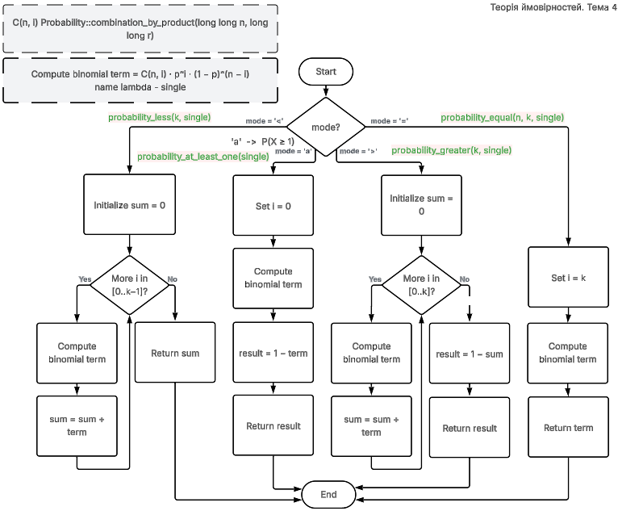

# Тема 4. Bernoulli

## Мета

- Навчитися застосовувати формулу Бернуллі для розв'язання практичних задач.

## Теорія

$$
P(X=k)=\binom{n}{k}p^k(1-p)^{n-k}
$$

Формула Бернуллі або біноміальний розподіл описує схему, коли незалежне випробування повторюється $n$ разів з однаковою ймовірністю успіху $p$. Коефіцієнт $\binom{n}{k}$ показує кількість різних способів вибрати $k$ успіхів серед $n$ випробувань.
Множник $p^k$ дає ймовірність того, що саме ці $k$ випробувань будуть успішними, а множник $(1-p)^{n-k}$ дає ймовірність того, що решта $n-k$ випробувань будуть не успішними.
Добуток цих множників описує одну конкретну конфігурацію успіхів і невдач, а множник $\binom{n}{k}$ враховує всі можливі перестановки таких конфігурацій.

Використовується коли кількість випробувань відносно невелика або коли потрібне точне значення ймовірності. Підходить для дискретних подій типу успіх або невдача. Класичні приклади це підкидання монети, дефектні вироби в партії або правильні відповіді у тесті.

## Задача
Комутатор обслуговує 100 абонентів, ймовірність того, що на впродовж хвилини абонент зателефонує на комутатор дорівнює 0,01. Знайти ймовірність того, що впродовж хвилини:

- а) зателефонує три абоненти;
- б) зателефонує менше трьох абонентів;
- в) зателефонує більше трьох абонентів;
- г) зателефонує хоча б один абонент.

Підставимо:

$$
P(X=k)=\binom{n}{k}p^k(1-p)^{n-k}
$$

|                 |                                                                       |
|-----------------|-----------------------------------------------------------------------|
| $n = 100$       | кількість абонентів                                                   |
| $p = 0.01$      | ймовірність що один абонент зателефонує за хвилину                    |
| $k$             | кількість абонентів, які зателефонують за хвилину                     |
| $C_{100}^k$     | кількість способів вибрати $k$ абонентів із 100, які зроблять дзвінок |
| $p^k$           | ймовірність того, що саме ці $k$ абонентів зателефонують              |
| $(1-p)^{100-k}$ | ймовірність того, що решта абонентів не зателефонують                 |
| $P(X=k)$        | ймовірність того, що рівно $k$ абонентів зателефонують за хвилину     |


$$
P(X=k)=C_{100}^k(0.01)^k(0.99)^{100-k}
$$

Тоді:

а) зателефонує три абоненти: 

$$P(X=3)=C_{100}^3(0.01)^3(0.99)^{100-3}$$

б) зателефонує менше трьох абонентів: 

$$P(X<3)=P(X=0)+P(X=1)+P(X=2)$$
$$P(X<3)=C_{100}^{0}(0.01)^{0}(0.99)^{100}+C_{100}^{1}(0.01)^{1}(0.99)^{99}+C_{100}^{2}(0.01)^{2}(0.99)^{98}$$

в) зателефонує більше трьох абонентів:

$$P(X>3)=1-\left(P(X=0)+P(X=1)+P(X=2)+P(X=3)\right)$$
$$P(X>3)=1-\left(C_{100}^{0}(0.01)^{0}(0.99)^{100}+C_{100}^{1}(0.01)^{1}(0.99)^{99}+C_{100}^{2}(0.01)^{2}(0.99)^{98}+C_{100}^{3}(0.01)^{3}(0.99)^{97}\right)$$

г) зателефонує хоча б один абонент

$$P(X \ge 1)=1-C_{100}^{0}(0.01)^{0}(0.99)^{100}$$

## Функція вибору стратегії обчислення

Функція приймає $n$, $k$, $p$, і тип запиту $mode$ - це символьний код режиму:

```cpp
double binomial_probability(long long n, long long k, double p,
    char mode   // '=', '<', '>', 'a'
)
```

| $mode$ | логіка                                               | функція                            |
|--------|------------------------------------------------------|------------------------------------|
| `=`    | рахується один вираз $P(X=k)$                        | `probability_equal(k, single)`     |
| `<`    | сумуються $P(X=0)+\cdots+P(X=k-1)$                   | `probability_less(k, single)`      |
| `>`    | використовується доповнення $1-\sum_{i=0}^{k}P(X=i)$ | `probability_greater(k, single)`   |
| `a`    | використовується $1-P(X=0)$                          | `probability_at_least_one(single)` |

Де `single` це функція що обчислює один член біноміальної формули ймовірності:

`combination_by_product` це ефективне обчислення комбінації, реалізація якого в роботі [2026-03-08-probability-combination](https://github.com/yourhostel/cpp_course/tree/main/math/III_course/2026-03-08-probability-combination)

{ height=95% }


