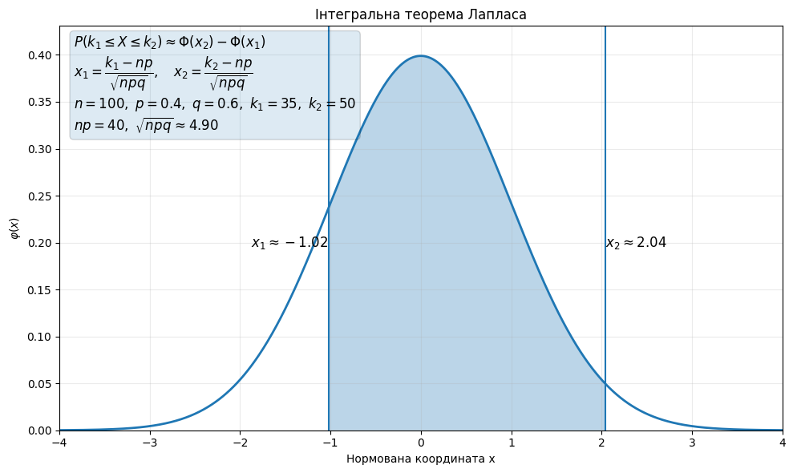
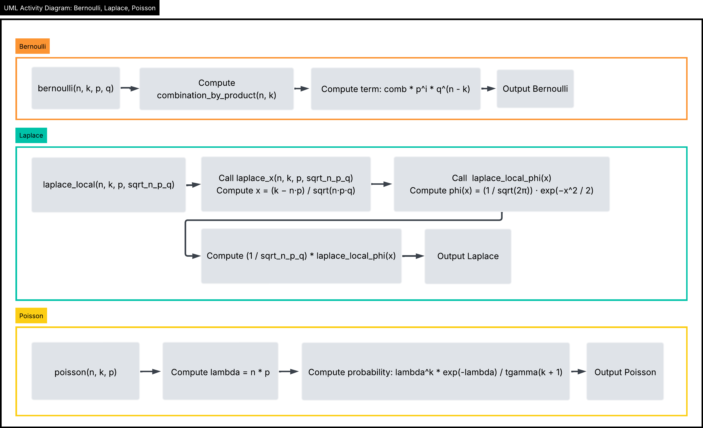
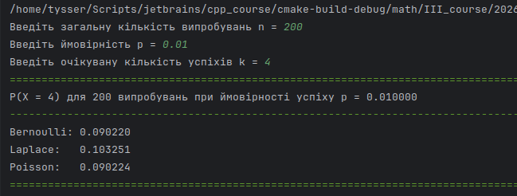

# Практичне заняття №5. ЗМІ. Тема 4.

# Laplace, Poisson

# Мета

- Навчитися застосовувати формулу Пуассона, Лапласа для розв'язання практичних задач. Зробити порівняння Бернуллі, Пуассон, Лаплас.

- Приклад реалізації [Бернуллі](https://github.com/yourhostel/cpp_course/tree/main/math/III_course/2026-03-13-bernoulli) був виконаний окремо

# Теорія

## Локальна теорема Лапласа

$$
\boxed{P(X=k) \approx \frac{1}{\sqrt{npq}}\varphi(x)}
$$

де:

$$
x = \frac{k-np}{\sqrt{npq}},\qquad q = 1 - p,\qquad \varphi(x) = \frac{1}{\sqrt{2\pi}}e^{-x/2}
$$

якщо підставити:

$$
P(X=k) \approx \frac{1}{\sqrt{npq}} \cdot \frac{1}{\sqrt{2\pi}}e\left ( - \frac{(k-np)^2}{2npq}\right ),\qquad q = 1- p
$$

Локальна теорема Лапласа є наближенням біноміального розподілу нормальним розподілом. Вираз $np$ є математичним сподіванням кількості успіхів, а $npq$ є дисперсією.
Значення $x = \frac{k-np}{\sqrt{npq}}$ нормалізує відхилення фактичного значення $k$ від середнього. 
Функція $\varphi(x)$ є щільністю стандартного нормального розподілу і дає значення ймовірності після масштабування множником $\frac{1}{\sqrt{npq}}$.

Використовується коли $n$ велике і $p$ не дуже мале. При великому $n$ біноміальний розподіл можна наближено замінити нормальним. Метод дозволяє швидко оцінювати ймовірності без обчислення великих комбінацій.

## Інтегральна теорема Лапласа

$$
P(k_1 \leq X \leq k_2) \approx \Phi(x_2) - \Phi(x_1)
$$

де: 

$$
x_1 = \frac{k_1 - np}{\sqrt{npq}},\qquad  x_2 = \frac{k_2 - np}{\sqrt{npq}},\qquad q = 1 - p
$$

$$
\Phi(x) = \int_{0}^{x}\frac{1}{\sqrt{2pi}}e^{-t^2/2}dt
$$

Значення $np$ є математичним сподіванням біноміального розподілу і показує середню кількість успіхів. Величина $\sqrt{npq}$ є стандартним відхиленням і визначає масштаб розсіювання значень.
Межі $k_1$ $k_2$ переводяться у нормовані координати $x_1$ і $x_2$, які показують відхилення від середнього у одиницях стандартного відхилення.
Функція $\Phi(x)$ є інтегральною функцією стандартного нормального розподілу і дає накопичену ймовірність від нуля до точки $x$. Різниця $\Phi(x_2) - \Phi(x_1)$ дає ймовірність того, що нормальна випадкова величина лежить у відповідному інтервалі.



На графіку показано стандартну нормальну криву $\varphi(x)$, межі $x_1$ і $x_2$, а також заштриховану область, яка відповідає ймовірності

$$
P(k_1 \leq X \leq k_2) \approx \Phi(x_2) - \Phi(x_1)
$$

У прикладі взято $\quad n = 100,\quad p = 0.4,\quad q = 0.6,\quad k_1 = 35,\quad k2 = 50$

тому: $\qquad np = 40,\qquad \sqrt{npq} = 4.9$

$$x_1 = \frac{k_1 - np}{\sqrt{npq}} = \frac{35 - 40}{4.9} \approx -1.02$$
$$x_2 = \frac{k_2 - np}{\sqrt{npq}} = \frac{50 - 40}{4.9} \approx 2.04$$

Сам інтеграл показує зміст під кривою, нормуємо межі інтервалу і отримуємо $x_1$ та $x_2$, у таблиці знаходимо $\Phi(x_1)$ і $\Phi(x_2)$, віднімаємо їх. 

Інтегральна теорема Лапласа використовується для наближеного обчислення ймовірності того, що біноміальна випадкова величина потрапляє у певний інтервал значень.
На відміну від локальної теореми, тут розглядається не одна точка $X=k$, а діапазон значень. У задачах статистики це використовується для оцінки інтервалів і відхилень від середнього.

## Пуасона

$$
P(X = k) = \frac{{\lambda}^ke^{-\lambda}}{k!},\qquad  \lambda = np
$$

Розподіл Пуассона є граничним випадком біноміального розподілу, коли кількість випробувань дуже велика, а ймовірність успіху дуже мала. Параметр $\lambda$ означає середню кількість появ події у всій серії випробувань.
Множник ${\lambda}^k$ враховує кількість появ події, $k!$ компенсує кількість можливих перестановок подій, а коефіцієнт $e^{-\lambda}$ робить суму всіх значень розподілу рівною $1$. 

Використовується для рідкісних подій. Типові приклади це кількість відмов обладнання, кількість дзвінків у кол центр за короткий час або кількість дефектів на великій площі матеріалу.

## Загальна порівняльна характеристика

| Характеристика     | Бернуллі                     | Локальна теорема Лапласа       | Інтегральна теорема Лапласа               | Пуассона             |
|--------------------|------------------------------|--------------------------------|-------------------------------------------|----------------------|
| Тип моделі         | Точний біноміальний розподіл | Нормальне наближення           | Нормальне наближення                      | Граничне наближення  |
| Тип змінної        | Дискретна                    | Неперервна модель              | Неперервна модель                         | Дискретна            |
| Що обчислює        | Ймовірність $X=k$            | Ймовірність $X=k$              | Ймовірність інтервалу $k_1 \le X \le k_2$ | Ймовірність $X=k$    |
| Умови застосування | $n$ будь яке                 | $n$ велике, $p$ не дуже мале   | $n$ велике, $p$ не дуже мале              | $n$ велике, $p$ мале |
| Основний параметр  | $n,p$                        | $np, npq$                      | $np, npq$                                 | $\lambda = np$       |
| Тип задач          | Точні ймовірності            | Наближення для одного значення | Наближення для інтервалу                  | Рідкісні події       |

---

## Завдання 47

Застосовуючи

- а) формулу Бернуллі; 
- б) локальну теорему Лапласа
- в) формулу Пуассона 

знайти ймовірність того, що серед 200 осіб виявиться четверо шульгів, якщо у середньому шульги становлять 1%.


### Допоміжні функції:

#### Таблична функція Лапласа
Функція для обчислення значень, які беруться з таблиці Лапласа:

$$\Phi(x)=\int_{0}^{x}\frac{1}{\sqrt{2\pi}}e^{-t^{2}/2}\,dt$$

яка виражається через функцію помилки так:

$$\Phi(x)=\frac{1}{2}\,\operatorname{erf} \left(\frac{x}{\sqrt{2}}\right)$$

```cpp
double laplace_phi(double x)
{
    return 0.5 * std::erf(x / std::sqrt(2.0));
}
```

#### Щільність нормального розподілу

Функція використовується в локальній теоремі Лапласа

$$\varphi(x) = \frac{1}{\sqrt{2\pi}}e^{-x/2}$$

```cpp
double laplace_local_phi(const double x)
{
return (1.0 / std::sqrt(2.0 * M_PI)) * std::exp(-x * x / 2.0);
}
```

### UML diagrams: Bernoulli, Laplace, Poisson



Приклад обчислень для завдання 47:



## Висновок

Формула Бернуллі дає точне значення ймовірності $P(X=k)$ і застосовується безпосередньо для обчислення біноміальної ймовірності.
Локальна теорема Муавра Лапласа використовується для наближеного обчислення $P(X=k)$ при великому числі випробувань $n$ і достатньо великому значенні дисперсії біноміального розподілу $npq$. Якщо ймовірність успіху $p$ дуже мала або дисперсія біноміального розподілу є малою, точність нормального наближення погіршується.
Інтегральна теорема Муавра Лапласа застосовується для знаходження ймовірності того, що число успіхів лежить у певному інтервалі. Вона також використовується за умови великої кількості випробувань і достатньо великої дисперсії біноміального розподілу.
Формула Пуассона використовується для рідкісних подій, коли ймовірність успіху $p$ в одному випробуванні мала, кількість випробувань велика, а математичне сподівання числа успіхів $np$ має скінченне значення. У розглянутій задачі саме наближення Пуассона дає результат, найближчий до точного значення, отриманого за формулою Бернуллі.
