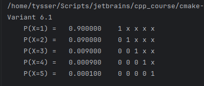
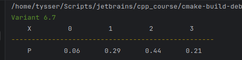

# Випадкові величини і процеси

Закон розподілу дискретної випадкової величини

ТІМС-ЛПР-06+

# Завдання 6.1

6.1–6.6 Маємо n ламп, кожна з яких з ймовірністю p є якісною.
Лампа вгвинчується в прилад і вмикається струм. При вмиканні струму дефектна лампа одразу виходить з ладу, після чого замінюється іншою. 
Розглядається випадкова величина X – число випробуваних ламп. Знайти її закон розподілу.

| Варіант | 6.1 | 6.2 | 6.3 | 6.4 | 6.5 | 6.6 |
|---------|-----|-----|-----|-----|-----|-----|
| n       | 5   | 4   | 5   | 4   | 5   | 4   |
| p       | 0.9 | 0.7 | 0.8 | 0.8 | 0.7 | 0.9 |

Розв'язання варіант 6.1:

$n = 5, p = 0.9, q = 1 - p = 0.1$

$q$ - ймовірність того, що лампа дефектна.

Випадкова величина $X$ - кількість перевірених ламп до появи першої якісної або до вичерпання всіх ламп. Закон розподілу має геометричний характер і задається формулою:
$$P(X = k) = \begin{cases} q^{k-1} p, & k = 1, 2, \dots, n - 1 \\ q^{n-1}, & k = n \end{cases}$$

Ця формула означає, що для значення $X=k$ перші $k-1$ ламп є дефектними, а $k$-та лампа якісна.

Обчислимо ймовірності для всіх можливих значень випадкової величини $X$:

$P(X=1)=0.9$

$P(X=2)=0.1\cdot 0.9=0.09$

$P(X=3)=0.1^2\cdot 0.9=0.01\cdot 0.9=0.009$

$P(X=4)=0.1^3\cdot 0.9=0.001\cdot 0.9=0.0009$

$P(X=5)=0.1^4=0.0001$

$0.9 + 0.09 + 0.009 + 0.0009 + 0.0001 = 1$

Розподіл побудовано правильно.

Для автоматизації обчислень реалізуємо програмну функцію, яка формує закон розподілу для заданих $n$ та $p$

```cpp
std::vector<double> geometric_distribution(int n, double p)
```

Для кожного можливого значення випадкової величини $X$ обчислено відповідну ймовірність $P(X=k)$. 
Праворуч наведено візуальне подання процесу перевірки ламп: $0$ означає дефектну лампу, $1$ означає першу якісну лампу, символ $x$ позначає лампи, які вже не перевірялися. 



---

# Завдання 6.7

6.7-6.12 Випробовується пристрій, який складається з трьох незалежно працюючих приладів. Ймовірності відмови приладів $p_1, p_2, p_3$. 
Розглядається випадкова величина $X$ - число приладів, які вийшли з ладу. Знайти її закон розподілу.

| Варіант | 6.7 | 6.8 | 6.9 | 6.10 | 6.11 | 6.12 |
|---------|-----|-----|-----|------|------|------|
| $p_1$   | 0.5 | 0.6 | 0.7 | 0.3  | 0.4  | 0.3  |
| $p_2$   | 0.6 | 0.7 | 0.8 | 0.8  | 0.7  | 0.6  |
| $p_3$   | 0.7 | 0.8 | 0.5 | 0.6  | 0.5  | 0.4  |

Розв'язання варіант 6.7:

Ймовірності відмови приладів: $p_1 = 0.5, p_2 = 0.6, p_3 = 0.7$

Ймовірності справної роботи: $1 - p_1 = 0.5, 1 - p_2 = 0.4, 1 - p_3 = 0.3$

Випадкова величина $X$ це число приладів, які вийшли з ладу, тому $X \in \{0,1,2,3\}$

$$P(X = k) = \sum_{\substack{A \subset \{1,2,3\} \\ |A| = k}} \left( \prod_{i \in A} p_i \right)\left( \prod_{j \notin A} (1 - p_j) \right)$$

Обчислюємо:

$P(X=0)=(1-p_1)(1-p_2)(1-p_3)=0.5\cdot0.4\cdot0.3=0.06$

$P(X=1)=p_1(1-p_2)(1-p_3)+(1-p_1)p_2(1-p_3)+(1-p_1)(1-p_2)p_3$

$P(X=1)=0.5\cdot0.4\cdot0.3+0.5\cdot0.6\cdot0.3+0.5\cdot0.4\cdot0.7$

$P(X=1)=0.06+0.09+0.14=0.29$

$P(X=2)=p_1p_2(1-p_3)+p_1(1-p_2)p_3+(1-p_1)p_2p_3$

$P(X=2)=0.5\cdot0.6\cdot0.3+0.5\cdot0.4\cdot0.7+0.5\cdot0.6\cdot0.7$

$P(X=2)=0.09+0.14+0.21=0.44$

$P(X=3)=p_1p_2p_3=0.5\cdot0.6\cdot0.7=0.21$

$0.06+0.29+0.44+0.21=1$

Розподіл побудовано правильно.

```cpp
std::vector<double> failure_distribution(const std::vector<double>& p)
```



# Висновок

У роботі було знайдено закони розподілу дискретних випадкових величин для двох типів випадкових процесів. Для задачі з лампами отримано геометричний закон розподілу, а для задачі з трьома незалежними приладами закон розподілу побудовано шляхом перебору всіх можливих комбінацій відмов. В усіх випадках перевірено, що сума ймовірностей дорівнює одиниці, тому результати є коректними. Програмна реалізація підтвердила правильність теоретичних обчислень.

---


