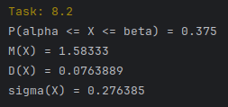
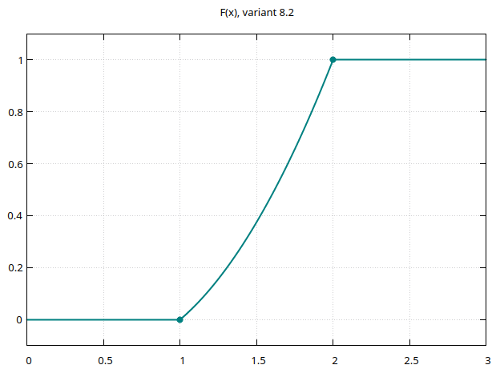
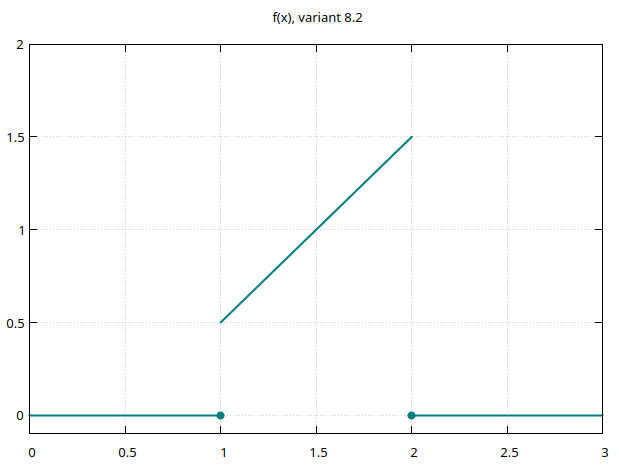

# Випадкові величини і процеси

Закон розподілу неперервної випадкової величини

Неперервна випадкова величина

# Завдання 8

$8.1-8.30$ Випадкова величина $X$ має функцію розподілу $F(x)$. Знайти:

а) ймовірність того, що $X$ набуде значення з інтервалу $\alpha;\beta $

б) щільність розподілу; 

в) математичне сподівання, дисперсію та середнє квадратичне відхилення. 

Побудувати графіки функції розподілу та щільності розподілу.


Варіант 8.2

$$F(x)=\begin{cases}
0, & x \le 1 \\
\dfrac{x^2 - x}{2}, & 1 < x \le 2 \\
1, & x > 2
\end{cases}$$

$\alpha = -1;\beta = 1.5$

a) Ймовірність того, що випадкова величина набуде значення з інтервалу $[\alpha, \beta]$ обчислюється через функцію розподілу:

$P(\alpha \leq X \leq \beta) = F(\beta) - F(\alpha)$

Для цього використовується функція:

```cpp
double probability(const distribution_case& c)
```

`distribution_case` тримає параметри конкретної задачі:

```cpp
struct distribution_case {
    std::string label;
    double a;
    double b;
    double alpha;
    double beta;
    std::function<double(double)> distribution_function;
    std::function<double(double)> density_function;
};
```

`a, b` інтервал, де визначена випадкова величина

`alpha, beta` інтервал, для якого рахується ймовірність

`distribution_function` функція розподілу

`density_function` щільність розподілу, тобто похідна функції розподілу $f(x)=F'(x)$

Репозиторій `DistributionRepository` тримає всі завдання 8.1 - 8.2, і має два методи для відображення графіків

Для функції розподілу

```cp
void plot_distribution_function(std::size_t variant_number) const;
```

Для щільності розподілу

```cp
void plot_density_function(std::size_t variant_number) const;
```

Інші значення вираховуються методами класу `DistributionStatistics`

# Клас DistributionStatistics

Формула чисельного інтегрування за методом Сімпсона.

```cpp
double DistributionStatistics::integrate(Function f, double a, double b)
```

Інтервал $[a,b]$ розбивається на $n$ рівних частин.
На кожній парі відрізків функція апроксимується квадратичною параболою.
Значення функції у вузлах беруться з різними вагами:
коефіцієнт 4 для непарних точок, 2 для парних, 1 для крайніх.
Має високу точність, тому що враховує кривизну функції а не площу прямокутників.

$$\int_a^b f(x)\,dx \approx \frac{h}{3}\left[f(x_0)+4\sum_{\substack{k=1 \\ k\ \mathrm{odd}}}^{n-1} f(x_k)+2\sum_{\substack{k=2 \\ k\ \mathrm{even}}}^{n-2} f(x_k)+f(x_n)\right]$$

$$h=\frac{b-a}{n}, \quad x_k=a+kh$$

## Математичне сподівання

```cpp
double DistributionStatistics::expectation(Function f, double a, double b)
```

Cереднє значення випадкової величини. Воно показує, навколо якого значення зосереджена випадкова величина при великій кількості спостережень.

$$\mathbb{E}[X]=\int_a^b x f(x)\,dx$$

## Математичне сподівання квадрата

```cpp
double DistributionStatistics::second_moment(Function f, double a, double b)
```

Допоміжна величина, яка характеризує розподіл значень з урахуванням їх квадрата. Вона використовується для обчислення дисперсії.

$$\mathbb{E}[X^2]=\int_a^b x^2 f(x)\,dx$$

## Дисперсія

```cpp
double DistributionStatistics::variance(Function f, double a, double b)
```

Міра розкиду значень випадкової величини відносно її середнього. Якщо дисперсія мала, значення зосереджені близько до математичного сподівання.

$$\mathrm{Var}(X)=\mathbb{E}[X^2]-(\mathbb{E}[X])^2$$

## Середнє квадратичне відхилення

```cpp
ouble DistributionStatistics::standard_deviation(Function f, double a, double b)
```

Це корінь із дисперсії. Показує типове відхилення значень від середнього.

$$\sigma=\sqrt{\mathrm{Var}(X)}$$

Результат виконання:







---

 -V geometry:landscape \
```bash
pandoc README.md -s \
--pdf-engine=xelatex \
-V mainfont="DejaVu Serif" \
-V monofont="DejaVu Sans Mono" \
-V fontsize=12pt \
-V linestretch=1.15 \
-V geometry:a4paper \
-V geometry:margin=20mm \
--toc-depth=3 \
--number-sections \
--metadata title="Теорія ймовірностей та математична статистика" \
--metadata subtitle="Закон розподілу дискретної випадкової величини. ТІМС-ЛПР-06+" \
--metadata author="Тищенко Сергій, alk-43" \
--metadata date="2026-03-19" \
-H ../../../header.tex \
-o README.pdf
```