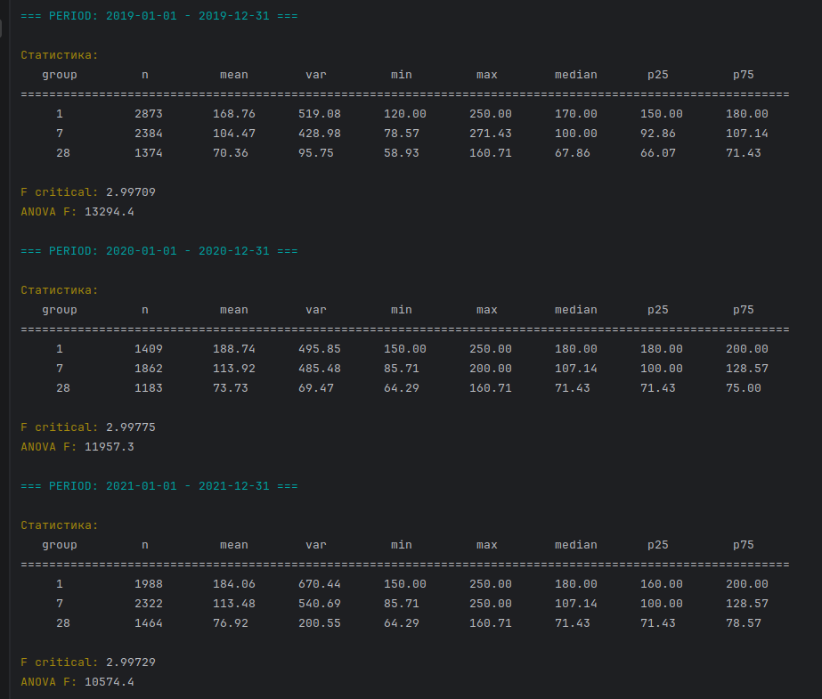

# ANOVA.

**Статистика F Критерію Фішера у використанні в методі дисперсійного аналізу ANOVA**

## Мета:
Перевірити, чи відрізняється середній дохід за добу між тарифами 1 день, 7 днів і 28 днів, 
та оцінити, чи тарифна політика відповідає очікуванню, що коротші проживання дають більший дохід за добу.

---
## Постановка задачі

Розглядається сукупність проживань у хостелі, де існують три фіксовані тарифні групи:

Залежна змінна:

$$
y = \text{revenuePerDay} = \frac{price}{\text{stayDays}}
$$

Фактор:

$$
g \in \{1Dday,\ 7Ddays,\ 28Days\}
$$

---

## Гіпотези

Нульова гіпотеза:

$$
H_0: \mu_1 = \mu_7 = \mu_{28}
$$

Альтернативна гіпотеза:

$$
H_1: \text{принаймні одне середнє відрізняється}
$$

---

## Інтерпретація

Перевіряється, чи тарифна політика реально створює різницю у середньому доході за добу.

Очікування:

$$
\mu_1 > \mu_7 > \mu_{28}
$$

Якщо це виконується і статистично значуще, політика працює коректно.

Якщо ж:

$$
\mu_7 \approx \mu_1 \quad \text{або} \quad \mu_{28} \ge \mu_7
$$

це сигнал про неефективність або особливості даних.

---

## Підготовка даних

Обчислення тривалості:

$$
stayDays = dateOut - dateIn
$$

Фільтрація:

$$
stayDays = 1 \quad \text{або} \quad 7 \quad \text{або} \quad 28
$$

---

## Формування вибірок

- Група 1: всі значення $\quad revenuePerDay \quad$ при $\quad stayDays = 1$
- Група 2: всі значення $\quad revenuePerDay \quad$ при $\quad stayDays = 7$
- Група 3: всі значення $\quad revenuePerDay \quad$ при $\quad stayDays = 28$

---

## Розрахунок ANOVA

- Кількість груп: $k=3$ 
- Обсяг вибірки: $N=n_1+n_7+n_{28}$ 
- Середні по групах: $\bar{x}_1,\ \bar{x}_7,\ \bar{x}_{28}$

Загальне середнє $\bar{x}$:

$$\bar{x}=\frac{1}{N}\sum_{i=1}^{k}\sum_{j=1}^{n_i}x_{ij}$$

або

$$\bar{x}=\frac{n_1\bar{x}_1+n_7\bar{x}_7+n_{28}\bar{x}_{28}}{N}$$

Ступені свободи:

$df_{between} = k-1$ означає, що хоча є $k$ груп, їх середні не повністю незалежні, бо вони пов’язані через загальне середнє, тому вільних лише $k−1$.


$df_{within} = N-k$ з усіх $N$ спостережень вже “витратили” по одному параметру на кожну групу, тобто $k$ середніх, і залишилось $N−k$ незалежних відхилень всередині груп.

Міжгрупова сума квадратів:

$$
SS_{between} = \sum_{i=1}^{k} n_i(\bar{x}_i - \bar{x})^2
$$

Внутрішньогрупова сума квадратів:

$$
SS_{within}=\sum_{i=1}^{k}\sum_{j=1}^{n_i}(x_{ij}-\bar{x}_i)^2
$$

Середні квадрати:

- зважена об’єднана дисперсія між групами (масштабована міжгрупова варіація):

$$
MS_{between} = \frac{SS_{between}}{df_{between}}
$$

- зважена об’єднана дисперсія всередині всіх груп (сумарна внутрішня варіація):

$$
MS_{within} = \frac{SS_{within}}{df_{within}}
$$

---

## Критерій Фішера

$$
F = \frac{MS_{between}}{MS_{within}}
$$

## Критичне значення через квантиль F розподілу

$$
F_{\mathrm{crit}} = F^{-1}(1 - \alpha;\ df_{between},\ df_{within})
$$

Де $\alpha$ - рівень значущості, $df_{between}$ - ступенів свободи між групами, $df_{within}$ - ступенів свободи всередині груп.


| $\alpha$ | Інтерпретація                                    | 
|----------|--------------------------------------------------|
| 0.05     | стандартний рівень значущості                    |
| 0.01     | нижча допустима ймовірність помилки першого роду |
| 0.001    | дуже низька ймовірність помилки першого роду     |

## Висновок

### Вимірювання по інтервалах



Значення $F$ порівнюється з критичним значенням F-розподілу:

$$
F_{\mathrm{crit}} \approx 2.997 \quad \text{при } \alpha = 0.05
$$

У всіх розглянутих періодах виконується:

$$
F_{\mathrm{obs}} \gg F_{\mathrm{crit}}
$$

Отже, нульова гіпотеза

$$
H_0 : \mu_1 = \mu_7 = \mu_{28}
$$

відкидається. Різниця між тарифними групами є статистично значущою.

Якщо різниця статистично значуща, робиться висновок, що дохід за добу залежить від тривалості проживання.

### 1. Перевірка гіпотези

У всіх трьох періодах спостерігається чіткий порядок середніх:

|        |                                                      |
|--------|------------------------------------------------------|
| *2019* | $\mu_1 = 168.76,\ \mu_7 = 104.47,\ \mu_{28} = 70.36$ |
| *2020* | $\mu_1 = 188.74,\ \mu_7 = 113.92,\ \mu_{28} = 73.73$ |
| *2021* | $\mu_1 = 184.06,\ \mu_7 = 113.48,\ \mu_{28} = 76.92$ |

У всіх випадках виконується:

$$
\mu_1 > \mu_7 > \mu_{28}
$$

Це прямо відповідає очікуванню тарифної політики.

### 2. Стійкість по роках

Структура не змінюється:

- порядок середніх стабільний
- медіани підтверджують ті ж самі значення
- аквартилі не перекриваються критично між групами

Це означає, що ефект не разовий, а стабільний у часі.

### 3. F дуже велике у всіх роках:

| 2019  | 2020  | 2021  |
|-------|-------|-------|
| 13294 | 11957 | 10574 |

Міжгрупова варіація значно більша за внутрішньогрупову. Тобто різниця між тарифами не випадкова, а системна.
Нульова гіпотеза $H_0: \mu_1 = \mu_7 = \mu_{28}$ відкидається з дуже високою впевненістю.
Короткі проживання дають більший дохід за добу. Це означає, що знижка за довгий термін реально працює,
клієнт “платить менше за день”, але довше днів живе.

## Реалізація:

Демонстраційна реалізація зроблена на прикладі ненормалізованих даних, мала вирізка яких показано у файлі [example_non_normalized_sample_csv.txt]().
Файл містив близько 27000 рядків. Методами класу `CsvToHostelStayMapper`,  дані були зчитані, нормалізовані, 
а потім методами класу `HostelStayRepository` завантажені в таблицю БД, міграція якої описана у файлі [001_accommodation.sql]().
Покроково виводилися за допомогою `SQL`-запитів етапи обчислення, які описані у файлі [FISHER_PLPGSQL_FUNCTION_OUTPUT.md](), 
і потім на іх основі були побудовані дві функції мовою [PL/pgSQL]().
Функція `stats_by_group` повертає структуру зі статистичними обчисленнями, а функція `calculate_fisher` повертає значення критерія Фішера.
Обидві функції приймають параметрами початок інтервалу та кінець. Якщо параметри не задані, обчислення виконується для всього періоду.

- `calculate_fisher` повертає одне скалярне значення:
```cpp
PGresult* res = PQprepare(
    conn,
    "calculate_fisher_stmt",
    R"sql(
        SELECT calculate_fisher($1, $2)
    )sql",
    2,
    nullptr
);
```

Обидві функції знаходяться у другому файлі міграції [002_anova_functions.sql]().
Таким чином, при першому запуску контейнера, разом із додаванням схеми, також додаються і функції в метадані `PostgreSQL`.
Після цього вони доступні для виклику з коду `C++` як звичайні функції.

- `stats_by_group` повертає таблицю:
```cpp
PGresult* res = PQprepare(
    conn,
    "stats_by_group_stmt",
    R"sql(
        SELECT *
        FROM stats_by_group($1, $2)
    )sql",
    2,
    nullptr
);
```

## Docker:

- Запуск контейнера
```bash
docker compose up -d
```

- Зупинка та повне очищення середовища

```bash
docker compose down -v
```

- Примусово видаляє контейнер бази даних

```bash
docker rm -f nova-db
```

- Перегляд усіх `volume`

```bash
docker volume ls
```

- Детальна інформація про конкретний `volume`

```bash
docker volume inspect 2026-03-26-anova_data
```

- Перегляд використання `volume` контейнерами

```bash
docker ps -a --filter volume=2026-03-26-anova_data
```

-  Ручне видалення `volume`
```bash
docker volume rm 2026-03-26-anova_data
```


[PL pgSQL](https://github.com/yourhostel/what-is-plpgsql)