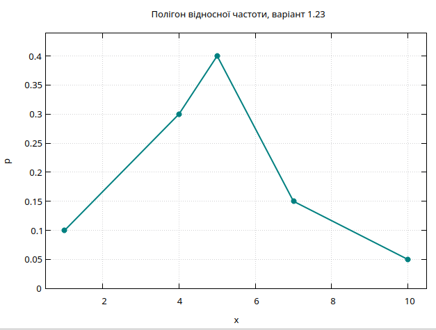
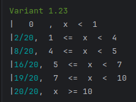
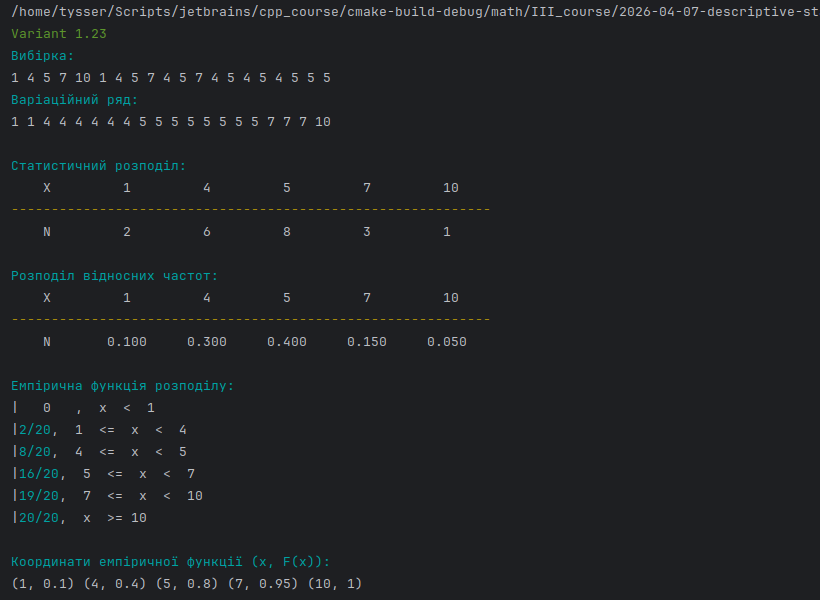
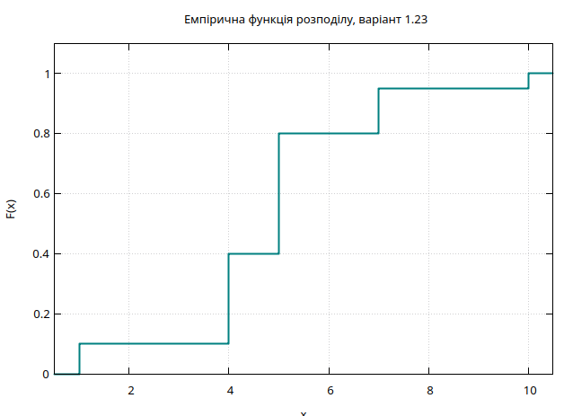

# Описова статистика

Практичне заняття №12. ЗМІ. Тема 6.

## Задано вибірку.

```cpp
    std::map<std::string, std::vector<int>> tasks =
    {
        {"1.1", {2,6,5,6,7,6,5,6,9,2,7,6,5,6,5,7,6,2,6,5,9,7,6,5,6}},
        {"1.2", {1,5,3,5,6,5,8,5,1,5,3,5,6,5,3,5,5,6,3,5}},
        {"1.3", {5,3,5,5,4,5,5,7,5,9,5,4,5,7,5,9,5,4,5,7,5,7,5,5,5}},
        {"1.4", {5,1,2,5,8,2,5,10,1,5,2,5,8,2,5,2,5,8,2,5}},
        {"1.5", {5,4,2,3,4,5,4,8,4,2,3,4,5,8,4,2,3,4,5,3,4,5,4,5,4}},
        {"1.6", {7,5,7,6,7,9,7,10,7,6,7,7,9,7,10,6,7,9,7,10,6,7,9,6,7}},
        {"1.7", {1,2,4,7,8,1,2,4,7,8,1,2,4,7,8,1,2,4,7,2,4,7,2,4,4}},
        {"1.8", {3,5,6,8,10,3,5,6,8,10,5,6,8,10,5,6,8,6,8,6}},
        {"1.9", {3,1,3,2,3,4,5,3,2,3,4,3,5,2,3,4,5,2,3,4,3,4,3,4,3}},
        {"1.10", {5,2,5,4,5,7,5,8,5,4,5,7,5,8,4,5,7,5,7,5}},
        {"1.11", {7,4,6,7,8,7,10,6,7,7,8,7,10,7,6,7,8,10,7,8,7,10,7,8,7}},
        {"1.12", {4,1,4,3,4,6,4,8,1,4,3,4,6,4,3,4,6,4,6,4}},
        {"1.13", {2,5,4,5,6,7,2,4,5,6,2,4,5,6,4,5,4,5,4,5,4,5,4,5,5}},
        {"1.14", {3,4,5,8,5,10,4,5,8,10,5,4,5,8,4,5,8,5,8,5}},
        {"1.15", {6,4,5,6,10,6,11,4,6,5,6,10,11,5,6,10,11,6,10,6}},
        {"1.16", {1,5,2,5,6,5,8,5,1,5,2,5,6,5,1,5,2,5,6,2,5,6,5,2,5}},
        {"1.17", {2,4,5,6,5,9,5,2,5,4,5,6,5,9,2,4,5,6,9,5,6,9,5,6,5}},
        {"1.18", {4,2,3,4,5,4,7,4,2,3,4,5,7,3,4,4,5,7,3,4}},
        {"1.19", {3,5,6,8,6,9,6,5,6,8,9,6,5,6,8,9,6,8,9,6,8,9,6,8,6}},
        {"1.20", {2,5,3,5,7,5,8,3,5,7,5,8,3,5,7,3,5,7,5,7}},
        {"1.21", {3,5,6,8,9,3,5,6,8,9,5,6,8,9,5,6,8,9,3,6,8,6,8,6,3}},
        {"1.22", {4,1,2,4,5,4,6,1,4,2,4,5,6,1,2,4,5,2,4,5,2,4,2,4,4}},
        {"1.23", {1,4,5,7,10,1,4,5,7,4,5,7,4,5,4,5,4,5,5,5}},
        {"1.24", {1,2,4,5,6,1,2,4,5,6,4,2,4,5,6,4,2,4,5,2,4,5,4,5,4}},
        {"1.25", {1,2,3,5,6,1,2,3,5,6,1,2,3,5,6,2,3,5,2,3,2,3,2,3,3}},
        {"1.26", {4,2,4,3,4,5,4,6,4,2,4,3,4,4,5,3,4,5,3,4}},
        {"1.27", {2,4,5,7,5,8,2,5,4,5,7,8,2,5,4,5,7,5,2,4,5,7,5,4,5}},
        {"1.28", {2,5,3,5,6,7,5,2,3,5,6,5,7,2,3,5,6,3,5,5}},
        {"1.29", {1,2,3,5,3,6,1,3,2,3,5,3,6,3,1,2,3,5,1,2,3,5,2,3,3}},
        {"1.30", {1,2,3,5,2,6,1,2,3,5,6,1,2,3,2,5,1,2,3,1,2,3,2,3,2}}
    };
```

- Потрібно:
  - побудувати варіаційний ряд;
  - побудувати статистичний розподіл вибірки;
  - побудувати полігон відносних частот;
  - знайти емпіричну функцію розподілу і побудувати її графік.

## Теорія

Нехай задано вибірку обсягу $n$:

$$
X = \{x_1, x_2, \dots, x_n\}
$$

### Варіаційний ряд

Варіаційний ряд це впорядкована за зростанням вибірка:
$$
x_{(1)} \le x_{(2)} \le \dots \le x_{(n)}
$$

Він дозволяє перейти до аналізу частот появи значень.

### Статистичний розподіл

Нехай $x_i$ це різні значення вибірки, а $n_i$ кількість їх появ.

Тоді статистичний розподіл задається як:

$$
\{(x_i, n_i)\}, \quad \sum n_i = n
$$

### Відносні частоти

Відносна частота кожного значення:

$$
p_i = \frac{n_i}{n}
$$

Виконується нормування:
$$
\sum p_i = 1
$$

### Полігон відносних частот

Полігон це ламана, що з'єднує точки:

$$
(x_i, p_i)
$$

Абсциси це значення вибірки, ординати це їх відносні частоти.

### Емпірична функція розподілу

Емпірична функція розподілу визначається як:

$$
F_n(x) = \frac{1}{n} \sum_{x_i \le x} n_i
$$

Вона є ступінчастою функцією.

У кусочному вигляді:

$$
F_n(x) =
\begin{cases}
0, & x < x_1 \\
\frac{n_1}{n}, & x_1 \le x < x_2 \\
\frac{n_1 + n_2}{n}, & x_2 \le x < x_3 \\
\dots \\
1, & x \ge x_k
\end{cases}
$$

де $k$ кількість різних значень.

Функція є правосторонньо неперервною та має стрибки в точках $x_i$.

## Реалізація

### Варіаційний ряд вибірки:

```cpp
std::vector<int> make_variation_series(std::vector<int> data);
```

Функція впорядковує всі елементи вибірки за зростанням, щоб отримати варіаційний ряд.
З такого впорядкованого набору зручно переходити до подальшого статистичного аналізу вибірки.

### Статистичний розподіл вибірки

```cpp
std::map<int, int> make_statistical_distribution(const std::vector<int>& data);
```

Функція підраховує, скільки разів кожне значення зустрічається у вибірці.
Результат є основою для таблиці статистичного розподілу, а також для подальшого 
знаходження відносних частот.

### Розподіл відносних частот

```cpp
std::map<int, double> make_relative_distribution(const std::map<int, int>& dist);
```

Функція переходить від абсолютних частот до відносних, тобто показує, яку частку всієї вибірки 
становить кожне окреме значення. Цей результат використовується для побудови полігону відносних частот.

### Вивід розподілу

```cpp
template <typename T>
void print_distribution_table(const std::string& number,
                              const std::map<int, T>& dist);
```

Функція використовується для виводу як статистичного розподілу вибірки, так і розподілу відносних частот.
У першому рядку виводяться значення ознаки, у другому їх частоти або відносні частоти. Тип значень у другому 
рядку таблиці може бути `int` для абсолютних частот або `double` для відносних частот.

### Полігон відносних частот

```cpp
std::map<int, double> make_relative_frequency_polygon(const std::map<int, int>& dist);
```

функція `make_relative_frequency_polygonдля` для кожного значення вибірки обчислює його відносну частоту.
Отримане відображення є готовим набором координат для побудови полігону відносних частот.

Потім значення відображаються на графіку за допомогою функції `plot_relative_frequency_polygon` з класу `Plotter`.



### Емпірична функція розподілу

```cpp
void print_empirical_row(int mode,
          const std::string& fraction,
          const std::string& left = "",
          const std::string& right = "");
```
функція формує один фрагмент кусочно заданої емпіричної функції розподілу. Вона використовується при 
послідовному виведенні всіх інтервалів, на яких функція має сталий вигляд.

- `mode` це режим побудови рядка:
  - `0` відповідає початковому інтервалу,
  - `1` відповідає внутрішньому інтервалу,
  - `2` відповідає останньому інтервалу.
- `fraction`  Значення емпіричної функції на відповідному інтервалі, подане у текстовому вигляді.
- `left` та `right` межи інтервалу

Далі обчислюється обсяг вибірки функцією `sample_size` ця функція знаходить загальну кількість спостережень у вибірці 
за вже побудованим статистичним розподілом. Це значення використовується при переході до 
відносних частот та емпіричної функції розподілу.

Функція `render_empirical_function` виводить емпіричну функцію розподілу у текстовому вигляді:



### Графік емпіричної функції розподілу

Спочатку будуються точки для графіка емпіричної функції розподілу за допомогою функції `make_empirical_function_points`
Ця функція перетворює статистичний розподіл на набір координат, з яких можна побудувати ступінчастий графік емпіричної функції розподілу.
Результат містить горизонтальні ділянки та точки стрибків. А сам графік будує функція `plot_empirical_function` с класу `Plotter`.





---

```bash
pandoc README.md -s \
--pdf-engine=xelatex \
-V mainfont="DejaVu Serif" \
-V monofont="DejaVu Sans Mono" \
-V fontsize=12pt \
-V linestretch=1.15 \
-V geometry:a4paper \
-V geometry:margin=20mm \
--toc --toc-depth=3 \
--number-sections \
--metadata title="Теорія ймовірностей та математична статистика" \
--metadata subtitle="Практичне заняття №12. ЗМІ. Тема 6." \
--metadata author="Тищенко Сергій, alk-43" \
--metadata date="2026-04-07" \
-H ../../../header.tex \
-o README.pdf
```


