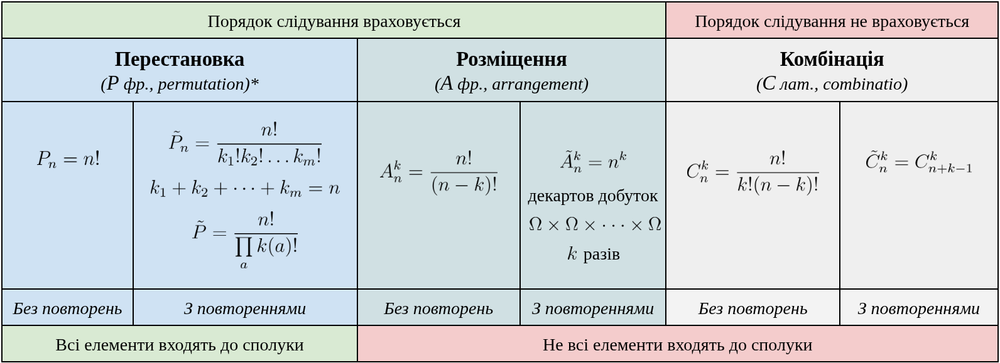
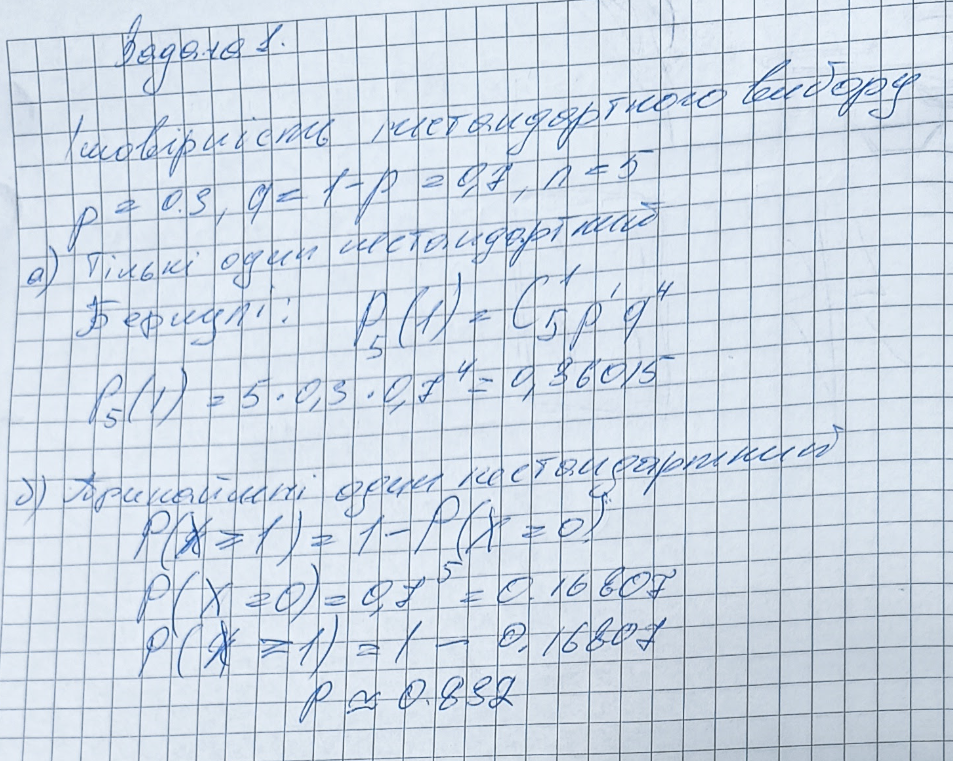
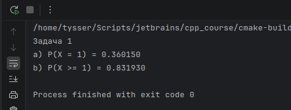
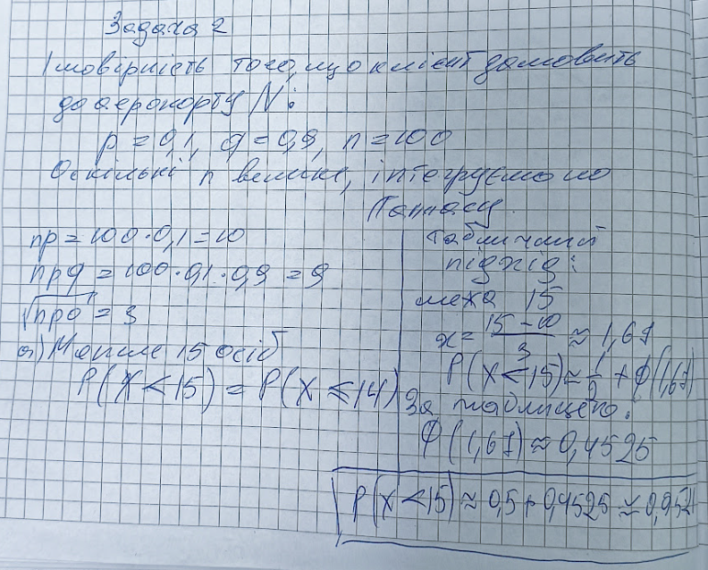
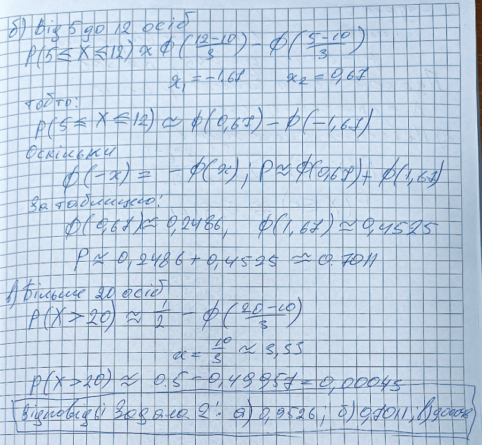
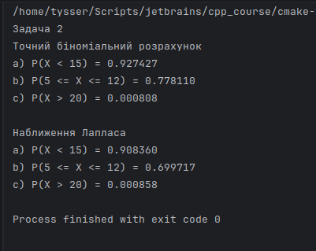
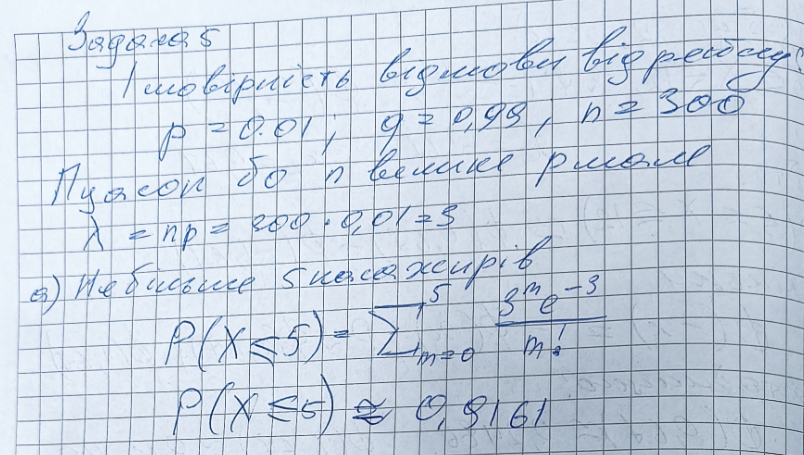
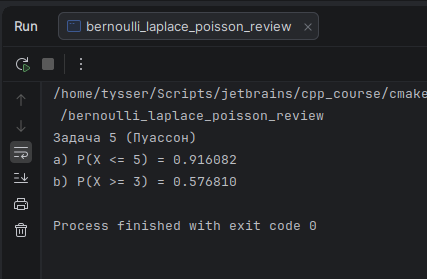
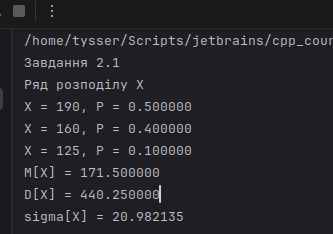
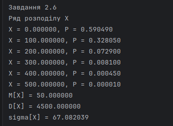

# Повторення незалежних випробувань.

[](https://github.com/yourhostel/cpp_course/tree/main/math/III_course/lib)

*Формула Бернуллі. Формула Муавра–Лапласа. Формула Пуассона*

---

## Мета роботи

Закріплення методів обчислення ймовірностей у схемі незалежних випробувань за формулами Бернуллі, 
Муавра Лапласа та Пуассона, а також формування навичок побудови законів розподілу дискретних 
випадкових величин і обчислення їх числових характеристик.

Застосування програмної реалізації статистичних методів для отримання точних і наближених результатів.

Розробка бібліотеки для обчислення ймовірностей та числових характеристик у схемі незалежних випробувань 
за формулами Бернуллі, Муавра Лапласа, Пуассона, а також для роботи з дискретними випадковими величинами.

## Порівняльна характеристика

| Характеристика              | Бернуллі                                            | Локальна теорема Лапласа                                     | Інтегральна теорема Лапласа                                           | Пуассона                                                         |
|-|-|-|-|-|
| Основна формула             | $P_n(m)=C_n^m p^m q^{n-m}$                          | $P_n(m)\approx \frac{1}{\sqrt{npq}}\varphi(x)$               | $P_n(m_1\le X\le m_2)\approx \Phi(x_2)-\Phi(x_1)$                     | $P_n(m)\approx \frac{\lambda^m e^{-\lambda}}{m!}$                |
| Аргумент стандартизації     | не потрібен                                         | $x=\frac{m-np}{\sqrt{npq}}$                                  | $x_1=\frac{m_1-np}{\sqrt{npq}},\quad x_2=\frac{m_2-np}{\sqrt{npq}}$   | $\lambda=np$                                                     |
| Тип моделі                  | точна біноміальна                                   | наближена біноміальна                                        | наближена біноміальна                                                 | наближення біноміального розподілу                               |
| Тип змінної                 | дискретна                                           | дискретна, але наближається неперервною нормальною моделлю   | дискретна, але сумарна ймовірність обчислюється через нормальний розподіл | дискретна                                                        |
| Що обчислює                 | ймовірність точно $m$ успіхів у $n$ випробуваннях   | ймовірність точно $m$ успіхів при великих $n$                | ймовірність потрапляння числа успіхів у проміжок                      | ймовірність точно $m$ рідкісних подій                            |
| Типова подія                | рівно $m$                                           | рівно $m$                                                    | не менше, не більше, від $m_1$ до $m_2$                               | рівно $m$, інколи також суми ймовірностей                        |
| Умови застосування          | незалежні випробування, стала ймовірність успіху $p$ | $n$ велике, $p$ не надто близьке до 0 або 1, зазвичай $npq>9$ | $n$ велике, $p$ не надто близьке до 0 або 1, зазвичай $npq>9$         | $n$ велике, $p$ мале, $np=\lambda$ скінченне, зазвичай $p\le 0.1$ |
| Основний параметр           | $n,p,q,m$                                           | $n,p,q,m,x$                                                  | $n,p,q,m_1,m_2,x_1,x_2$                                               | $\lambda=np,\ m$                                                 |
| Тип задач                   | малі або помірні $n$, точний рахунок                | великі $n$, треба одна точка                                 | великі $n$, треба інтервал                                            | рідкісні події, мала ймовірність успіху                          |
| Перевага                    | точний результат                                    | швидке наближення                                            | зручно для нерівностей і проміжків                                    | дуже зручно для малих $p$                                        |
| Недолік                     | громіздко при великих $n$                           | лише наближення                                              | лише наближення, потрібна таблична функція                            | працює не для всіх $p$                                           |
| Коли обирати в першу чергу  | коли $n$ невелике                                   | коли питають рівно одне значення при великому $n$            | коли питають менше, більше, від і до                                  | коли подія рідкісна                                              |
| Приклад формулювання задачі | із 10 паперів подорожчає рівно 5                    | із 300 виробів буде рівно 250 першосортних                   | із 100 клієнтів менше 15 замовлять квиток                             | із 2000 абонентів за годину зателефонують 5                      |

## Таблиця параметрів

|  № |   Позначення |                  Зміст                   |   № |             Позначення |                    Зміст                     |
|-:|-------------:|:----------------------------------------:|-:|-----------------------:|:--------------------------------------------:|
|  1 |          $n$ |     кількість незалежних випробувань     |   9 |              $\lambda$ |  параметр розподілу Пуассона, $\lambda=np$   |
|  2 |          $p$ | ймовірність успіху в одному випробуванні |  10 |                   $np$ |    математичне сподівання $\mathbb{E}[X]$    |
|  3 |          $q$ |      ймовірність неуспіху, $q=1-p$       |  11 |                  $npq$ |          дисперсія $\mathbb{D}[X]$           |
|  4 |          $m$ |            кількість успіхів             |  12 |    $\sigma=\sqrt{npq}$ |        середньоквадратичне відхилення        |
|  5 |          $X$ |    випадкова величина, число успіхів     |  13 |                    $x$ |         нормований аргумент Лапласа          |
|  6 |      $C_n^m$ | число комбінацій, $\frac{n!}{m!(n-m)!}$  |  14 |           $\varphi(x)$ | щільність стандартного нормального розподілу |
|  7 |     $P(X=m)$ |      ймовірність рівно $m$ успіхів       |  15 |              $\Phi(x)$ |               функція Лапласа                |
|  8 |   $Bin(n,p)$ |          біноміальний розподіл           |  16 |               $F_0(x)$ |    стандартна нормальна функція розподілу    |

## Таблиця вибору метода

| Ознака задачі                                                   | Що брати                   |
|-|-|
| Потрібна точна ймовірність, $n$ невелике                        | Бернуллі                   |
| Потрібно знайти ймовірність рівно одного значення, $n$ велике   | Локальна теорема Лапласа   |
| Потрібно знайти ймовірність проміжку, типу не менше, не більше, від і до | Інтегральна теорема Лапласа |
| $p$ дуже мале, а $n$ велике                                     | Пуассона                   |


## Основні формули комбінаторики та умови їх застосування



---

## Завдання на схему Бернуллі, теорему Лапласа та формулу Пуассона

### Бернуллі

Серед великої кількості виробів, що знаходяться в комплекті, 30 % – нестандартні. 
Знайти ймовірності того, що серед 5 виробів, навмання взятих із комплекту, буде:

а) тільки один нестандартний;

б) принаймні один нестандартний.





### Інтегральна теорема Лапласа

Імовірність того, що кожен клієнт, який звернувся в авіакасу, замовить квиток до аеропорту N, 
дорівнює 0,1. Знайти ймовірності того, що із 100 клієнтів, що звернулись в касу, 
замовлять квиток до аеропорту N:

а) менше 15 осіб; 

б) 5 – 12 осіб; 

в) більше 20 осіб.







### Формула Пуассона

За статистичними даними у середньому 1 % пасажирів відмовляється від рейсу. 
Знайти ймовірності того, що з 300 пасажирів, які мають квитки на рейс, 
відмовляться від польоту: 

а) не більше 5 пасажирів; 

б) не менше 3 пасажирів.





## Завдання на дискретні випадкові величини

Продавець морозива дійшов висновку, що рівень продажу залежить
від погоди: сонячної, похмурої та холодної.

Сонячні дні становлять 50 %, холодні – 10 %.

Виторг від продажу морозива становить 290, 260 і 225 грн за день відповідно до стану погоди.

Неповернені витрати на морозиво становлять 100 грн за день.

Побудувати ряд розподілу випадкової величини Х – прибутку від продажу морозива
та визначити її числові характеристики.



У рекламних цілях торгова фірма вкладає в кожну десяту одиницю товару приз вартістю 100 грн.

Побудувати ряд розподілу випадкової величини Х – розміру виграшу за 5 покупок та знайти її числові характеристики.



---

## Висновок

У ході роботи були розглянуті основні підходи до обчислення ймовірностей у дискретних моделях та побудовані 
ряди розподілу для прикладних задач. Підтверджено коректність використання різних методів залежно від умов задачі, 
точного біноміального розрахунку, нормального наближення та розподілу Пуассона. Для обчислень використано 
власну бібліотеку `StatKit`, яка забезпечує уніфікований інтерфейс для роботи з дискретними розподілами, 
інкапсулює перевірки інваріантів і дозволяє отримувати числові характеристики випадкових величин у стандартизований спосіб.


```bash
pandoc README.md -s \
  --pdf-engine=xelatex \
  --columns=60 \
  -V mainfont="DejaVu Serif" \
  -V monofont="DejaVu Sans Mono" \
  -V fontsize=12pt \
  -V linestretch=1.15 \
  -V geometry:a4paper \
  -V geometry:margin=20mm \
  -V geometry:landscape \
  --toc --toc-depth=3 \
  --number-sections \
  --metadata title="Теорія ймовірностей та математична статистика" \
  --metadata subtitle="Повторення незалежних випробувань. Формули: Бернуллі, Муавра–Лапласа, Пуассона" \
  --metadata author="Тищенко Сергій, alk-43" \
  --metadata date="2026-04-20" \
  -H ../../../header.tex \
  -o README.pdf
```